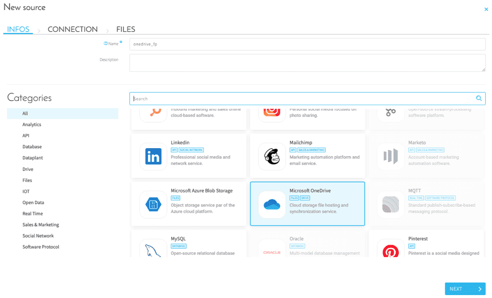
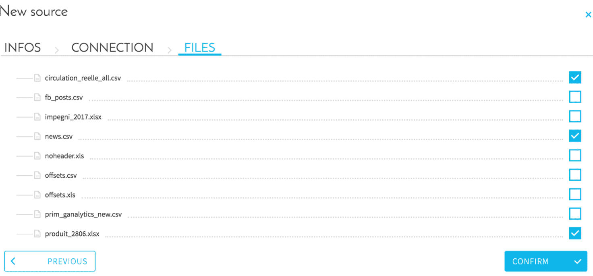

# OneDrive

## はじめに

Microsoft OneDriveは、MicrosoftがWeb版のOfficeの一部として運営しているファイルホスティングおよびファイル同期サービスです。

ForePaaSでは、OneDriveに接続し、OneDrive上のファイルを選択して、そのデータをプラットフォームに直接インポートできます。

## 実行する手順

### Microsoft OneDriveソースの選択

### パラメータのセットアップ

必須フィールド

* Client ID：アプリケーションID 
* Client Secret：承認されたクライアントシークレット 
* Token：OAuth 2によって生成されたトークン
* Refresh Token：OAuth 2によって生成されたリフレッシュトークン
* Path：ファイルのパス（省略可能）
* Redirect URI：OAuth 2のリダイレクトURI（http://localhost）

「Fetch（フェッチ）」をクリックしてコネクターで構成をチェックした後、「Next（次へ）」をクリックして次のステップに進みます。

詳しい説明については、[アクセストークンの取得](/jp/product/data-manager/collect/connectors/onedrive/access-tokens.md)に関するドキュメントを確認してください。

### インポートするファイルをチェックして、« CONFIRM（確認） »をクリックします。

> 関連情報

このOneDriveコネクターではサーバー上のすべてのファイルをリスト表示できますが、メタデータやデータの抽出でサポートされるのは、.csv、.xls、.xlsx、.xml、.json、.parquetのみであることに注意してください。

メタデータの抽出（Data Managerに関するガイドの分析のパートを参照）で、このOneDriveコネクターでダウンロードされるファイルのサイズの上限は、次の通りです。
* 完全な抽出：約900 MB
* サンプル抽出：約2.5 GB
