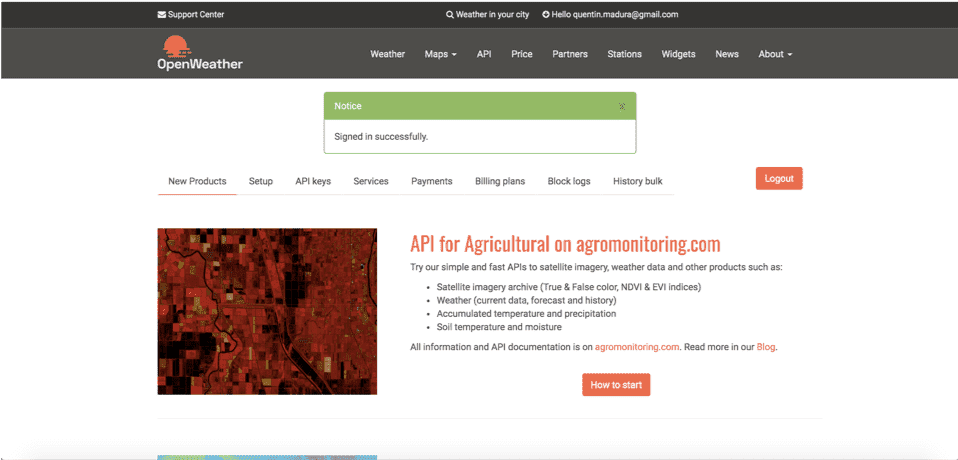

# OpenWeather

## OpenWeatherについて

OpenWeatherMapは、Webサービスやモバイルアプリケーションの開発者向けに、現在の天候データ、予測、履歴データを含む天候データを提供するオンラインサービスです。

OpenWeatherは、ビッグデータ、データ処理、および衛星画像処理分野の技術者と専門家が2014年に立ち上げた小規模なIT企業です。 

## ForePaaSでのOpenWeatherコネクターの設定

### アカウントの作成

1. https://openweathermap.org/apiにアクセスし、ページの上部にある「Sign Up」ボタンをクリックします。 

2. 登録ページにリダイレクトされます。入力項目を記入してアカウントを作成します。 

### APIキーの取得

1. アカウントを作成した後、プラットフォームにログインします。
2. 続いて、「API keys」のリンクをクリックします。

3. 新しいキーを生成します。

以上で準備は完了です。