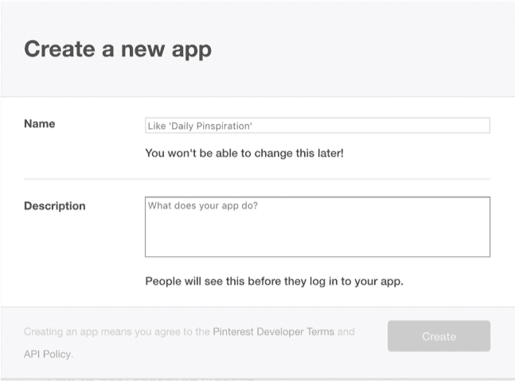
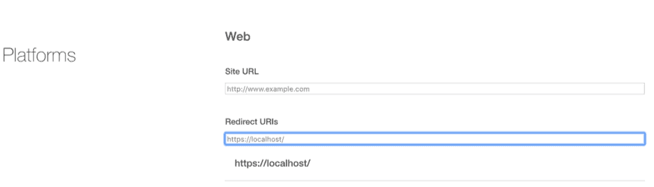
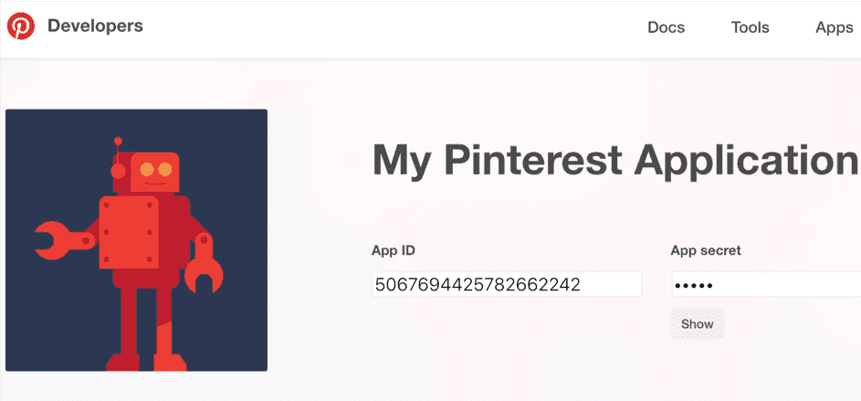
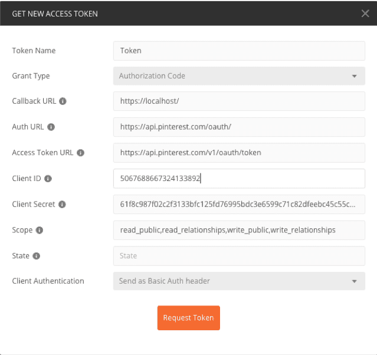
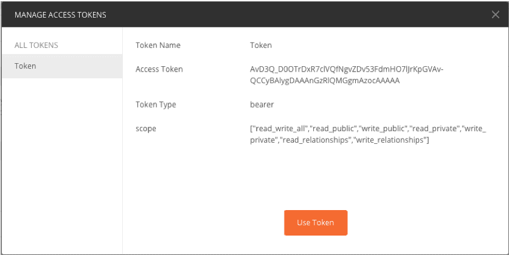
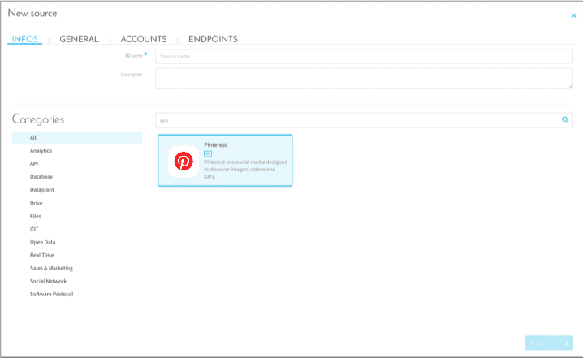

# Pinterest

## はじめに
Pinterestは、自分のボードや他のユーザーのボード（共通のテーマを持つ「ピン」のコレクション）に画像やビデオを投稿（Pinterestでは「ピンする」という）したり、他のユーザーがピンしたものをブラウズしたりすることで、興味のある画像を共有し、新たな興味関心を見いだすことができるソーシャルネットワークです。 

ここでは、データを効率的に収集するため、PinterestのアカウントをForePaaSに接続します。

## チュートリアル

### ForePaaS用のPinterestアクセストークンの生成

PinterestはOAuth 2.0を使用して、アプリケーションとユーザーの間の要求を認証します。
このトークンを生成するには、サードパーティツールであるPostmanを利用すると便利です。

最初に、次の手順でアプリケーションを作成し、App IDとApp Secretを取得します。

PinterestにアクセスしてDevelopers App Dashboardを追加し、ログインしてアプリケーションを作成します。

* https://developers.pinterest.com/apps/にアクセスします。
* 「Create app」をクリックし、アプリケーション名と説明を入力します。

* アプリケーションの詳細の「Redirect URL」を更新します。次のいずれかURLを指定できます：
https://www.getpostman.com/oauth2/callback、
https://localhost/

* App IDとApp Secretを書き留めます。

次に、Postmanを設定してトークンを生成します。

1)	新しい要求を作成
2)	要求の名前と説明を入力
3)	「Authorization」タブをクリック
4)	「Get New Access Token」をクリック
5)	詳細情報を入力

コールバックURLは、Pinterestアプリケーションの詳細で「Redirect URL」に対して記述したものと同じものにします。

Auth URLにはhttps://api.pinterest.com/oauth/を指定します。

Access Token URLにはhttps://api.pinterest.com/v1/oauth/tokenを指定します。

Client IDとSecret IDはPinterestアプリケーションからコピーします。

> 注意：以下のScopeのルールに基づき記述します：read_public,read_relationships,write_public,write_relationships

入力が済んだら、「Request Token」をクリックします。正常に実行されると、ポップアップウィンドウが表示され、ログインするように求められます。ログインして、Pinterestアプリケーションのアクセストークンを許可します。

要求が成功してアクセストークンが表示されると、ForePaaSプラットフォームでPinterestコネクターを設定できます。

このアクセストークンは時間あたりの要求回数に制限がありますので注意してください（1時間あたりクエリ10回程度）。

### ForePaaSのPinterestコネクターの設定

マーケットプレイスでPinterestコネクターを選択し、詳細情報を入力します。
* Account（アカウント）：TBD
* Token（トークン）：OAUTH2から受け取ったアクセストークン

