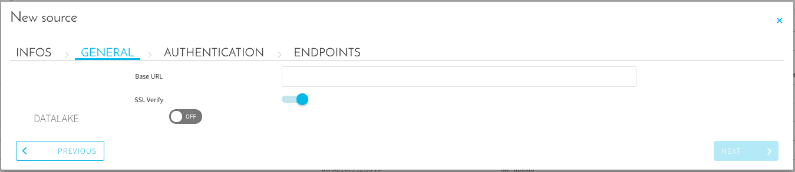
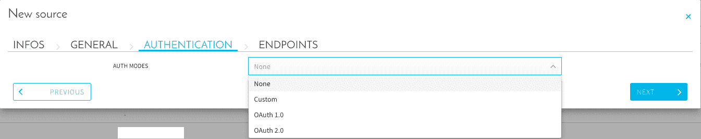
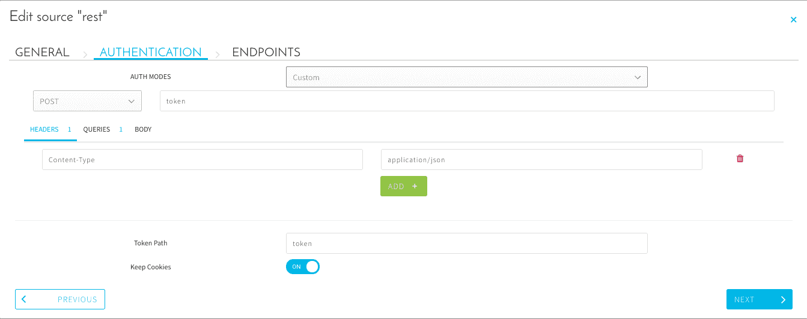
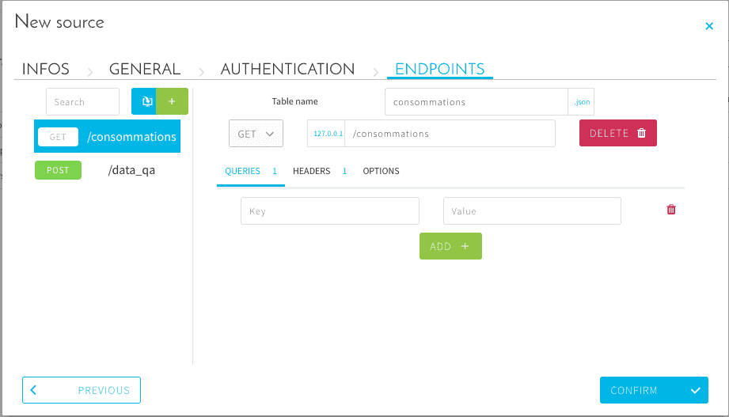
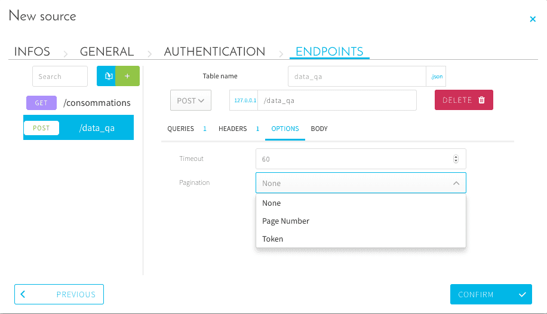

# RESTプロトコル

## はじめに

**REST**は、互換性のあるAPIで情報をリクエストし、JSONレスポンスからデータをインポートできる標準的なアプリケーションプロトコルです。

---
## ソースの構成

### 一般設定

最初に、次のパラメータを設定する必要があります。
* **Base URL（ベースURL）**：リクエストするAPIのURLまたはアドレス
* **SSL verify（SSL検証）**：セキュアな接続をセットアップする場合

### 認証モードの構成

REST APIで認証が必要な場合は、「**AUTHENTICATION（認証）**」タブで認証モードを選択して認証を設定します。
APIで認証が必要ない場合は、この手順を省略できます。

使用するメソッド（POSTまたはGET）を選択し、その後に認証が必要なURLを選択します（例：`http://localhost/auth`）。  
続いて、以下の任意のパラメータを設定します。
* **Headers**：リクエストのヘッダーを追加
* **Queries**：リクエストへのクエリを追加
* **Body**：タイプjson、form-data、form-urlencoded、またはinlineのオプションのボディを追加

最後に、レスポンスで使用する*トークンパス*を入力し、トークンを*Cookies*内に保持する（認証セッションをCookiesに保存する）かどうかを指定します。

認証レスポンスからトークンを取得する必要がある場合は、トークンが保管されるレスポンスのJSONのキーを指定する必要があります（通常は`token`）。 

### エンドポイントの構成

最後のステップとして、レスポンスを抽出するエンドポイントを定義します。
これを行うには、コネクターの「**ENDPOINTS（エンドポイント）**」タブに移動します。

ここでは、エンドポイントごとに次のパラメータを設定できます。
* **Table name**：このエンドポイントからのデータを格納するテーブル名を設定
* **Curl**：アイコンをクリックして**Curl**リクエストからあらかじめ設定されたエンドポイントをインポート
* **Delete**：エンドポイントを削除

#### 特殊データ

**トークン** 
認証エンドポイントを有効にしていて、以前に取得したトークンを再利用する必要がある場合、「**Queries**」セクションで必要なキーの値として`$token`を指定することができます。

**相対日付**

クエリ当日に対する相対的な日付パラメータを使用する必要がある場合には、パイプ記号`|`で区切られた2つのパートから成る特別なワイルドカードを使用できます。
`(%now|date%)`はクエリが実行された日付に置き換えられます（YYYY-MM-DDの形式）。
 
パイプ記号の前に指定できる値：
* `(%dateMin|`：DPEワークフローパラメータで設定された最小日付を使用
* `(%dateMax|`：DPEワークフローパラメータで設定された最大日付を使用
* `%now|`：実行時点の日付と時刻を使用

パイプ記号の後に指定できる日付の形式を指定する値：
* `|date%)`：`YYYY-MM-DD`
* `|datetime%)`：`YYYY-MM-DD HH:mm:SS`
* `|timestamp%)`：UNIXタイムスタンプ
* `|%Y-%m-%d%)`：カスタムフォーマッタ

> カスタムフォーマットの詳細については、[Pythonの`datetime`のドキュメント](https://docs.python.org/3/library/datetime.html#strftime-and-strptime-format-codes)を参照してください。

エンドポイントごとに、次のオプションを設定することもできます。
* **Timeout**：エンドポイントリクエストのタイムアウトを設定
* **Pagination**：ページ番号またはトークンを使用してページネーションを設定

---
## 関連情報

> 現在、RESTコネクターはJSONタイプのレスポンス**のみ**をサポートしています。

また、メタデータの抽出を使用してその場でデータの検査を行う際のファイルのサイズの上限は、次の通りです（Data Managerの「Analyze（分析）」タブを参照）。
* 完全な抽出：約900 MB
* サンプル抽出：約2.5 GB
