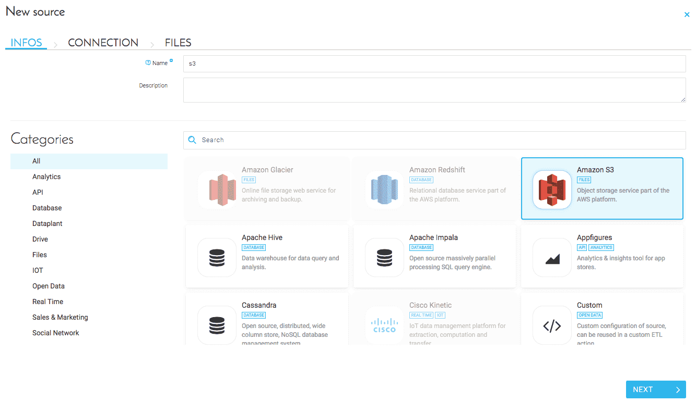
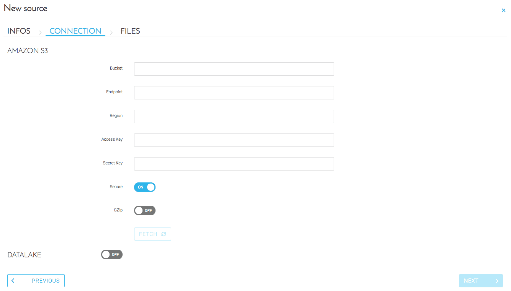
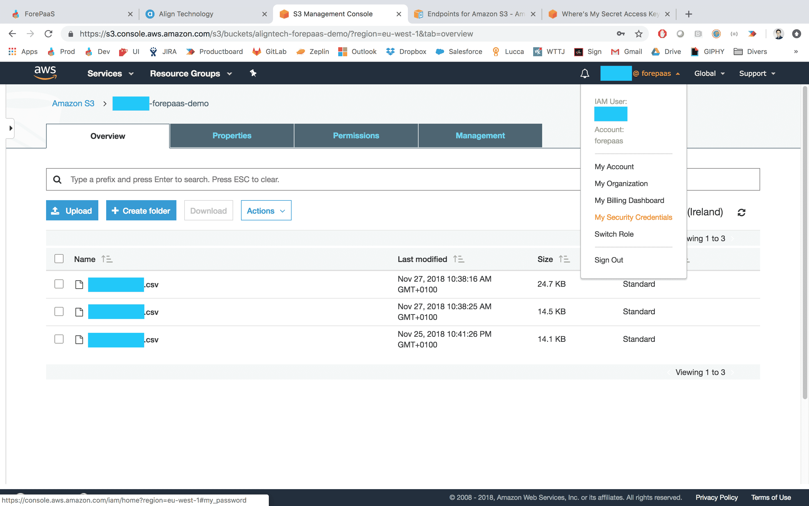
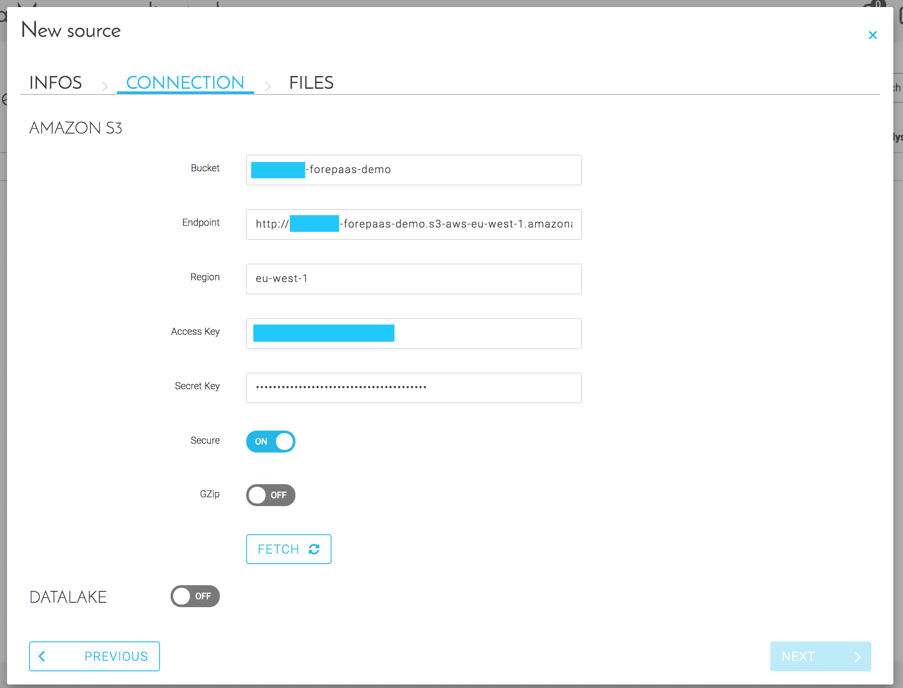
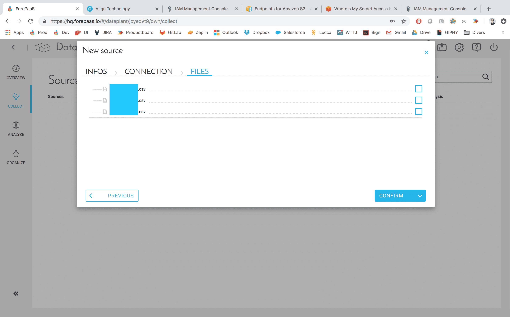

# Amazon S3

## はじめに

Amazon S3は、Web上で時間や場所に関係なく、任意の量のデータを保存し取得するのに使用できるシンプルなWebサービスインターフェースです。ForePaaSが開発したコネクターを使用すると、わずか数回のクリックでオンライン上に保存したデータにアクセスできます。 

## コネクターの構成

### 新しいS3コネクターの作成

データプラントにアクセスし、**Data Manager**コンポーネントの「*Collect（収集）*」で、「Add a source（ソースを追加）」を選択します。新しいコネクターの名前を指定し、Amazon S3を選択します。「Next（次へ）」をクリックします。



### S3コネクターの設定

次のフィールドを含むフォームに入力します。  
  * お使いの**バケット**の名前
  * リクエストするバケットの**エンドポイント**
  * バケットが保管されている**リージョン**
  * アカウントの**アクセスキー**
  * アカウントの**シークレットキー**



この情報を入力するには、AWS S3にログインしてデータが保管されているバケットにアクセスします。バケットを開いて、次のようなブラウザのURLを確認します。

```
s3.console.aws.amazon.com/s3/buckets/<bucket-name>/?region=<region>&...
```
このURLのリージョン名の表示を使用し、次の構造を用いてForePaaSフォームにバケットのエンドポイントを入力します。
```
http://<bucket-name>.s3-aws-<region>.amazonaws.com
```
バケットのエンドポイントの詳細は、次のAWSのドキュメントに記載されています。
{AWS S3でのバケットの使用}(https://docs.aws.amazon.com/AmazonS3/latest/dev/UsingBucket.html)

AmazonのアクセスキーIDとシークレットアクセスキーを取得するには、AWSアカウントに対する適切なアクセス権が必要になります。アカウント名（コンソールの右上隅）をクリックします。展開されたドロップダウンリストから、「*Security Credentials（セキュリティ認証情報）*」を選択します。その場所からルートアクセスキーとIAMアクセスキーを管理できます。



> AWSはルートアクセスキーを使用する代わりに、IAMユーザーを作成することを推奨しています。IAMアクセスキーを使用すると、ユーザーのAWSのサービスとリソースへのアクセスをセキュアに制御できます。

この情報を取得する方法については、AWSのドキュメントの説明を参照してください。
{AWS S3のセキュリティ認証情報の使用}(https://docs.aws.amazon.com/general/latest/gr/aws-security-credentials.html)

次の分かりやすいブログ記事も参考になります。
{AWS S3のアクセスキーとシークレットキーの取得}(https://www.cloudberrylab.com/resources/blog/how-to-find-your-aws-access-key-id-and-secret-access-key/)



### コネクターのオプションとテスト

このコネクターでは、オプションで以下を設定できます。
  * *Secure*トグルスイッチ：ForePaaSプラットフォーム内でコネクターの資格情報を暗号化する場合
  * *GZip*トグルスイッチ：**GZip**機能で内容を圧縮する場合
  * *Datalake*トグルスイッチ：ForePaaSのデータレイクにバックアップ用のデータをアーカイブする場合

?>  コネクターの設定が済んだら、「Fetch（フェッチ）」をクリックして転送プロトコルが適切に機能しているかどうかを確認できます。応答に問題がなければ、「Next（次へ）」をクリックしてバケット内で利用可能なファイルを表示します。 

「Files（ファイル）」セクションで、「*Analyze（分析）*」セクションで探索するファイルにチェックを入れます。


これで、ForePaaSでS3データを活用する準備は完了です。