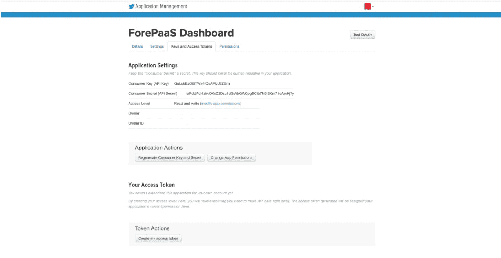

# Twitter
 
## 背景

Twitterコネクターを使用すると、**特定のTwitterアカウントのインサイトを統合**できます。
ただし、Twitter APIではクエリが行われたときにだけデータを取得できます。Twitterの履歴データを取得することはできません。
また、データは公開されているため、競合企業などのアカウントのデータを取得することができます。 

Twitter APIにアクセスするには、最初にTwitter上にアプリケーションを作成する必要があります。その後、それを元にトークンが生成されます。

TwitterパブリックAPIを使用する場合は、特定の権限を持つ特定のアカウントでこのアプリケーションを作成する必要はありません。

## 利用可能なメトリックス

Twitterコネクターを利用すると、次の情報を取得できます。  
* Twitterアカウント：
 * 日付
 * アカウント名
 * 合計フォロワー数
 * 合計ツイート数（ツイート、リツイート、リプライ）
 * いいねの合計数
* ツイート：
 * ツイートID
 * アカウント名
 * ツイートの作成日
 * ツイート文
 * リツイートの合計数（これがリツイートの場合に元のツイートのリツイートを含める）
 * リツイートの合計数（これがリツイートの場合に元のツイートのリツイートを除外する）
 * 元のツイートのリツイート数（これがリツイートの場合）
 * このツイートをいいねに追加したユーザーの数
 * ツイートのタイプ：別のツイートの引用
 * ツイートのタイプ：別のツイートへのリプライ
 * ツイートのタイプ：リツイート
 * 言語

## ステップ

1. <i>[Twitter](https://apps.twitter.com/)にアクセスし、« Create New App »をクリックします。<i>

2. <i>フォームのすべての必須フィールドに各自の情報を記入します。
*Developer Agreementを忘れないようにしてください。*<i>

3. <i>« Keys and Access Tokens »タブに移動します。<i>

4. <i>« Your Access Token »に移動し、« Create my access token »をクリックします。<i>

5. <i>テキストエディターを開き、コンシューマーキー、コンシューマーシークレット、アクセストークン、アクセストークンシークレットをコピーして貼り付けます。<i>

6. <i>プラットフォームに戻り、Data Managerで新しいソースを追加します。</i>

7. <i>フォームに入力し、コンシューマーキー、コンシューマーシークレット、アクセストークン、アクセストークンシークレットを貼り付けます。</i>

8. <i>複数のアカウントのデータを取得する場合は、次の画面で設定します。</i>

8. <i>次に、保存するエンドポイント（データ）を選択します。</i>

Twitter APIの詳細については、[このリンク](https://developer.twitter.com/jp/docs/api-reference-index)を参照してください。