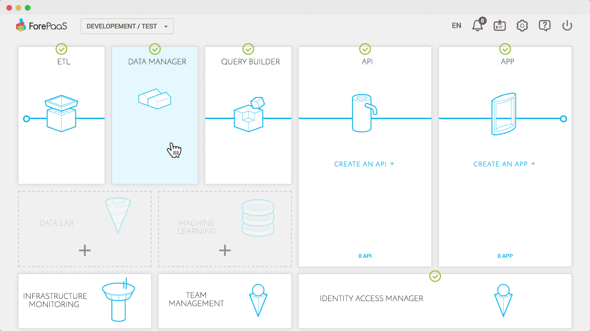
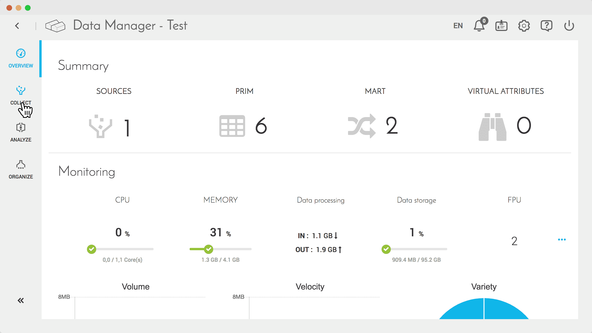
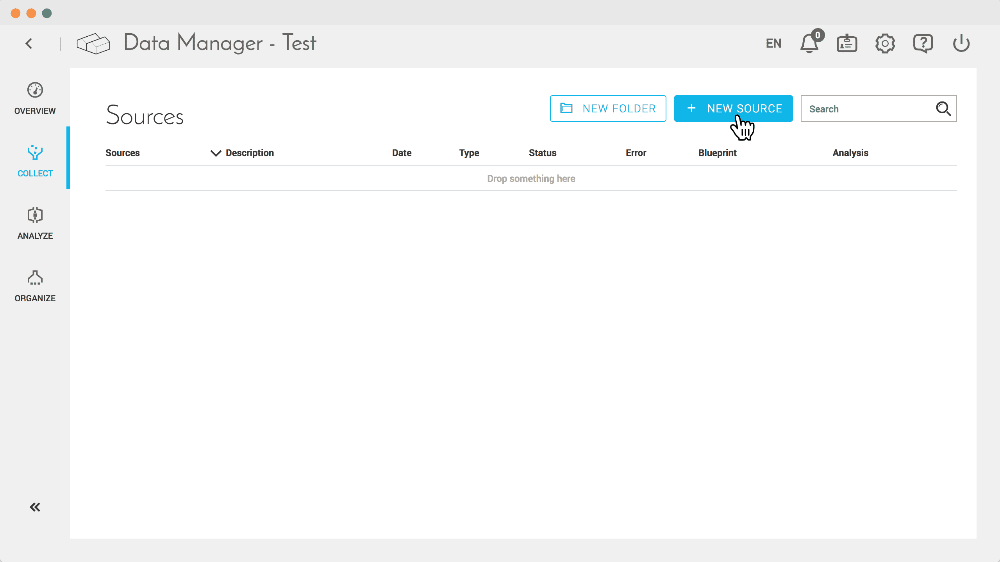
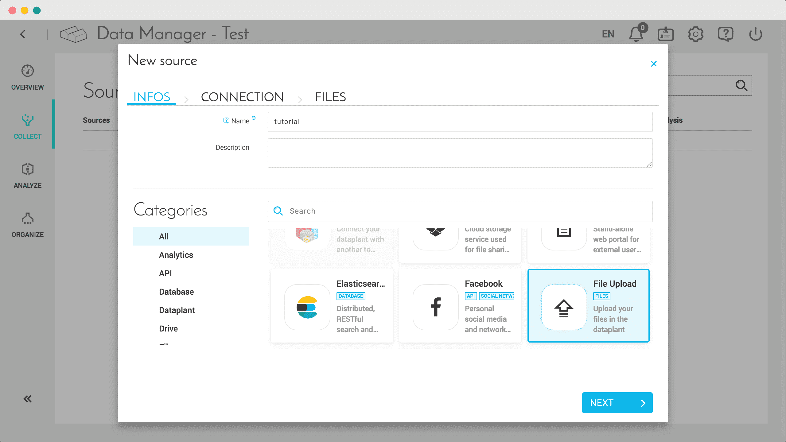
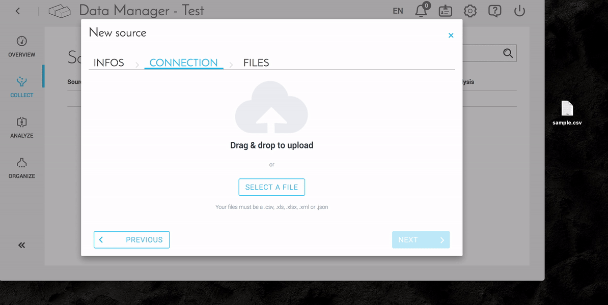

# ファイルのアップロード

## はじめに

ForePaaSプラットフォームにはさまざまなコネクターが揃っているため、外部のサービスやアプリケーションのデータをデータプラントに直接リンクすることができます。このガイドでは、セットアップが容易なコネクターであるドラッグアンドドロップアップロードについて説明します。

## 使用できるファイル

このコネクターでは、`.csv`、`.xls`、`.xlsx`、`.xml`、`.json`のファイルをドラッグアンドドロップできます。

## ファイルの追加

<a href="/fr/tutoriels/data-manager/connectors/files/sample.csv" target="_blank" download>こちら</a>にあるファイル`sample.csv`を使用します。

1. ForePaaSプラットフォームにログインし、データプラントを選択します。
2. **Data Manager**にアクセスします。

3. この画面には、データの処理に必要な複数のステップがあります。このガイドでは、「**Collect（収集）**」ステップを中心に説明します。

4. 「**New Source（新規ソース）**」をクリックしてソースを追加します。

5. 入力ウィンドウに、名前、説明、タイプなどの新しいソースに関する項目が表示されます。これらの項目を入力し、「**Next（次へ）**」をクリックします。

6. 次の画面で、「**Select a File（ファイルを選択）**」を使用してファイルを選択します。また、ファイルをウィンドウにドラッグアンドドロップすることもできます。`.csv`、`.xls`、`.xlsx`、`.xml`、`.json`のファイルをアップロードできることを覚えておいてください。

7. ファイルをチェックしてアップロードするファイルを確認し、「**Confirm（確認）**」をクリックしてソースの作成を完了します。

8. 新しく作成したソースがソースリストに表示されます。

