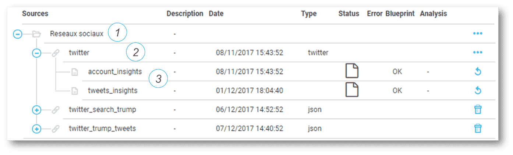
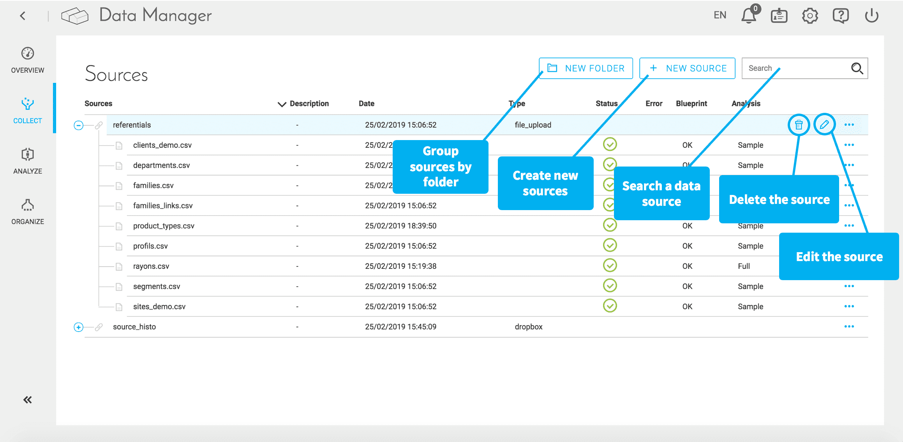

# 収集

データはプラットフォームの内部**マーケットプレイス**で利用可能な**データソース**を介してForePaaSのデータプラントに取得または挿入されます。これらのデータソースの定義と管理を行うには、Data Managerの「Collect（収集）」メニューを利用します。 

{ForePaaSのマーケットプレイスの詳細を確認する}(#/jp/product/dataplant/marketplace.md)

### ソースのタイプ

ForePaaSでは、現在、次のソースがサポートされています。

* **データベース**：PostgreSQL、MySQL、SQLServer、MariaDB、Cassandra、Google BigQuery、AWS Redshift、ElasticSearch、Heroku Postgre、Swift、Apache Hive、Impala
* **エンタープライズソフトウェア**：Salesforce、Hubspot、MailChimp、Marketo、Stripe、Zendesk、Freshdesk、Oracle、SAP
* **接続されたオブジェクトおよびリアルタイム**：MQTT、Sigfox、Cisco Kinetic、RabbitMQ、Kafka
* **オブジェクトストアおよびファイルストレージ**：AWS S3、HDFS、Dropbox、Dropzone、Google Drive、Azure Storage、OneDrive
* **ソフトウェアプロトコルおよびオープンデータ**：FTP、HTTP、SCP、SFTP、SSH、REST API、SOAP API、Open Weather
* **ソーシャルネットワークおよびメディア**：Pinterest、Facebook、LinkedIn、Twitter、YouTube、Weibo、Instagram
* **分析**：Google Analytics、Appfigures

> データ抽出では、次のファイルタイプをサポート：.csv、.xlxs、.xls、.xml、.json、.parquet

!> このタブで扱えるファイルのサイズは**1GBが上限**です。1GBよりも大きなファイルを処理する場合は、[データストア](/jp/product/data-manager/datastore/index.md)を介してファイルをアップロードする必要があります。

### ソースの体系化

データソースは、次のように階層的に体系化され定義されます。

1. **ファイル**：論理グループ
2. **ソースの場所**（以下を定義）：
  * ソースのタイプ
  * アクセス（URL、アドレスなど）
  * アクセスエレメント（認証など）
3. **ソーステーブル**（テーブル、ファイル、エンドポイントなどの、より小規模なオブジェクトへのアクセスを指定）

### ダッシュボード

ソースを追加するたびに、このダッシュボードに新しい行が追加されます。読みやすくするため、ソースをフォルダーにグループ化することをお勧めします。 

{次の記事：分析}(#/jp/product/data-manager/analyze/index.md)
