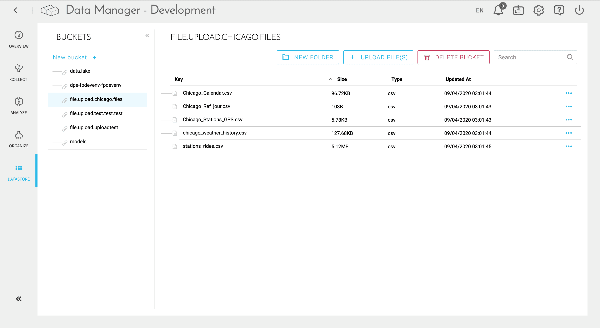

# データストア

ForePaaSのデータストアは、あらゆる非構造化データを保管できる**S3準拠のオブジェクトストア**です。データストアの仕組みは、**従来型のファイルベースのストレージシステムと似ており**、バケットをベースに構成されます。バケットは、特定の機械学習プロジェクト、または写真やビデオの保存場所などのための、個別の作業領域だと考えてください。

!> データストアで扱えるファイルの**サイズの上限は10GB**です。

?> 🚧 このセクションは準備中です。

---

##  サポートが必要な場合🆘

> サポートの依頼が必要な場合は、いつでもプラットフォームの「*Support（サポート）*」タブから直接依頼を送信することができます。また、support@forepaas.com宛にメールを送付することもできます。

{サポートに質問を送付する🤔}(https://support.forepaas.com/hc/en-us/requests)