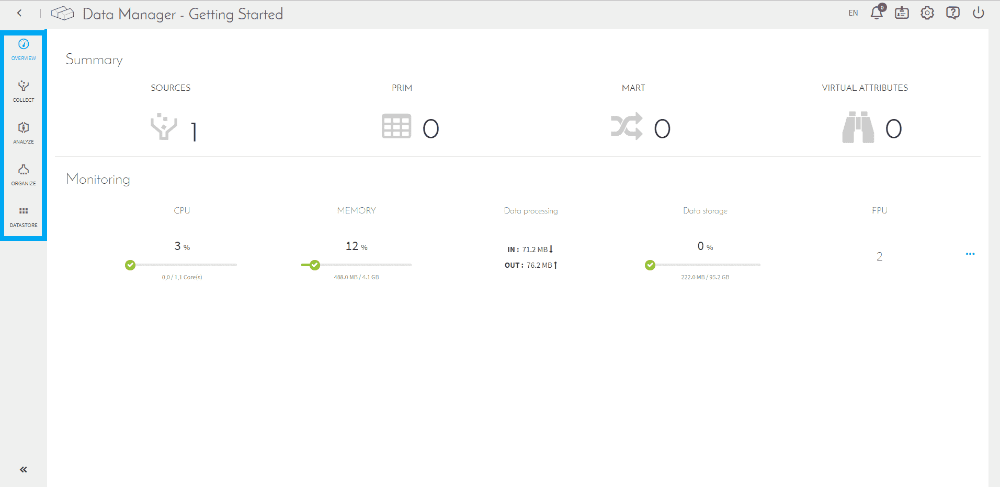

# Data Manager

## Data Managerとは

Data Managerは、**データソースの実装とウェアハウス**を制御するコンポーネントです。Data Managerでは、データ品質管理ツールやデータモデリングツールを利用して、データのソースに関係なく、論理的かつクエリ可能な形でデータを体系化できます。

Data Managerはデータ構成を抽象化します。つまり、Data Managerは特定のデータベースにリンクされないマルチベースエンジンです。ストレージ容量に関する水平スケーラビリティを備えているため、データ量が少ない場合に最適なデータベースからデータ量の拡大に対応できるデータベースへ、自動的に切り替えることができます。 

Data Manager内では、データ品質を向上させるためのルールを設定することもできます。これらは**ブループリント**と呼ばれ、ETLを通じて統合を行う前に単純データを適用することができ、可読性を高めてからデータを運用ラインに取り込むことができます。 

また、Data Managerでは、**Data Mart**の作成が可能であるため、データモデリングがさらに便利になります。これらのデータ「ストア」は、データの視覚化のニーズや複雑な計算に対応するためにデータを集約するものです。 

まとめると、Data Managerは**データのロード、クリーンアップ、体系化を行う包括的なツール**であり、ForePaaSのデータプラントに保管されたすべての情報の概要を確認することができます。 

---
 
## 主な機能

Data Managerコンポーネントには、主要な機能に対応した5つのサブメニューがあります。
 

* **Overview（概要）**：全体的な使用状況に関する情報を表示（CPU、メモリ、データ処理、データストレージ）  
* [**Collect（収集）**](/jp/product/data-manager/collect/index.md)：すべての可能なデータソースの表示、新しいデータソースの作成、またはデータソースの変更を実行
* [**Analyze（分析）**](/jp/product/data-manager/analyze/index.md)：メタデータを抽出し、必要に応じて、データ品質のルールを適用（正規表現エンジンを使用）  
* [**Organize（体系化）**](/jp/product/data-manager/organize.md)：概念的かつ視覚的なインターフェースを介してデータを体系化
* **Datastore（データストア）**：非構造化オブジェクト（画像など）を保管 

---

## 名前付けの制限

ForePaaSでは、SQL言語に基づいて設計されたデータベーステクノロジーを利用しています。データモデルを作成する際には、テーブルや属性の名前に対して名前付けの制限が適用されます。具体的には、以下に列挙された単語を名前として使用することはできません。参考として、以下にSQL言語の共通の予約語を列挙します。

| A～D  | F～N    | N～W |
| :--- | :--- | :--- |
| ALTER       | FROM      | NULL |
| AND          | GROUP   | OR |
| AS             | HAVING   | ORDER |
| AVG           | INNER     | OUTER |
| BETWEEN | INSERT   | ROUND |
| BY              | IS           | SELECT |
| CASE         | JOIN       | SUM |
| COUNT      | LIKE       | TABLE |
| CREATE     | LIMIT      | UNION |
| DELETE     | MAX       | UPDATE |
| DISTINCT  | MIN        | WHERE |
| DROP         | NOT       | WITH |

安全のため、これらの予約語のバリエーションを使用しないことをお勧めします。例えば、テーブル名として「Orders」を使用せず、代わりに「Store Orders」のようなプロジェクトに固有の語句を使用することをお勧めします。 

> 予約語はデータベースエンジンの*一般的な制限事項*です。例えば、MariaDBの予約語の一覧は[こちら](https://mariadb.com/kb/jp/library/reserved-words/)に記載されています。

---

##  サポートが必要な場合🆘

> サポートの依頼が必要な場合は、いつでもプラットフォームの「*Support（サポート）*」タブから直接依頼を送信することができます。また、support@forepaas.com宛にメールを送付することもできます。

{サポートに質問を送付する🤔}(https://support.forepaas.com/hc/en-us/requests)