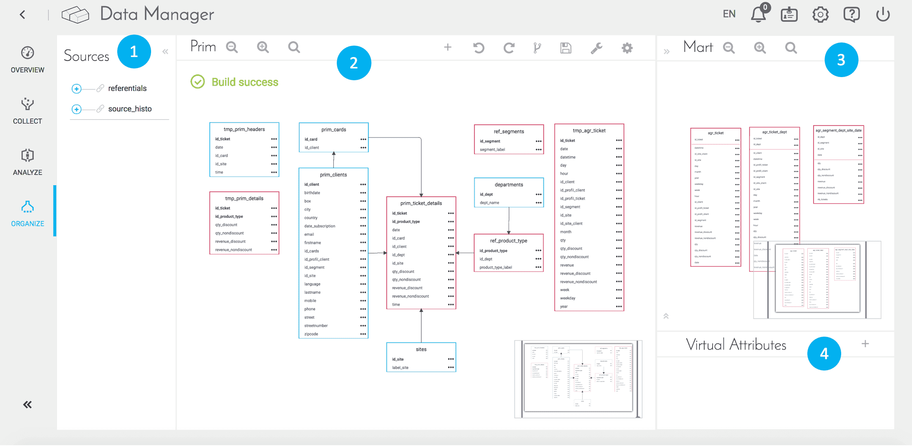
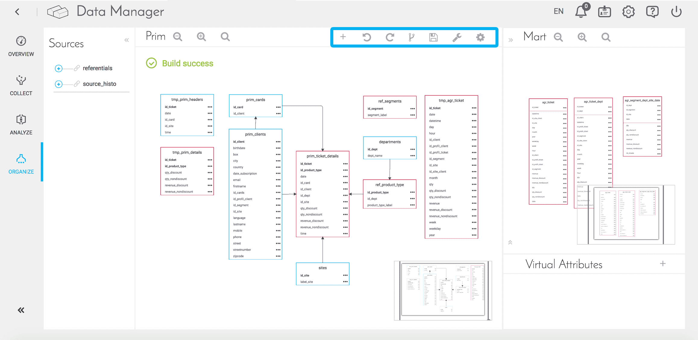
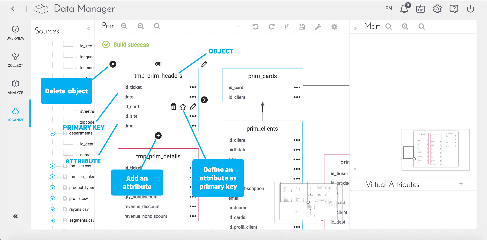

# 体系化

このモジュールでは、分析アプリケーションで利用するすべてのデータの全体像を確認できます。 

ここでは、データの論理構造を視覚的に示すことができ、技術的な制約を気にせずにデータを扱うことができます。 

1. 左側には、「Collect（収集）」メニューに列挙されるソースが表示されます。
2. ソースをここに移動するには、オブジェクトとして表示されているソースをドラッグアンドドロップします。また、主キーとオブジェクト間のリンクを管理することもできます。 
3. 新しいオブジェクトを使用して新しい集計テーブルを作成します。
4. 仮想属性を作成します。仮想属性は保存されることなくオンザフライで処理され、データの復元フェーズで使用できます。 

### 基本的な操作

上部のボタンでは、次の操作を行うことができます。

- オブジェクトの追加（メジャーまたはスケール）  
- 直前の編集の取り消し——前のイメージに戻る  
- 取り消した編集の再実行——次のイメージに進む  
- 直前のビルドの取得——直前のビルドに戻る
- 変更内容をすべて保存
- ETLアクションを自動的に生成（シンプルなロードアクションの場合、このボタンでソースと宛先の間のマッピングアクションをトリガーできる）  
- 表示された論理的構成に対応した物理的スキーマを作成

?> 表示を見やすくするには、拡大／縮小ボタンを使用するか、画面の調整を行います。  

### オブジェクトの作成と編集

オブジェクトを手動で作成する場合は、以下のことを行うことができます。 
 

 
オブジェクトを編集する場合は、次のオプションが利用できます。
- ラベルの追加
- インデックスの追加

**インデックス**を定義すると、インデックス構造を維持するための追加の書き込みコストとストレージ領域が必要になりますが、テーブルのデータ取得操作の速度を向上させることができます。インデックスを使用すると、テーブル内のすべての行を検索することなく、データを素早く見つけることができます。

テーブル内にインデックスを作成するには、テーブルの横のメインの**ペン**✏️アイコンをクリックしてテーブルを編集し、**「ADD AN INDEX（インデックスの追加）」➕**ボタンをクリックしてインデックスを追加します。

最後に、**仮想属性**を追加して、新しい属性を計算して生成できます。仮想属性はデータベース内には保存されず、要求やダッシュボード／復元グラフに合わせてオンザフライで処理されます。
