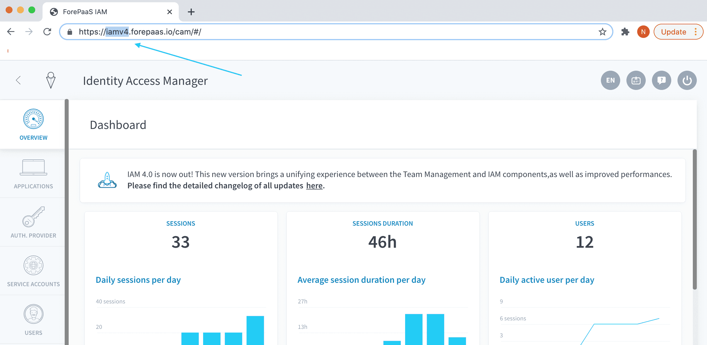

# データプラントの特性

#### データプラントのサブドメイン

データプラントのサブドメインを取得するには、データプラントのURLを参照します。サブドメインは、**データプラントのURLのパスで最初に参照される部分**です。 

例えば、IAMを使用している場合、サブドメインは次のようになります。

```
https://{dataplant_subdomain}.forepaas.io/iam/#/
```

