# データプラントの構成

このページでは、コンポーネントごとに**データプラントの構成をエクスポートまたはインポートする方法**について説明します。構成は、特定のコンポーネントのセットアップ方法に関する情報を含む一連のファイル（JSONおよびコードファイル）です。

このページでは、次の内容について説明します。
* [一時的なアクセストークンを取得する方法](/jp/product/dataplant/config?id=getting-a-temporary-access-token)
* [さまざまなインポート／エクスポートAPI呼び出し](/jp/product/dataplant/config?id=importexport-api-calls-per-component)
* [Data Processing Engine](/jp/product/dataplant/config?id=data-processing-engine)
* [Data Manager](/jp/product/dataplant/config?id=data-manager)
* [Query Builder](/jp/product/dataplant/config?id=query-builder)
* [再利用可能なテンプレートに構成をエクスポートする方法](/jp/product/dataplant/config?id=creating-reusable-dataplant-templates)

> [Postman](https://www.postman.com/)や[Insomnia](https://insomnia.rest/)などのAPI開発ツールを使用してcURL呼び出しを実行することをお勧めします。このガイドでは、セキュアな無料ツールである[Insomnia](https://insomnia.rest/)を使用してAPI呼び出しをテストします。

---

## 一時的なアクセストークンの取得

インポートスクリプトやエクスポートスクリプトを実行するには、**一時的なアクセストークン**が必要です。アクセストークンを取得するには、まず、ForePaaSのインターフェースを介してプラットフォームにログインします。**プラットフォームのいずれかのコンポーネントにアクセス**します。この例では、Data Processing Engineにアクセスします。**画面上を右クリックして、「Inspect（検証）」を選択**します。

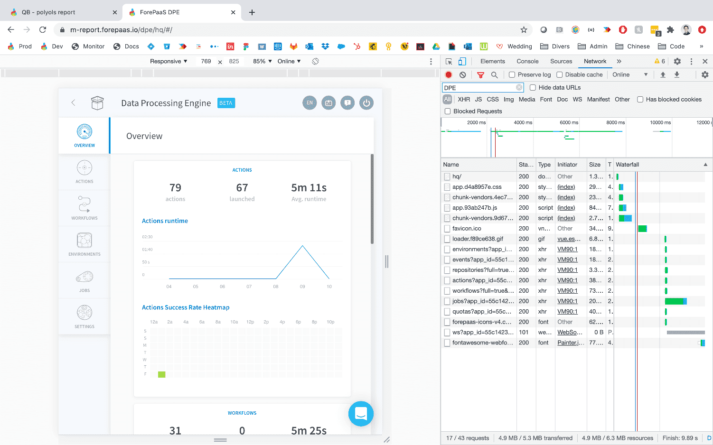

ブラウザのコンソールウィンドウが開いたら、**「Network」タブに移動**します。呼び出しが表示されていない場合は、*F5キーを押すか、ページを更新*します。上記のスクリーンショットのように、利用可能な呼び出しのリストが表示されます。**「workflows」または「actions」で始まる呼び出しを右クリック**し、**「Copy」オプションに移動して、「Copy as cURL」を選択**します。秘密のアクセストークンを含むcURL呼び出しがクリップボードにコピーされます。

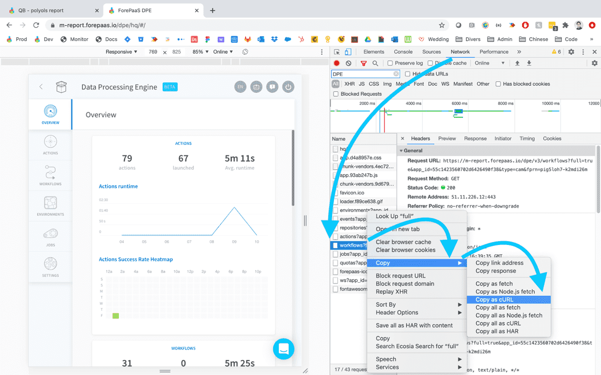

Insomniaを開き、ウィンドウの上部の（Insomniaというタイトルの右側の*GET*ドロップダウンボタンの横にある）**メインヘッダー内に、コピーしたcURLを貼り付け**ます。

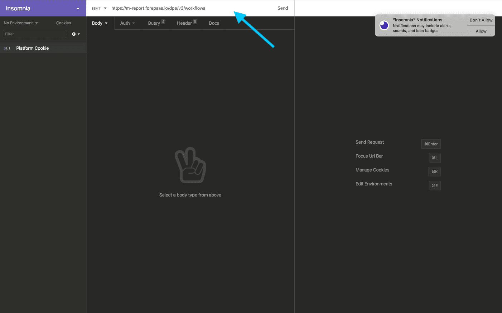

cURLを貼り付けると、Insomniaによって**このcURL呼び出しのすべてのパラメータが自動的に検出され、フォームに入力され**ます。あとは、先ほどコピーして貼り付けた呼び出しからメインのAPI呼び出しを変更するだけで、*ヘッダー*パラメータのリストは変更せずそのままにします。 

ここからは、コンポーネントごとの呼び出しのリストを示します。個々の呼び出しの詳細について説明していきますが、原則として次の操作を使用します。
* *インポート*📤の呼び出しを行う際には*POST*メソッドを使用
* *エクスポート*📥の呼び出しを行う際には*GET*メソッドを使用

これから示す例では、DPEコンポーネントで呼び出しを使用するすべてのステップについて説明します。 

最初に、URL（以下のセクションを参照）をコピーし貼り付けて*構成をエクスポート*し、*GET*に変更して、「*Send*」をクリックします。この呼び出しが成功すると、右側のレスポンスにローカルマシンにダウンロードできるZIPファイルが表示されます。下のスクリーンショットでは、ZIPファイルが圧縮されているため判読できなくなっているのが分かります。

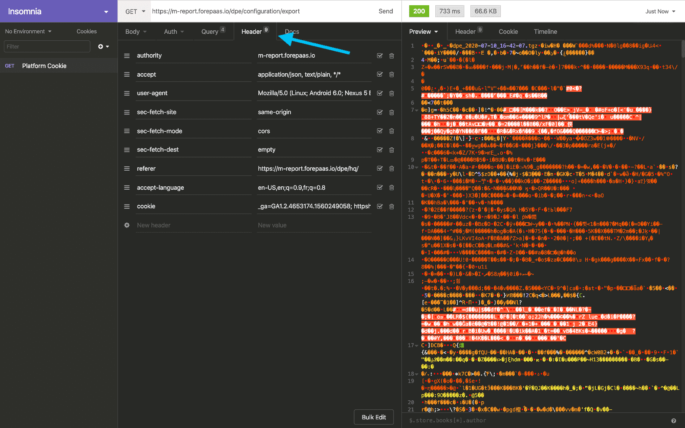

次に、**同じZIPファイルをインポート**して、構成を正しくインポートできるかどうかを確認しましょう。下のスクリーンショットのように、*GET*メソッドを*POST*に変更し、*Body*タイプを*Multipart Form*に変更します。 

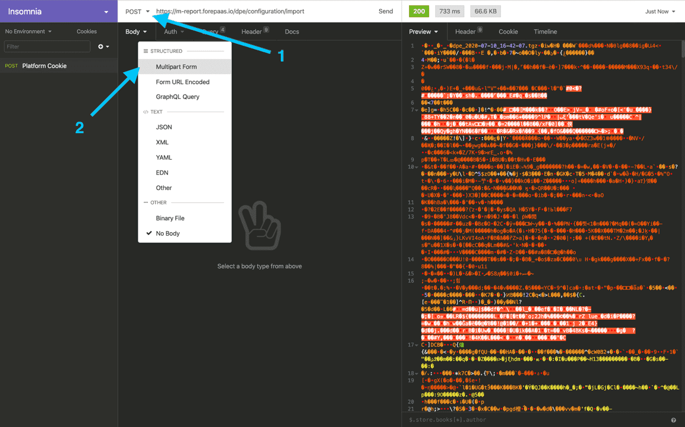

「*Multipart Form*」を選択することで、Bodyにパラメータを追加して、先ほどリクエストの中でエクスポートしたZIPファイルをロードすることができます。 

最初の入力に、`archive`と入力し、「value」の横のドロップダウン矢印で「*File*」オプションを選択します。この場合、お使いのコンピューターからロードするファイルを直接選択できます。

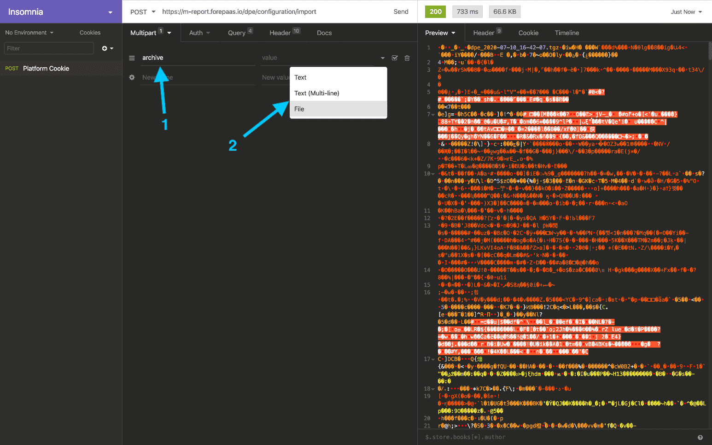

データプラントに**ロードするZIPファイルを選択**します。

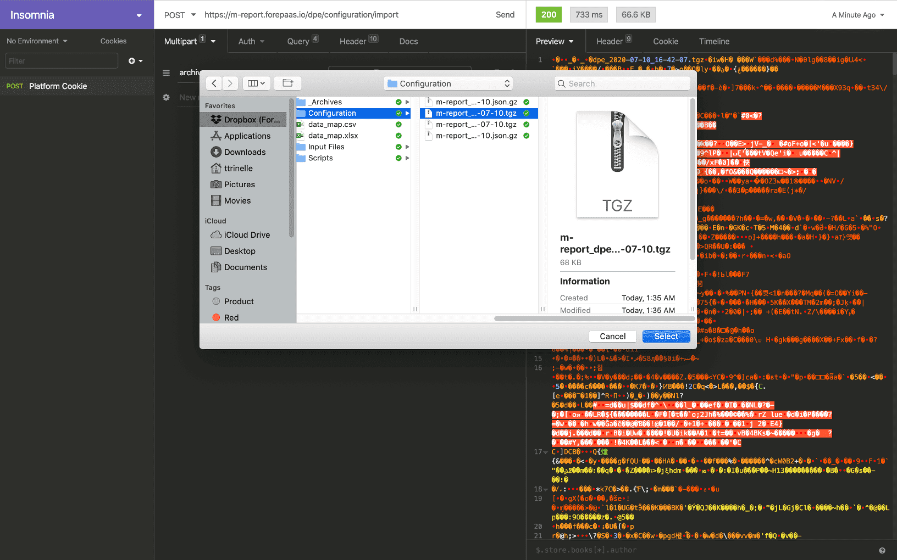

**「Send」📨をクリック**します。

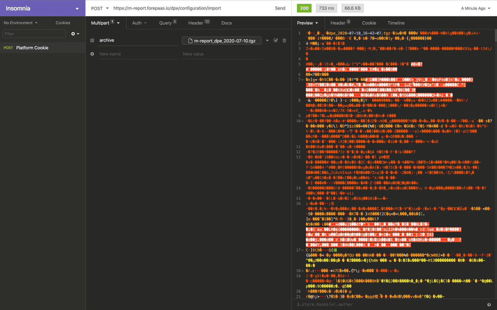

操作は以上です。データプラントページを更新すると、すべてのコンポーネントの構成が再ロードされているのを確認できます。

---

## コンポーネントごとのAPI呼び出しのインポート／エクスポート

### Data Processing Engine

DPEのインポート／エクスポート用の一般的なURLは、以下で始まります。
```cURL
https://datademo.forepaas.io/dpe/
```

> ただし、`datademo`は実際のデータプラントの名前に置き換える必要があります。URLを確認すると、データプラント名が[スラッグ化](https://en.wikipedia.org/wiki/Clean_URL#Slug)されていることが分かります。

#### エクスポート

```cURL
GET /configuration/export
```

リクエストの*Body*セクションに以下のパラメータを入力します。

| パラメータ | 説明 |
| :--------- | :---------- |
| **sourceType** | 構成のエクスポートに使用する形式。*tgz*または*git*を指定可能 |
| **sourceVersion** | エクスポートする構成のバージョン。デフォルトですべてのバージョンをエクスポート |
| **sourceParam** | sourceTypeとして*git*を使用する場合に、構成を抽出するリポジトリのURL |
| **filters** | 抽出するリソースのタイプ（アクション、ワークフロー、または環境）、およびエクスポートするリソースの名前。デフォルトで、すべてのリソースのタイプをエクスポート。例：`filters : {“action” : [“action1”, “action2”]}` |

sourceTypeが*tgz*の場合は、圧縮ファイルが返されます。構成のリストを特定の*git*または*url*の宛先に送信するには、sourceTypeの値を変更します。

例えば、**完全なURLは次のようになります**。
```
https://datademo.forepaas.io/dpe/configuration/export?token=TOKEN
```

!> `datademo`をデータプラント名に変更し、アクセストークンを実際の値に変更するのを忘れないようにしてください。

#### インポート

```cURL
POST /configuration/import
```

POSTリクエストの*Body*セクションで以下のパラメータを使用します。*トークン*のみがリクエストの*パラメータ*内に残ります。

| パラメータ | 説明 |
| :--------- | :---------- |
| **sourceType** | 構成のエクスポートに使用する形式。*tgz*（デフォルト）または*git*を指定可能 |
| **sourceParam** | sourceTypeとして*git*を使用する場合に、構成を抽出するリポジトリのURL |
| **sourceBranch** | sourceTypeが*git*の場合のリポジトリ内のブランチ名 |
| **archive** | sourceTypeが*tgz*の場合の構成を含むアーカイブ |

例えば、**完全なURLは次のようになります**。
```
https://datademo.forepaas.io/dpe/configuration/import?token=TOKEN
```

!> `datademo`をデータプラント名に変更し、アクセストークンを実際の値に変更するのを忘れないようにしてください。

### Data Manager

Data Managerのインポート／エクスポート用の一般的なURLは、以下で始まります。
```cURL
https://datademo.forepaas.io/dwh/
```

> ただし、`datademo`は実際のデータプラントの名前に置き換える必要があります。 

#### エクスポート

```cURL
GET /export?token=TOKEN&dwhName=ORGAID_FPRN
```

リクエストの*Body*セクションに以下のパラメータを入力します。

| パラメータ | 説明 |
| :--------- | :---------- |
| **filters** | 抽出するリソースのタイプ（sources、metas_attribute、logical_object、logical_object_mart）、およびエクスポートするリソースの名前。デフォルトで、すべてのリソースのタイプをエクスポート。例：`filters : {“action” : [“action1”, “action2”]}` |

#### インポート

```cURL
POST /import?token=TOKEN&dwhName=ORGAID_FPRN
```

POSTリクエストの*Body*セクションで以下のパラメータを使用します。

| パラメータ | 説明 |
| :--------- | :---------- |
| **url** | *tgz*ファイルが配置される*url* |
| **source** | *url*が空の場合に構成を含むファイルアーカイブ |

### Query Builder

Query Builderのインポート／エクスポート用の一般的なURLは、以下で始まります。
```cURL
https://datademo.forepaas.io/qb/
```

> ただし、`datademo`は実際のデータプラントの名前に置き換える必要があります。 

#### エクスポート

```cURL
GET /export?token=TOKEN
```

リクエストの*Body*セクションに以下のパラメータを入力します。

| パラメータ | 説明 |
| :--------- | :---------- |
| **sourceType** | 構成のエクスポートに使用する形式。*tgz*または*git*を指定可能 |
| **sourceParam** | sourceTypeとして*git*を使用する場合に、構成を抽出するリポジトリのURL |

#### インポート

```cURL
POST /import?token=TOKEN
```

POSTリクエストの*Body*セクションで以下のパラメータを使用します。

| パラメータ | 説明 |
| :--------- | :---------- |
| **sourceType** | 構成のエクスポートに使用する形式。*tgz*（デフォルト）または*git*を指定できます。 |
| **sourceParam** | sourceTypeとして*git*を使用する場合に、構成を抽出するリポジトリのURL |
| **file** | sourceTypeが*tgz*の場合に構成を含むファイルアーカイブ |

---

## データプラントの再利用可能なテンプレートの作成

API呼び出しを使用してデータプラントの構成を手動で簡単にエクスポートおよびインポートできることを確認しました。これは特に、データプラント間で一連のアクションやクエリを再利用する場合に便利です。また、プロジェクトごとに1つのインスタンスをデプロイする場合は（例えば、建設現場、倉庫、発電所など）、**データプラントの構成を再利用可能なテンプレートとして保管**するのも便利です。 

データプラントの構成は内部のForePaaSストアに容易にエクスポートが可能であり、新しいデータプラントの作成時に再利用することができます。これを行うには、エクスポートするデータプラントにアクセスし、**上部のナビゲーションバーの⚙️アイコンをクリック**します。

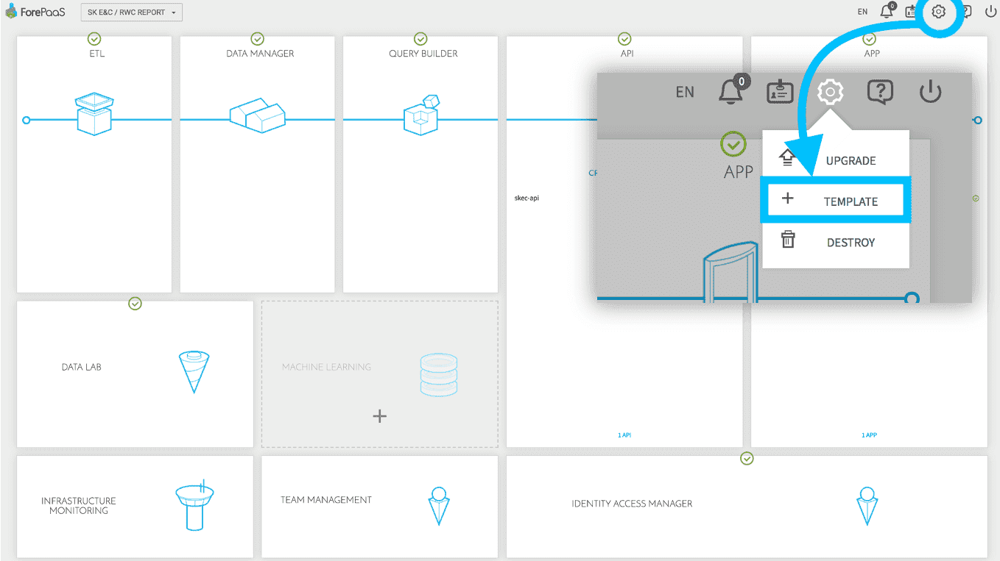

テンプレートに名前を付け、テンプレートを「*private（非公開）*」のままにするかどうかを選択します。
* 「*private（非公開）*」テンプレートは組織内のみで利用できます。
* 「*public（公開）*」テンプレートは新しいデータプラントを作成する際にForePaaS上のすべてのユーザーが利用できます。

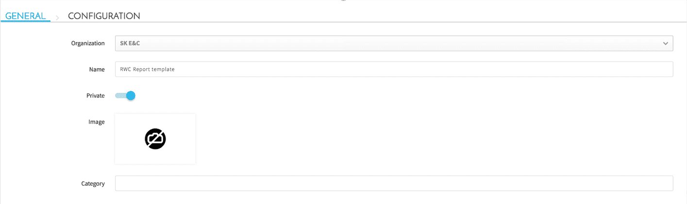

「*Configuration（構成）*」タブでは、テンプレートに保存するコンポーネントの構成を選択できます。アプリケーションをエクスポートすることなく、DPEアクション、ワークフロー、Data Managerのデータモデルなどを保管できます。

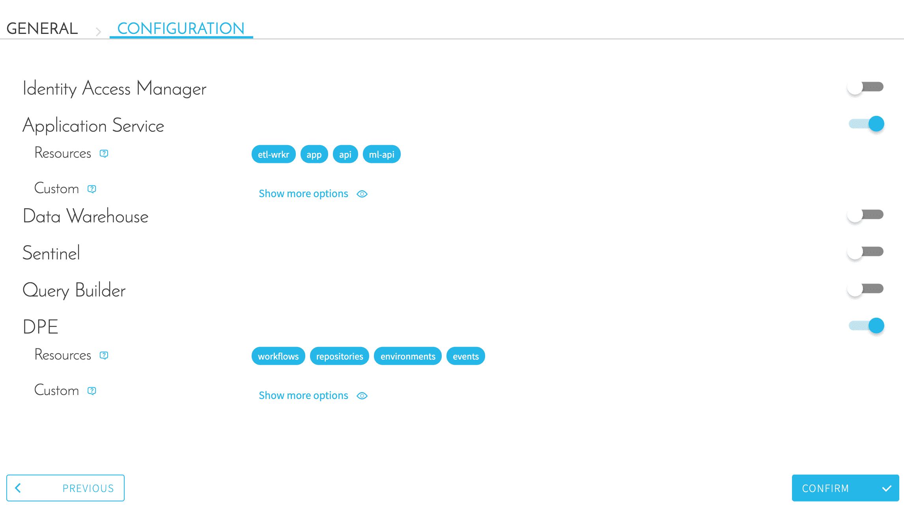

**「Confirm（確認）」をクリック**すると完了です。これで、新しいデータプラントを作成する際に、作成したテンプレートを利用できるようになります。

---

## お探しの情報が見つからない場合🔍

**疑問点やご質問**がある場合は、弊社の[サポートポータル](https://support.forepaas.com/hc/en-us/requests)から直接依頼を送信できます。サポートポータルには、プラットフォームの上部のナビゲーションバーの❓セクションからアクセスできます。また、support@forepaas.com宛にメールを送付することもできます。

{サポートに質問を送付する🤔}(https://support.forepaas.com/hc/en-us/requests)