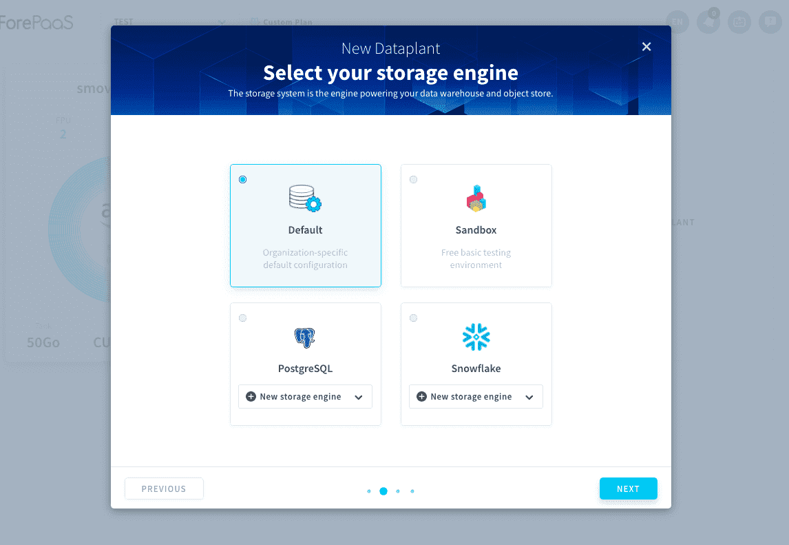
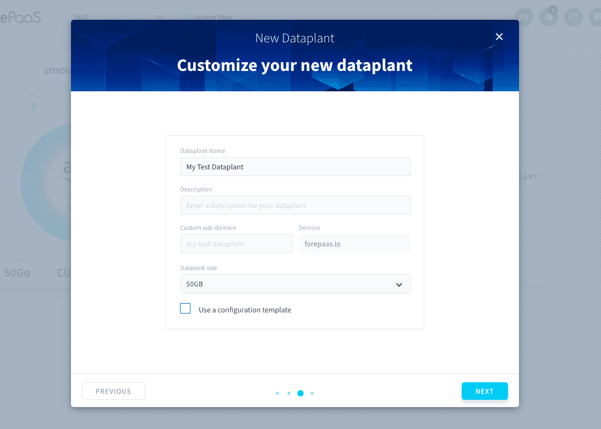
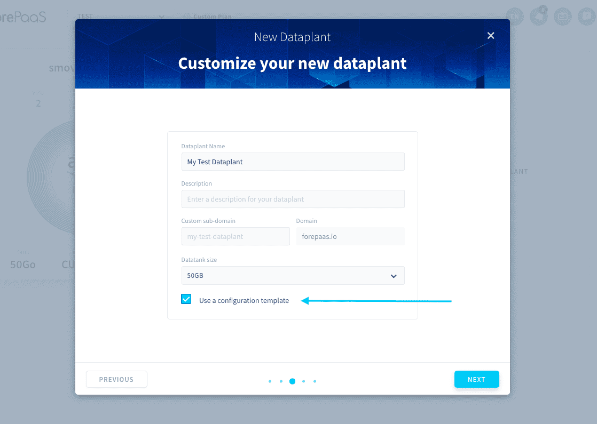
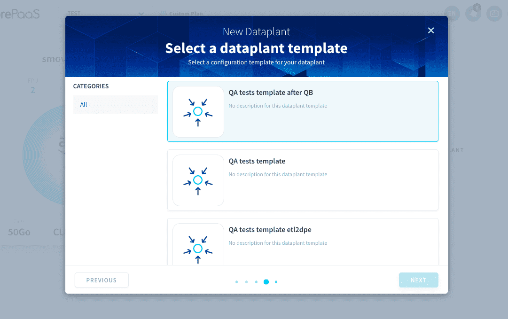
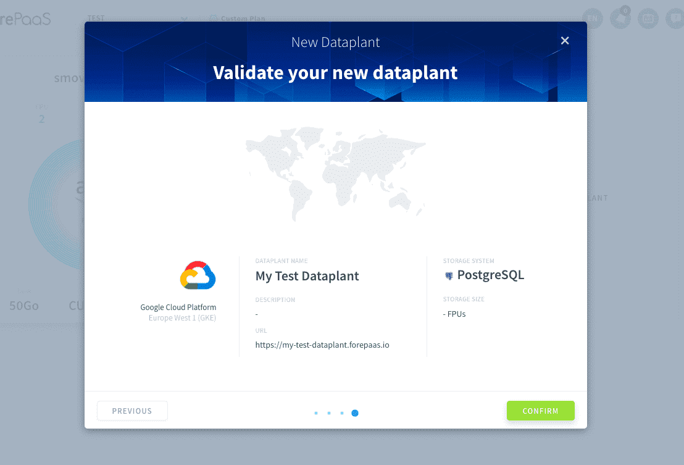

# データプラントの作成

データプラントはわずか数分で作成できます。データプラントを利用すると、データアプリケーションやアルゴリズムのプロジェクトの作成、デプロイ、拡張を素早く行うことができます。

データプラントの作成時には、クラウドプロバイダーやデータの保管場所（クラウド環境またはオンプレミス環境）を選択できます。その後はプロジェクトを通じて、水平スケーラビリティや垂直スケーラビリティを利用することで、データプラントの機能やストレージボリュームを拡張していくことができます。 

データプラントは、次の4つのステップで作成します。

---
## データを保管するクラウドプロバイダーの選択

各クラウドプロバイダーのスクロールダウンメニューには、データを保管できるデータセンターのリストが表示されます。データセンターは1つだけ選択できます。 

---
## データプラントのストレージエンジンの選択
[ストレージエンジン](/jp/product/dataplant/storage-engine/index)は、データプラントの**データを「物理的に」保管**するテクノロジーです。新しいデータプラントを作成する際には、使用する[ストレージエンジンを選択](/jp/product/dataplant/storage-engine/index.md?id=link-a-storage-engine-to-a-dataplant)する必要があります。

---
## データプラントのカスタマイズ

ここでは、データプラントの名前を設定できます。この名前は変更できず、データプラントのドメイン・ネーム・システム（DNS）に対応したものになります。また、説明を追加できます。 

オプションで、データプラントを素早く作成できるように、[テンプレート](/jp/product/dataplant/config.md?id=creating-reusable-dataplant-templates)の使用を選択することもできます。

---
## 概要と確認

最後に、データプラントに関するすべての情報をまとめた次のような画面が表示されます。

「**Confirm（確認）**」をクリックすると、データプラントの作成が始まります。

この確認フェーズでは、一連のサービスが起動されて実際のデータプラントの作成が行われます。このため、次のようなテクノロジーの設定に手間取ることなく、自動的にクラウド環境を構築できます。
* ロードバランサー
* プロキシ
* セキュリティルール
* ファイアウォールWebアプリケーションのデプロイ
* DPE、データベース、DNSサーバーの初期設定  

作成が完了すると、データプラントにアクセスできるようになります。

---
##  サポートが必要な場合🆘

データプラントやストレージエンジンについてのサポートが必要な場合は、プラットフォームの「*Support（サポート）*」タブから直接依頼を送信することができます。また、support@forepaas.com宛にメールを送付することもできます。