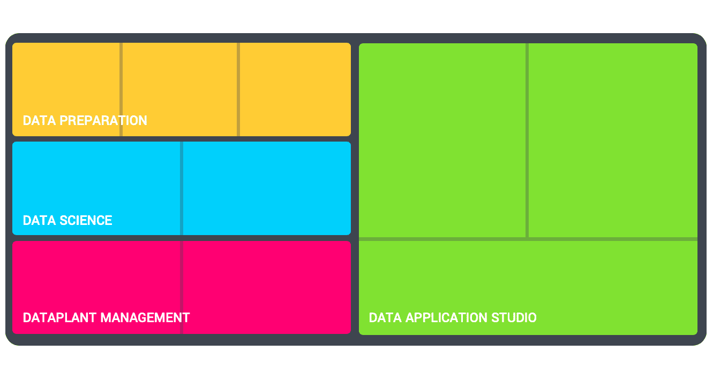

# データプラント

**データプラント**は、データの取り込みから復元までのデータのライフサイクルを管理するのに必要なすべてのコンポーネントを含む、専用のコンピュートおよびストレージリソースを備えたクラウド環境です。

---

## 概要

ForePaaSでデータプラントを使用すると、データアプリケーションの作成や運用アルゴリズムの適用に必要な数多くのタスクを自動化することができます。データプラントでは、データとデータの処理プロセスを組織全体で一貫性のある形で表示できます。

データプラントは**組織**内でまとめられるため、ユーザーのアクセス権限を管理するのに役立ちます。会社全体で1つの組織を使用することも、会社内のビジネスユニットや部門ごとに1つの組織を使用することもできます。 

### データプラントを使用する目的

一般に、データプラントは、さまざまなデータソース、ストレージ、処理、API、視覚化アプリケーションを使用して、特定のユースケースに対応するものです。複数のデータプラントを使用し、同じユースケースに対して異なる複数の環境（開発環境と運用環境など）で作業を行うことができます。また、ユースケースに応じて異なる複数のデータプラントを使用することもできます。 

データプラントは次のことを行うのに役立ちます。
* 1つまたは複数のアプリケーションに関わる1つのチームの構成
* 特定のデータベースにリンクしていないデータの論理ビュー作成
* ハイレベルなインターフェースを介したデータ収集と変換の簡素化および自動化
* データと予測モデルとの関連付け
* ハイレベルなインターフェースによるデータのクエリ
* APIおよびアプリケーションの素早いビルドとデータのビジュアル化
* ユーザーおよびユーザーのデータアクセス権限の微調整

### データプラントのコンポーネント
データプラントは、異なる複数の機能カテゴリーに分類できる複数のモジュールで構成されています。

* データプラント管理：リソース管理とアクセス制御
  * チーム管理
  * インフラモニタリング
* データの準備：収集、保管、クエリ
  * データウェアハウス
  * ETL
  * Query Builder
* データサイエンス：Notebooksおよびモデル管理
  * データラボ
  * 機械学習
* データアプリケーションスタジオ：クエリ、ゲートウェイ、視覚化、アクセス制御
  * API
  * APP
  * Identity Access Manager

{データプラント作成の詳細を確認する}(#/jp/product/account-setup/create-dataplant.md)

---
## データプラントでリソースを割り当てる方法 

データプラント内の各コンポーネントは実行中に[リソース](/jp/product/billing/resources/index)を消費します。ジョブごとにそれぞれのコンポーネントで使用されるリソースを管理することができます。

> アイドル状態のときでも、データプラントはデフォルトでFPUをわずかに使用します。この使用量は[インフラモニタリング](/jp/product/infra-monitoring/index)で管理できます。

{リソース消費の詳細を確認する}(#/jp/product/billing/resources/index.md)