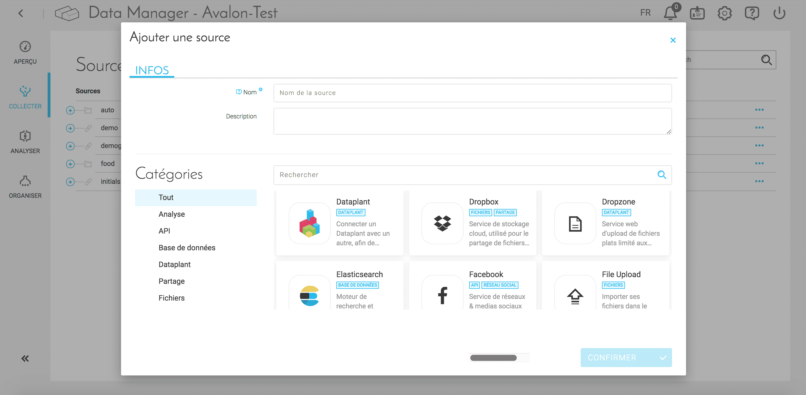
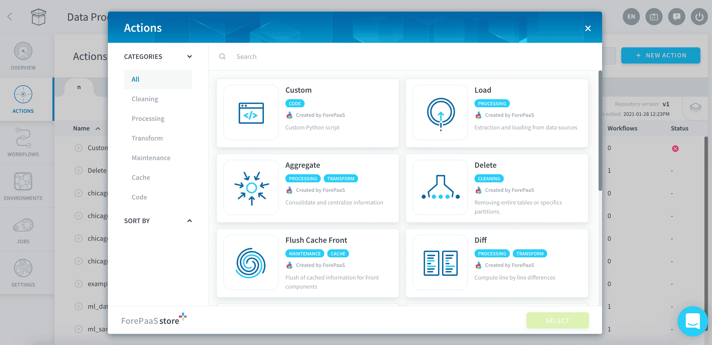
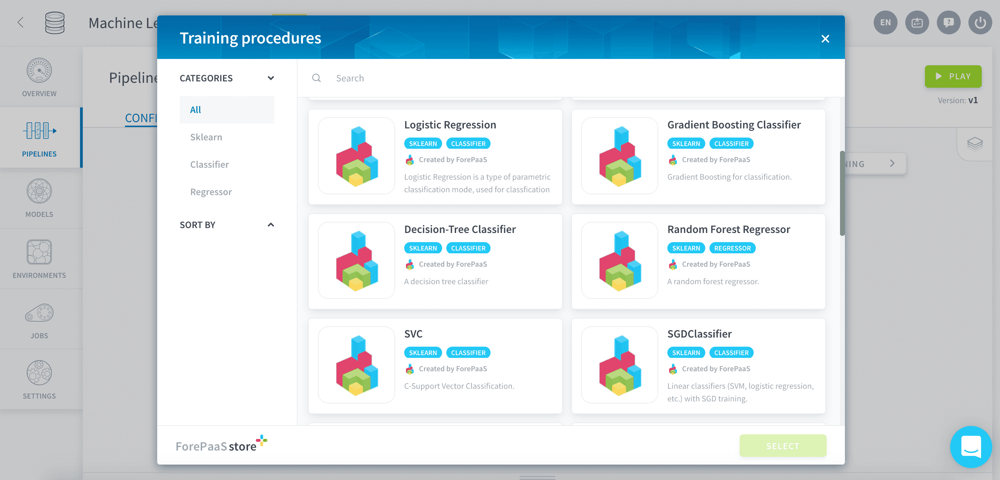
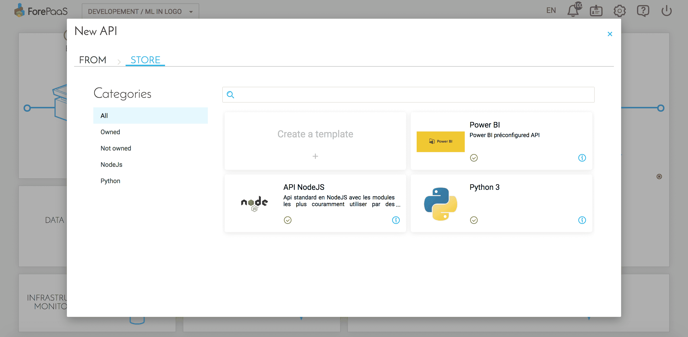
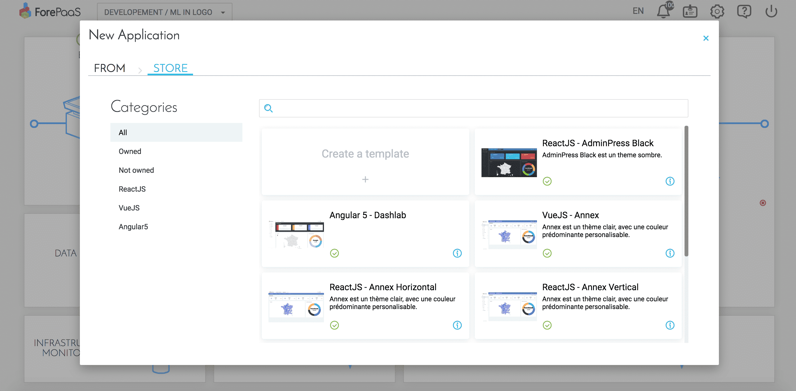

# ForePaaSのマーケットプレイス

ForePaaSプラットフォームでは、データ運用チェーンの各ステップで、マーケットプレイスを介してリソースや成果物の作成、共有、利用を行うことができます。

* **[収集](/jp/product/dataplant/marketplace.md?id=connectors-marketplace)**：データソースとの容易な接続
* **[変換](/jp/product/dataplant/marketplace.md?id=dpe-marketplace)**：あらかじめ作成されたETLアクションでの動作 
* **[データサイエンス](/jp/product/dataplant/marketplace.md?id=machine-learning-marketplace)**：人工知能アルゴリズムの活用
* **[公開](/jp/product/dataplant/marketplace.md?id=api-and-app-marketplace)**：ウィジェットやダッシュボードのテンプレートの統合

マーケットプレイスには数多くのツール、モデル、テンプレートなどが収集されているため、分析アプリケーションやAIアプリケーションを作成する際の時間を節約できます。 

---
## コネクターのマーケットプレイス

Data Manager内でマーケットプレイスを利用すると、数回のクリックで、あらゆるソースからあらゆるタイプのデータを収集できます。 

{データ収集の詳細を確認する}(#/jp/product/data-manager/collect/index)

---
## DPEのマーケットプレイス

Data Processing Engine内では、マーケットプレイスによって、データを効率的に変換するのに役立つあらかじめ設定された10を超えるアクションが利用できます。必要なアクション（集計、ロード、削除など）を選択するか、カスタムアクションを作成します。 

{Data Processing Engineアクションの詳細を確認する}(#/jp/product/dpe/actions/index)

---
## 機械学習のマーケットプレイス  

ForePaaSでは、完全な学習済みモデルや、推定器やスコアといったMLパイプラインの一部など、AIソリューションのあらゆるコンポーネントを統合できます。

{Machine Learning Managerの詳細を確認する}(#/jp/product/ml/index.md)

---
## APIおよびアプリケーションのマーケットプレイス
独自のテンプレートを作成して組織内で共有したり、他のForePaaSユーザーに提供したりすることができます。APIテンプレートのNodeJS、PowerBI、Python 3を利用して、APIを容易にビルドできます。  

{API作成の詳細を確認する}(#/jp/product/api-manager/deploy)

App Managerでは、VueJSおよびReactのフレームワークを使用して分析ダッシュボードを新規に作成できます。 

最後に、拡張のマーケットプレイスでは、新しい機能を使ってアプリケーションやAPIを拡張することができます。 

{アプリケーション作成の詳細を確認する}(#/jp/product/app-manager/index)