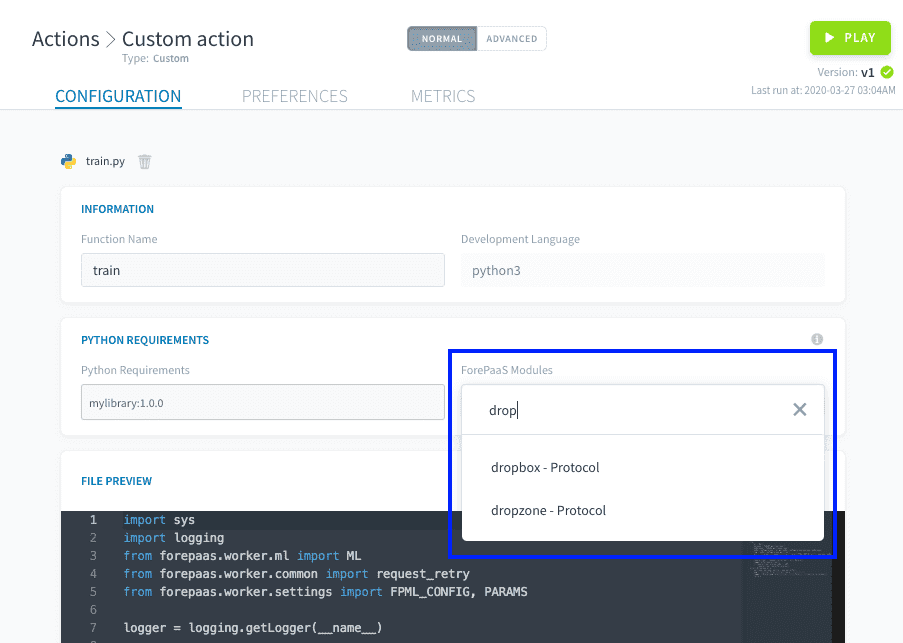

# デフォルトパッケージ

起ち上げられたすべてのアクションとワークフローは、**事前にロードされたパッケージが含まれるコンテナ**内で作成され実行されます。このように、特にカスタムアクションでは、コードを実行するのに必要なライブラリを常に手動で指定する必要はありません。

現在、ForePaaSのジョブはPython 3+にのみ対応しているため、次の2つのデフォルトパッケージのみが使用できます。
* **Pythonライブラリ**：独自のカスタムアクションを作成しようとしている方に、Pythonライブラリについての説明は不要でしょう。バックグラウンドでは、*pip install*コマンドが実行されます。
* **ForePaaSモジュール**：コンテナのイメージが重くならないようにするため、ForePaaSのすべてのコネクターが自動的にロードされることはありません。SDKを使用して特定のコネクターを使用する場合は、内部のサポート対象リストから必要なモジュールを指定します。

---
## デフォルトのPythonライブラリ

以下は、ForePaaS DPEコンテナにデフォルトでインストールされるすべてのPythonライブラリと対応するバージョン番号の一覧です。

```
nameko==2.12.0
pyopenssl==19.1.0
minio==5.0.8
bson==0.5.8
requests==2.22.0
timedelta==2019.4.13
coverage==4.5.4
pycryptodome==3.9.4
kubernetes==10.0.1
sqlalchemy==1.3.8
mysqlclient==2.0.1
prometheus_client==0.7.1
google-cloud-storage==1.36.2
pandas==1.0.0
```

!> **注**：互換性の問題が生じるのを防ぐため、ユーザーは古いバージョンでインストールされたデフォルトのライブラリをオーバーライドできないようになっています。

ただし、UIまたはJSONファイルでカスタムアクション設定の「Requirements（要件）」フィールドにライブラリを追加して、**上記のリストに別のライブラリを追加でインストールすることは可能**です。*pip install*コマンドを使用する場合と同じ形式を使用して、バージョンのライブラリを指定します。

{PyPIの公式WebサイトですべてのPythonライブラリを確認する}(https://pypi.org/)

---
## ForePaaSモジュール

ForePaaSのData Processing Engineを使用して新しいカスタムアクションを作成する場合には、外部データソースに接続して、さまざまなファイル形式を使用することになります。**ForePaaSは、コード内のデータ形式とコネクタータイプを処理するための既存モジュールのリストを保有**しています。 

デフォルトでプレインストールされるモジュールのリストでは主に、一般的なファイル形式とプラットフォームの他のコンポーネント（データウェアハウスやデータストア）がサポートされています（mySQL、S3、CSV、XML、XLS、XLSX、JSON）。Parquetファイル形式はデフォルトでインストールされません。これはモジュールのサイズが約400MBになり、ワーカーのビルドでの遅延が大きくなるためです。

カスタムアクション用のForePaaSモジュールをインストールするには、カスタムアクションの設定画面の「*Requirements（要件）*」セクションを使用します。例えば、SDKの関数を使用して外部Dropboxのソースに接続する際にDropboxモジュールがインストールされていない場合、カスタムアクションを以下のように設定しないとコードがエラーになります。



または、次のように、モジュールのリストをJSON形式のアクション設定ファイルの*modules*キーの下に直接入力することができます。

```
{
  "modules": [
    {
      "type": "action",
      "id": "aggregate",
      "version": "latest"
    },
    { ... }
  ],
```

> **注**：UIドロップダウンではデフォルトで、すべてのモジュールが最新バージョンでインストールされます。特定のバージョンをインストールする場合は、「Advanced（詳細）」モードにし、JSON形式のアクション設定ファイルから直接指定（上記の構文を参照）するようにしてください。

以下は、DPEのワーカーにインストールして**利用できるForePaaSモジュールの完全なリスト**です（Data Managerのソースのマーケットプレイスで利用できるリストに対応しています）。

| モジュール | 説明 | タイプ | テクニカル名 |
| --- | --- | --- | --- |
| Dropbox | Dropboxファイルストレージシステムへのコネクター | プロトコル | dropbox |
| Dropzone | ForePaaSのDropzoneプロトコルへのコネクター | プロトコル | dropzone |
| FTP | FTPプロトコルをサポートするモジュール | プロトコル | ftp |
| Google Drive | Google Driveファイルストレージシステムへのコネクター | プロトコル | google-drive |
| HTTP | HTTPプロトコルをサポートするモジュール | プロトコル | http |
| HTTP REST | HTTP RESTプロトコルをサポートするモジュール | プロトコル | httprest |
| Microsoft One Drive | One Driveファイルストレージシステムへのコネクター | プロトコル | onedrive |
| AWS S3 | AWS S3ファイルストレージシステムへのコネクター | プロトコル | s3 |
| SFTP | SFTPプロトコルをサポートするモジュール | プロトコル | sftp |
| App Figures | [Appfigures](https://appfigures.com/)の分析およびASOツールへのコネクター | コネクター | appfigures |
| GCP BigQuery | Googleのビッグデータ分析プラットフォームへのコネクター | コネクター | bigquery |
| ForePaaS DataPlant | ForePaaSの別のデータプラントへのコネクター | コネクター | dataplant |
| Facebook | Facebook Analyticsへのコネクター | コネクター | facebook |
| Google Analytics | Google Analyticsへのコネクター | コネクター | ganalytics |
| Apache Impala | Apache Impala分散SQLクエリエンジンへのコネクター | コネクター | impala |
| Instagram | Instagram Analyticsへのコネクター | コネクター | instagram |
| Intercom | Intercom Analyticsへのコネクター | コネクター | intercom |
| LinkedIn | LinkedIn Analyticsへのコネクター | コネクター | linkedin |
| Mailchimp | Mailchimp Analyticsへのコネクター | コネクター | mailchimp |
| Parquet | Parquetファイル形式をサポートするモジュール | コネクター | parquet |
| PostgreSQL | PostgreSQLデータベースエンジンへのコネクター | コネクター | postgresql |
| SQL Server | SQLServerデータベースエンジンへのコネクター | コネクター | sqlserver |
| Twitter | Twitter Analyticsへのコネクター | コネクター | twitter |
| Weibo | Weibo Analyticsへのコネクター | コネクター | weibo |
| Youtube | Youtube Account Analyticsへのコネクター | コネクター | youtube |
| Youtube Analytics | Youtube Analyticsツールへのコネクター | コネクター | youtube-analytics |

> **注**：ForePaaSではモジュールのリストの作成と更新を積極的に進めています。お客様のプロジェクトに必要な情報が見つからない場合は、弊社の[製品ポータル](https://hq.forepaas.io/#/features)を通じてお問い合わせください💡。