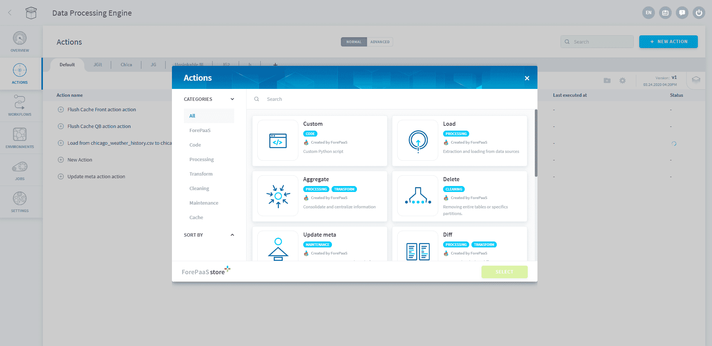
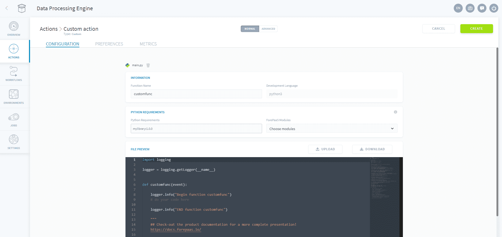
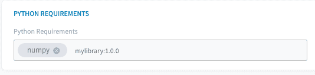

# カスタムアクション

DPEでは、必要に応じてカスタムPython関数を実行できます。ForePaaSの[SDK](#/jp/technical/sdk/dpe/methods)を使用すると、プラットフォームのさまざまなコンポーネントと容易にやり取りし、次のようなさまざまなユースケースを実現できます。
*  データに対して操作を行うアルゴリズムを実行
*  シンプルな機械学習アルゴリズムを実行
*  コネクターを作成せずにForePaaSマーケットプレイスで入手できないデータソースからデータを抽出
*  リアルタイムデータを抽出（MQTT、kafkaなど） 

いずれの場合も、ForePaaSのDPEの以下の機能を利用できます。
* DPEの基本的なアクションではセグメント化が利用できるため、アルゴリズムを並列処理で実行可能
* ワークフロー内で実行することで、アルゴリズムを他のアクションと連携させることが可能

---

## カスタムアクションの作成

データプラントのDPEコンポーネントに移動し、「Actions（アクション）」をクリックしてから「New Action（新規アクション）」をクリックします。アクションタイプ「Custom（カスタム）」を選択し、「Select（選択）」をクリックします。


 
任意のPythonコードエディターを起動し、次のサンプル行をコピーして貼り付けます。 

```python
import logging
logger = logging.getLogger(__name__)

def my_custom_action(event):
  logger.info("Hello John Doe.")
```
このファイルを「example.py」という名前でお使いのコンピューター上に保存します。「Drag and drop（ドラッグアンドドロップ）」セクションにファイルをドラッグアンドドロップします。または、「*start with a boilerplate（ボイラープレートを使用）*」を選択してForePaaSのPython GUIを起動し、ここにサンプル行をコピーします。



この編集ウィンドウでソースファイルを直接編集するか、新しいファイルをドロップすることができます。

関数の名前を入力します。ここでは関数名を「my_custom_action」と指定して、「Create（作成）」をクリックします。

独自のカスタムアクションを作成する際には、SDKで提供されている関数を使用できます。SDKの関数の詳細については、以下の記事を参照してください。

{SDKのすべてのメソッドを確認する}(#/jp/technical/sdk/dpe/methods)

--- 

## 依存関係の管理

### Pythonパッケージのインストール

DPEのワーカーにデフォルトで含まれていないパッケージのインストールが必要になる場合があります。このためには、pip（Pythonパッケージマネージャー）の基本的な要件ファイルで使用されるフォーマットに基づいて「Python Requirements（Pythonの要件）」フィールドにパッケージを追加し、キーボードのENTERキーを押します。

ENTERキーを押した後の画面表示は、次のようになります。  
 
 
### デフォルトの依存関係のリスト

注意：弊社ではマイナーバージョンを積極的にブロックすることで、バグ修正をインストールできるようにしています。新しいバージョンのライブラリが必要な場合は、「Requirements」フィールドに同じパッケージの新しいバージョンを追加して手動でオーバーロードできます。

DPEのワーカーに付属しているすべてのパッケージとバージョン（pipの要件ファイルに記載）の一覧を以下に示します。

{すべてのデフォルトPythonパッケージを確認する}(/#/jp/product/DPE/actions/custom/default-packages.md)

---

## シンプルな関数の例

### ファイルの抽出を行った後にdata_primでロードを行う例

```python
from forepaas.worker.connect import connect
from forepaas.worker.connector import bulk_insert

# connect to the source connector
connector = connect("dwh/dropbox_test/consommations.csv")

# upload raw file from the source connector
connection_str = get_raw(connector)

# connect to the source connect
source = connect(connection_str)

# connect to the destination connector
destination = connect("dwh/data_prim/consommations")

# extract dataframe from source and bulk insert into the connector
for df in extract(source):
  stats, error = bulk_insert(destination, "consommations", df)
```

### data_primとdata_martとの間でデータ転送を行う例

```python
import logging
from forepaas.worker.connect import connect
from forepaas.worker.connector import bulk_insert

logger = logging.getLogger(__name__)

# Connection to a source datastore
connector = connect("dwh/data_prim/prim_consommations")

# Data extraction from the source by a SELECT
lines = connector.select("prim_consommations",{"filter_attribute":"2018-01-01"})

del connector

# Treatment of each line of the data
for line in lines :
    line["new_insight"] = (line["factor1"] + line["factor2"] * 2) / 100

# Connection to the destination datastore
connector = connect("dwh/data_mart/agr_consommations")

# Bulk insert into the destination
stats,err = bulk_insert(connector, "agr_consommations", lines)
logger.info(stats)
logger.info(err)
del connector
```

### その他の例

カスタムアクションは、アクションやワークフローの間でのリンクなど、さまざまなケースで使用できます。アクションおよびワークフローはすべて外部のトリガーイベントを用いて設定できますが、**カスタムアクションを使用してジョブをトリガーする方法**については、次の記事をご確認ください。

{カスタムアクションを用いたジョブのトリガー}(#/jp/product/dpe/actions/custom/start.md)