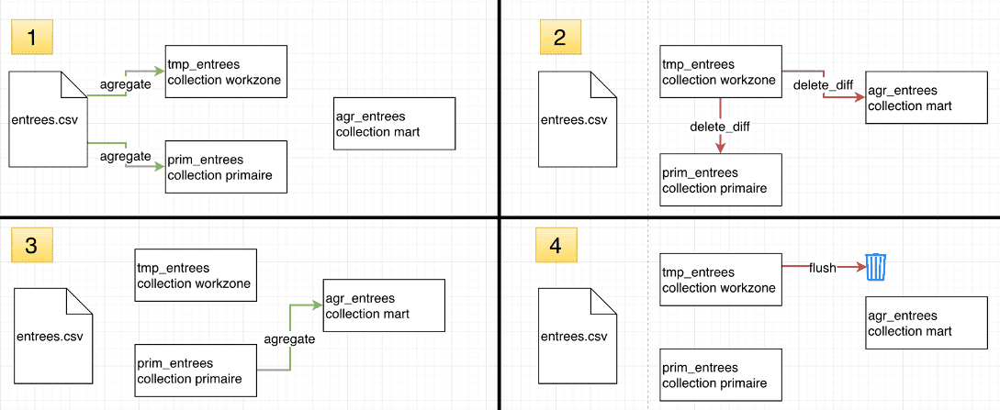

# 差分の削除アクション

このアクションは、以前存在していて今は存在しなくなった古いエントリを削除するのに使用します。ForePaaSのすべてのprim/martデータエンジンに対応しています。

## ユースケースの例

ソースファイルに対して誤りのあるデータが入力されました。この入力データは、DPEによって主テーブルと集計テーブルに自動的に追加されます。誤りのある入力データが見つかると、そのデータはソースから削除されますが、主テーブルと集計テーブルにはそのまま残ります。   

## 使用方法

存在しなくなったアイテムを削除する必要がある場合は、作業領域として機能する一時テーブルを作成し、維持する必要のあるデータのみを格納することをお勧めします。こうすることで、日付フィールドに対する境界を設定して、特定の期間のみを対象に操作することが可能になります。すべてのデータを対象にする必要がある場合は、差分の削除を使用せずに、一時テーブルをフラッシュしてソースから新しいデータを入力するのが最も簡単な方法です。 

一時テーブルを参照テーブルとして使用して、レコードを削除する各テーブルに対して差分の削除アクションを作成します。比較を行う属性を選択します。オプションの、「Preferences（基本設定）」セクションで日付の境界を設定します。 

 

## 詳細モードの例

```
{ 
	"diffToCheck" : [
      {
        "tablecheck": "dwh/data_prim/testfile",
        "tabletodelete": "dwh/data_prim/testfile2",
        "uniqFields": "attr1,attr2"
      }
   ]
}
```
