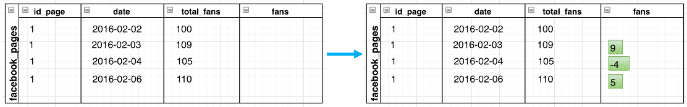
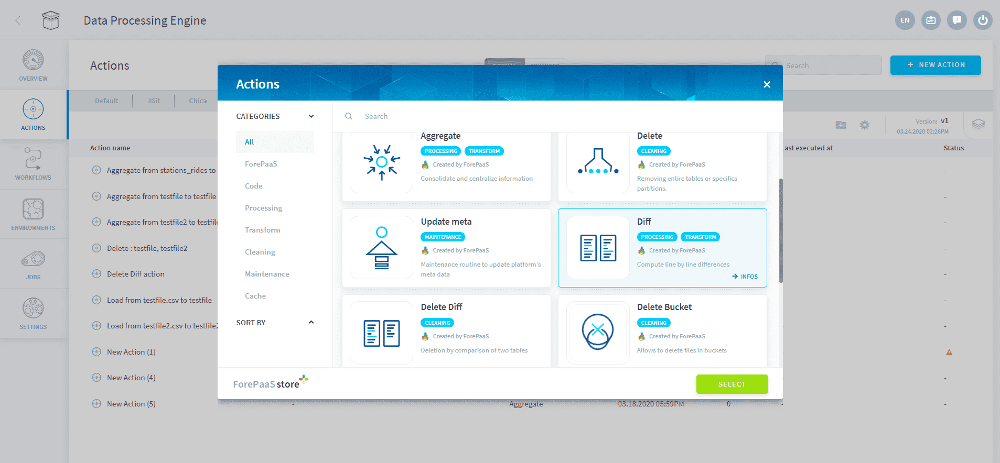

# 差分アクション

## はじめに

特定の時点での合計値（1日の合計オーダー数、毎月の合計収益など）を表した日付付きの属性を含むテーブルがある場合、差分アクションを使用すると、連続する時間増分の間でこれらの値の差を計算することができます。

例えば、ソーシャルメディアのプロファイルページで毎日集計されている以下のテーブルの*total_fans*属性について考えます。*total_fans*がこのプロファイルを作成して以降のファンの合計数を表しているとすると、**差分**アクションを使用することで、日ごとのファンの増減数を計算することができます。

 

IDごとの最初の日付では、前の日付が分からないため、増分値は計算されていません。
オプションの詳細パラメータで作成日を指定すると、合計属性に等しいものとして最初の増分日付の計算が行われます。

---

## アクションの設定

### アクションの設定インターフェース

インターフェースで**差分**アクションを設定する場合は、以下を指定する必要があります。
* 合計値を含む**テーブル名**
* 2つの合計値の間の時間増分を取得するのに使用する**タイムライン属性**
* 計算対象の**メジャー**、1つのテーブルに対して複数指定可能、それぞれに対して**累積値属性**と**増分値属性**を指定

テーブルの主キーは自動的に割り当てられます。 

 

### アクションのJSON形式の設定ファイルサンプル

DPEの他のアクションと同様に、「Advanced（詳細）」モードでJSON形式の差分アクション設定ファイル（以下に示すスニペット）を編集して、差分アクションを設定することもできます。

```
{
    "table": "dwh/data_prim/posts",
    "attribute_timeline": "date",
    "attribute_total": ["total_impressions"],
    "attribute_diff": ["incr_impressions"],
    
    "table_attribute_created_at": "ref_posts",
    "attribute_created_at": "post_createdat",
}
```

### アクションのパラメータ

以下は、JSON形式の設定ファイルで利用可能なすべての属性についての簡単な説明です。

|                パラメータ                | 説明              | 例              | 必須／任意              | 
| :------------------------------: | -------------------------- | -------------------------- | -------------------------- | 
|             **table**              | 差分アクションを実行するテーブルの名前                   |Dwh/agr_site_date| 必須              | 
|            **attribute_timeline**             | タイムラインの属性の名前                 |    date      | 必須              | 
|            **attribute_total**             | 合計を含む属性名のリスト    |    ["total_impressions"]      | 必須              | 
|            **attribute_diff**             | 増分値を含む属性名のリスト |    ["incr_impressions"] | 必須             | 
|            **table_attribute_created_at**             | IDの作成日を含むオプションテーブル |    ref_posts | 任意             | 
|            **attribute_created_at**             | IDの作成日を含むオプション属性 |    post_createdat | 任意             | 

---


