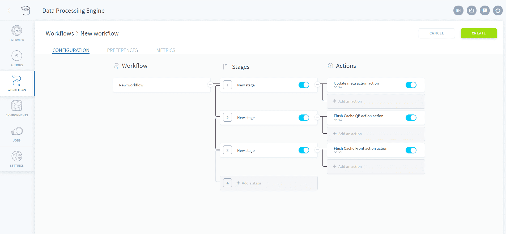
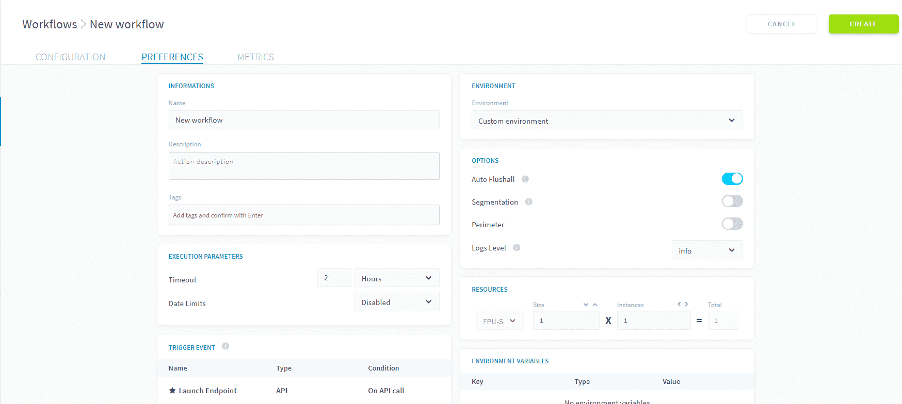

# キャッシュのフラッシュおよびメタデータの更新

## メンテナンスアクション

ユーザーは、APIか視覚的なダッシュボードアプリケーションかに関係なく、最終的なコンシューマーエンドポイントでほぼ瞬時にデータをロードする必要があります。このために、ForePaaSはキャッシュを使用したクエリの結果の事前計算や、データモデルに関する一般情報の事前ロードを行います。

ただし、この場合には、処理手続き中にキャッシュとメタデータの定期的な管理と更新が必要です。ForePaaSストアのアクションのマーケットプレイスには、次の3つのタイプの**メンテナンスアクション**があります。
* **Update-meta**：データモデルのメタデータを更新
* **Flush Cache QB**：Query Builderコンポーネントのキャッシュを更新してデータモデルの最新のデータを表示
* **Flush Cache Front**：データプラントにデプロイされたAPIのキャッシュを更新してクエリごとの最新の結果を表示

## メンテナンスの自動化

ワークフローの中で最適化を行うためにこれらのアクションを実行するタイミングを正確に選択できるのは便利ですが、管理はかなり面倒になる場合があります。このため、弊社では処理手続きにこのメンテナンスルーチンを追加するための2つのシンプルな方法を用意しています。

### 自動ですべてをフラッシュするワークフロー

弊社では新しいデータプラントを作成する際に、4つのアクションを含めたワークフロー*_flushall*を作成することをお勧めしています。これらのアクションは、Update-meta、Flush Cache QB、Flush Cache front、およびPurge Datalakeの4つのステージで順次実行されます。

 

!> **Purge Datalake**アクションは、オブジェクトストア内に現在格納されているすべてのデータを消去するため、デフォルトで作動しないようにします（すぐに使用する予定がない場合でも除外しません）。このアクションでは、アーカイブされたすべての情報が**恒久的**に削除されるため、使用には注意が必要です。

### 自動ですべてをフラッシュするオプション

このメンテナンスルーチンを実行するもう1つの方法に、ワークフローの「Preferences（基本設定）」タブで、ワークフローの「Auto Flushall（自動ですべてをフラッシュ）」オプションを使用する方法があります。この方法では、Update-meta、Flush Cache QB、Flush Cache APIの3つのアクションが実行されます。

 

{キャッシュのフラッシュおよびメタデータの更新の詳細を確認する}(#/jp/product/etl/actions/flush-update-metas/flush-cache-api.md)