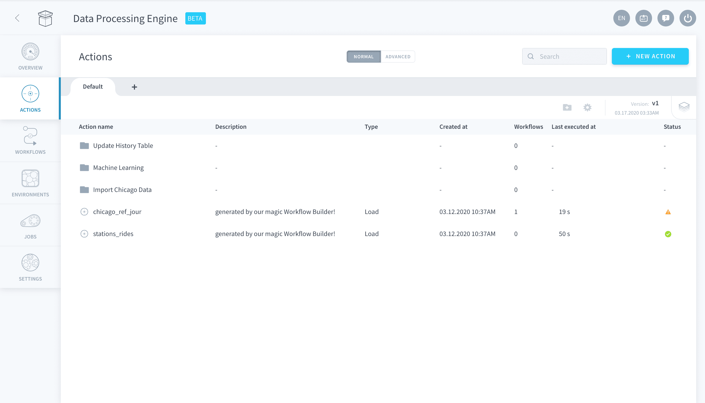
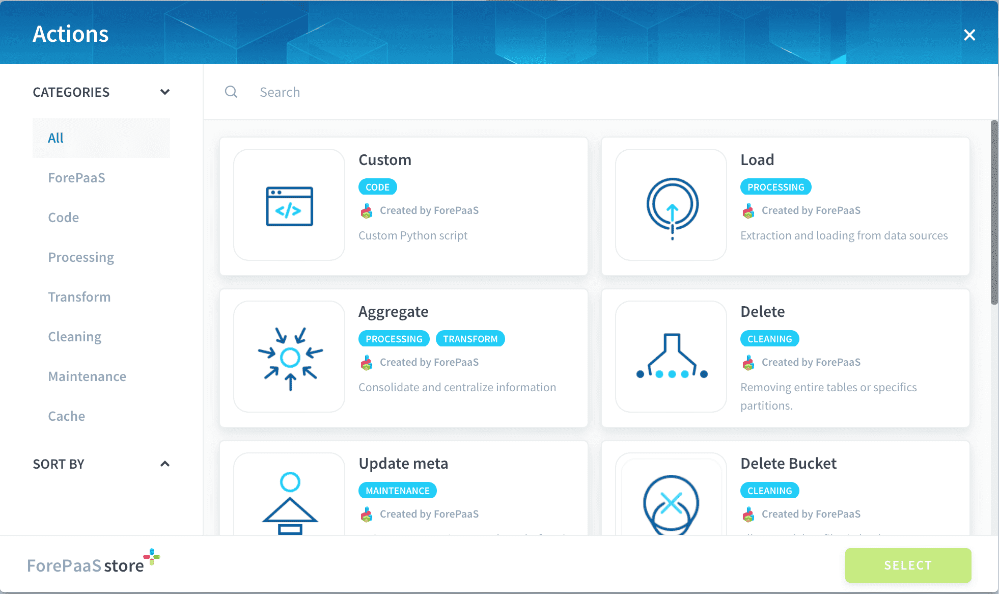
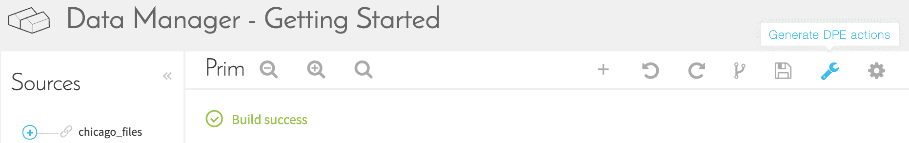
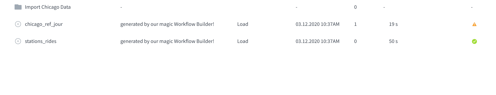
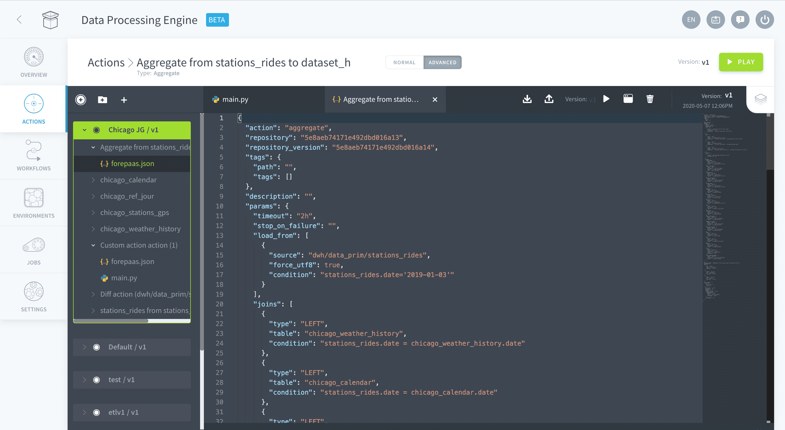

# アクション

DPEの「*Actions（アクション）*」タブは、DPEの重要なコンポーネントです。アクションという名前から分かるように、テーブルへのデータのロードや複雑なカスタムPythonコードなど、さまざまなサービスを実行するアクションを作成できます。

このタブは重要であるため、できるだけシンプルかつ直感的にアクションの整理、視覚化、管理を行えるようにするための方法を用意しています。  

---

## 概要

プロジェクトが成熟していくと、アクションの整理が重要になっていきます。このため、アクションを効果的に整理して管理するのに役立つ複数の方法が用意されています。

-	**リポジトリ**：アクションを各種セクションに分けることができるだけでなく、これらの各セクションをGitリポジトリにリンクすることもできます。

-	**バージョン**：ForePaaSでは、アクションのリポジトリごとにオンラインバージョン管理を行うことができます。つまり、リポジトリ単位でバージョンリストを管理できます。各リポジトリは外部のGitリポジトリにリンクすることができ、この場合、バージョンはGitのコミットと同期されます。このため、運用環境にデプロイされているバージョンに影響を与えることなく、アクションの更新とテストを継続的に行うことができます。

-	**名前付けの自動化**：作成したアクションには分かりやすいシンプルな命名規則に基づいて自動的に名前が付けられるため、アクションを容易に見つけることができます。

-	**説明とタグ**：アクションには*説明*や*タグ*を割り当てることができます。これにより、プロジェクトをドキュメント化することができます。これは、大規模なチームで共同作業を行う場合に特に便利です。

-	**系列**：アクションには「Lineage（系列）」サブタブが存在し、アクションの編集時にアクセスできます。ここには、特定のアクションを使用するすべてのワークフローが表示されます。ワークフローでは、複数のアクションを組み合わせ、ステージを使用してアクションを特定の順序で起動することができます。 

リポジトリに何も無い場合、最初に行うのは**アクションの作成**です。メインページで、画面の右上にある「*New Action（新規アクション）*」ボタンをクリックします。次のように、ForePaaSの内部マーケットプレイスから実行するアクションのタイプを選択するように求められます。 

---

## アクションのタイプ

効率性を高め、アクションを整理するのに役立つように、アクションは次の複数のタイプに分かれています。
-	**Load**：データソースからData Managerのテーブルにデータを抽出、マッピング、ロードします。
-	**Aggregate**：Data Managerのテーブル間でデータを抽出、変換、ロードします。
-	**Truncate**：オブジェクトを完全にクリアします。
-	**Diff**：日付ごとに差分を作成します。つまり、日付に基づいてデータを分割します（データが所定の期間の合計である場合）。
-	**Delete diff**：以前存在していて、今は存在しなくなったエントリを削除します。
-	**Update metas（フル&ライト）、Flush Cache Front、Flush Cache QB**：データの追加／編集後にプラットフォームの中間キャッシュを空にします。
-	**Custom**：データを抽出、ロード、変換するPythonコードを追加します。

これらのアクションについての詳しい説明は、該当するセクションに記載されています。

---

## ヒントとテクニック

### マーケットプレイスの利用

* マーケットプレイスで入手できるあらかじめ定義されたアクションの既存リストを利用して、アクションを新規に作成する手間を省くことができます。
*  データに対して複雑な操作を実行する必要がある場合に、ForePaaSプラットフォームでマーケットプレイスを利用できます。マーケットプレイスの*カスタム*アクションを使用して、独自のPythonスクリプトをロードします。

### ワークフロービルダー

データプロジェクトで数多くのソースを元に集計を行うのは、退屈で面倒な作業になりがちです。ForePaaSでは、効率性と自動化に重点を置いています。Data Managerコンポーネントの「*Organize（体系化）*」タブで、シンプルな*Load*アクションを自動的に作成してソースを主テーブルにリンクすることができます。

これらのアクションが作成されると、DPE内の説明に「Generated by our magic Workflow Builder!（ForePaaSのワークフロービルダーによって生成）」と書かれたアクションのリストが表示されます。ユーザーは直ちにこれらのアクションを使用して、データソースからのウェアハウスのテーブルのロードをオーケストレートするワークフローを作成できます。

> **ワークフロービルダーで生成されたアクションは動的にリンクされています**。このため、データモデルやソースを更新する場合に、Data Managerの「Organize（体系化）」画面で「generate actions（アクションの生成）」をクリックすると、アクションが更新されます。しかし、**DPEインターフェースでこれらのアクションを手動で編集すると、このリンクは解除される**ため、変更がある場合はデータモデルからDPEへ手動で変更を反映する必要があります。

### 詳細モード

Data Processing Engineのアクションは、JSON形式の設定ファイルで指定された一連の入力を用いて設定されます。**ユーザーがアクションの入力を更新する方法は2つあり、GUIを使用して行うか、「詳細モード」を使用**して行います。「詳細モード」の場合、JSON形式の設定ファイルから直接編集できます。そうすることで柔軟性が向上し、利用できるオプションが増えるため、上級ユーザーには便利です。

各アクションの詳細設定オプションは、個別のセクションに記載されています。

> 詳細モードでは、WebでIDE（統合開発環境）のような設定を行うことができるため、カスタムアクションでも役立ちます。この設定では、お使いのコンピューター上でファイルを管理することなく、ForePaaS内でカスタムPythonスクリプトを直接コーディングできます。

---

準備ができたら、集計アクションのインターフェースで複雑なデータ操作を作成しましょう。
{集計アクションの詳細を確認する}(#/jp/product/etl/actions/aggregate/index.md)
