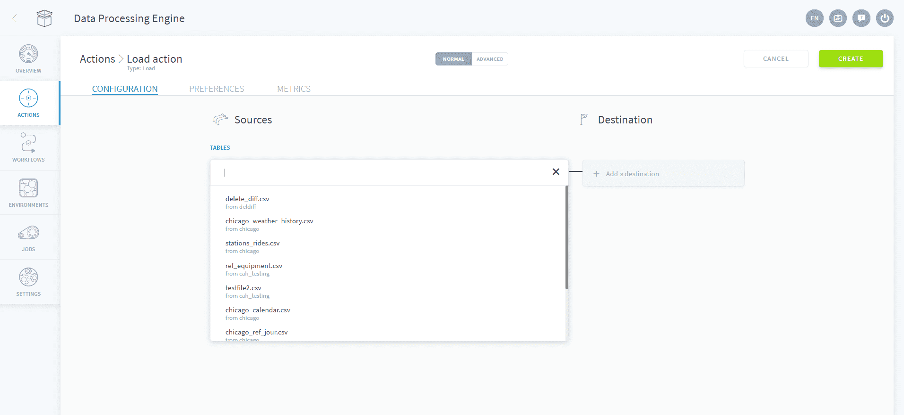
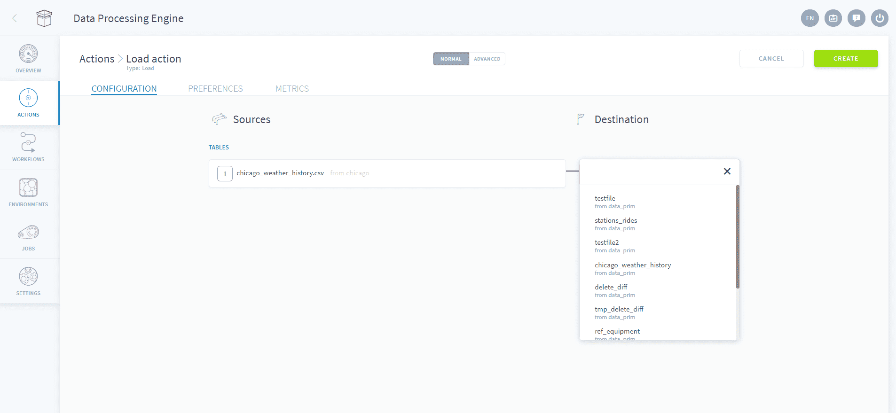
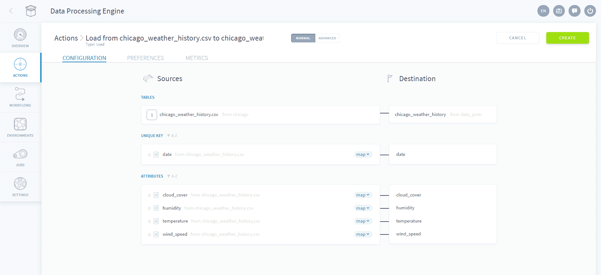
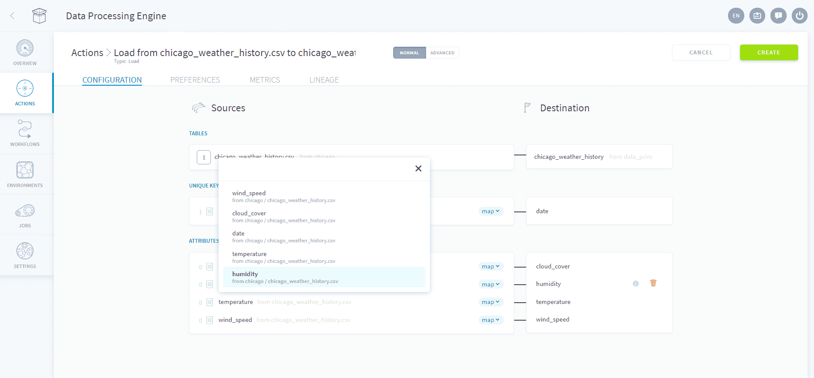
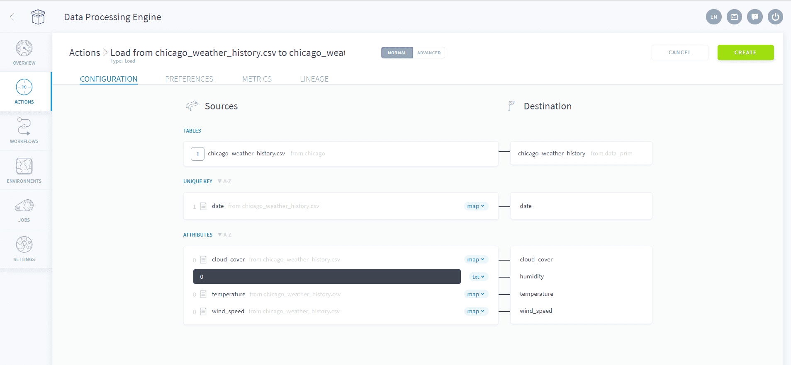
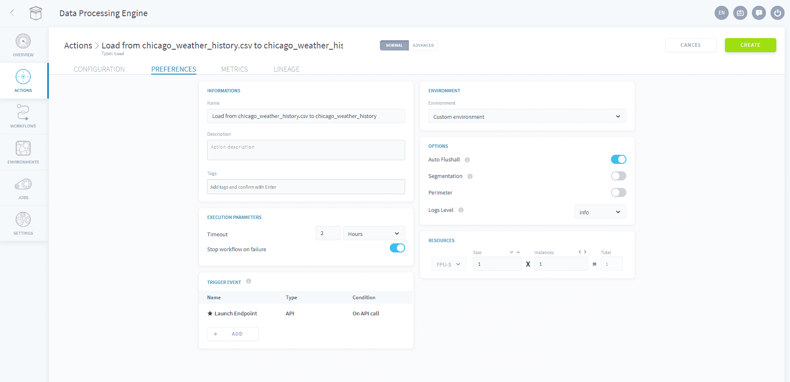

# ロードアクション

## はじめに 

*ロード*アクションは、**ソースから生データを抽出してデータウェアハウスの主テーブルに追加**します。言い換えると、Data Managerを介してコネクターをセットアップしてある場合、データプラントにはソースに接続するための情報は存在しますが、*ロード*アクションを使用して実際にロードするまでは、データプラント内にソースのデータは存在しません。

> そのため、データウェアハウスを使用してソースからのデータに対して他のプロセスを実行するには、前もって*ロード*アクションを実行する必要があります。

## アクションの設定

新しい*ロード*アクションを作成するには、DPEの「*Actions（アクション）*」タブに移動します。「New Action（新規アクション）」をクリックし、「*Load* action（ロードアクション）」を*選択*します。動的な命名システムにより、ソース、宛先、アクションのタイプを用いた分かりやすいアクション名が自動的に生成されますが、これはアクションの「*Preferences（基本設定）*」でオーバーライドできます。

### ソースと宛先のマッピング

*ロード*アクションをセットアップするには、最初にData Managerコンポーネントの「*Collect（収集）*」タブで設定済みのリストから**ソース**を選択します。 

続いて、データの送信先となる**宛先**テーブルを選択します。ソースと同様に、これらのテーブルはData Managerの「*Organize（体系化）*」タブで事前に設定されている必要があります。データモデルが作成済みであることを確認します。データモデルが作成されていない場合、これらのテーブルにプラットフォーム内の他のコンポーネントからアクセスできません。

### 属性のマッピング

ソースと宛先の選択が完了すると、生（未処理）のデータソース内で識別されたさまざまな列を含む宛先テーブルの宛先属性が**自動的にマッピング**されます。通常これらの列は、サードパーティのAPIによって提供されるエンドポイントや、テーブル（データベース、.csv、Excel）内のヘッダーです。

> 下の図では、*date*属性のメモ帳アイコンの横に「1」という値が表示されています。これは、Data Managerで定義された**データ検証ルール（ブループリントルールともいう）**の数を表しています。これらのルールは、データをロードする際に自動的に適用されます。[ブループリントルール](#/jp/product/data-manager/analyze/blueprint-rules.md)を使用すると、ユーザーはNULLや空のセルなどの無効なデータを素早く除外したり、日付や通貨などの値の書式を変更したりすることができます。

次のステップに進む前に、**マッピングが正しく行われているかどうかや、不足箇所がないかどうかを再度確認**します。システムによって宛先属性とマッピングするソース属性が適切に検出されていない場合があります。この例では、ソース属性をクリックして選択内容をオーバーライドします。

必要な場合は、宛先テーブル内に直接、**生テキストを挿入**することができます。これは、データポイントの数をカウントする場合や、集計テーブルで後から使用するラベルを特定のソースに付ける場合などに役立ちます。これを行うには、< txt >を選択してソース属性をテキスト入力フィールドに設定します。

### アクションの設定

属性のマッピングが済んだら、「Preferences（基本設定）」タブに移動してアクションの設定を行います。

### 確認

アクションの編集が済んだら、「Create（作成）」をクリックしてアクションを有効化します。バックグラウンドで、アクションのすべての設定が保存され、ビルドプロセスが実行されます。このアクションの自動ビルドにより、アクションがトリガーされ起動されたときの実行時間の最適化が行われます。

## 詳細モード

JSON形式のアクション設定ファイルにアクセスする必要がある場合は、いつでも「Advanced（詳細）」ボタンをクリックして「Advanced（詳細）」モードにすることができます。
次の章では、JSON形式について説明します。 

{詳細モードに進む}(#/jp/product/dpe/actions/load/advanced-mode.md)

