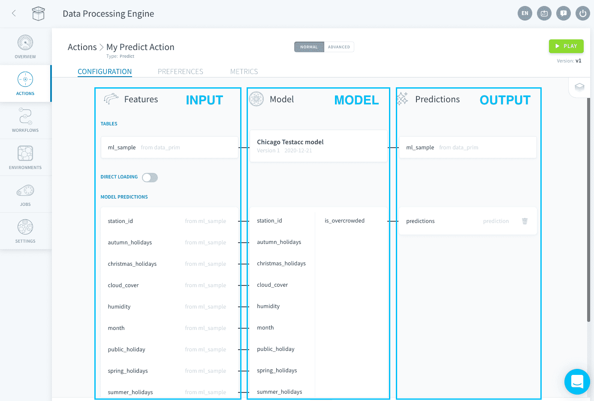
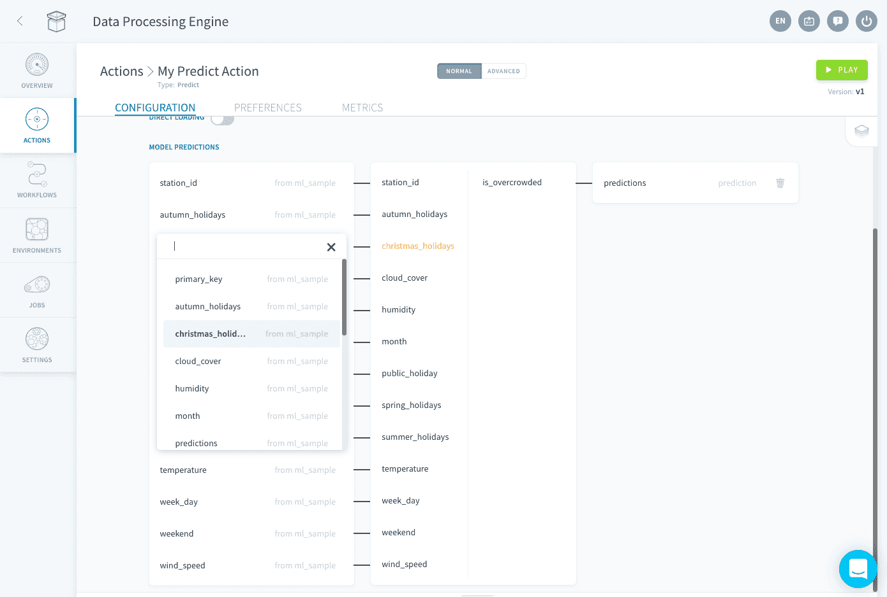
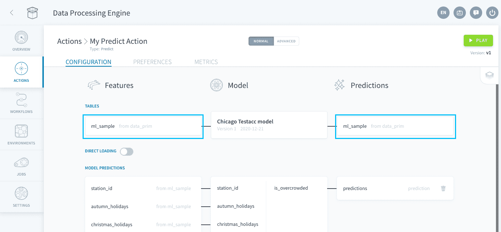
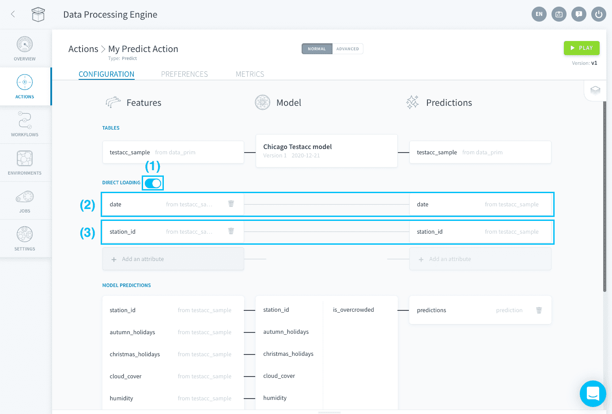
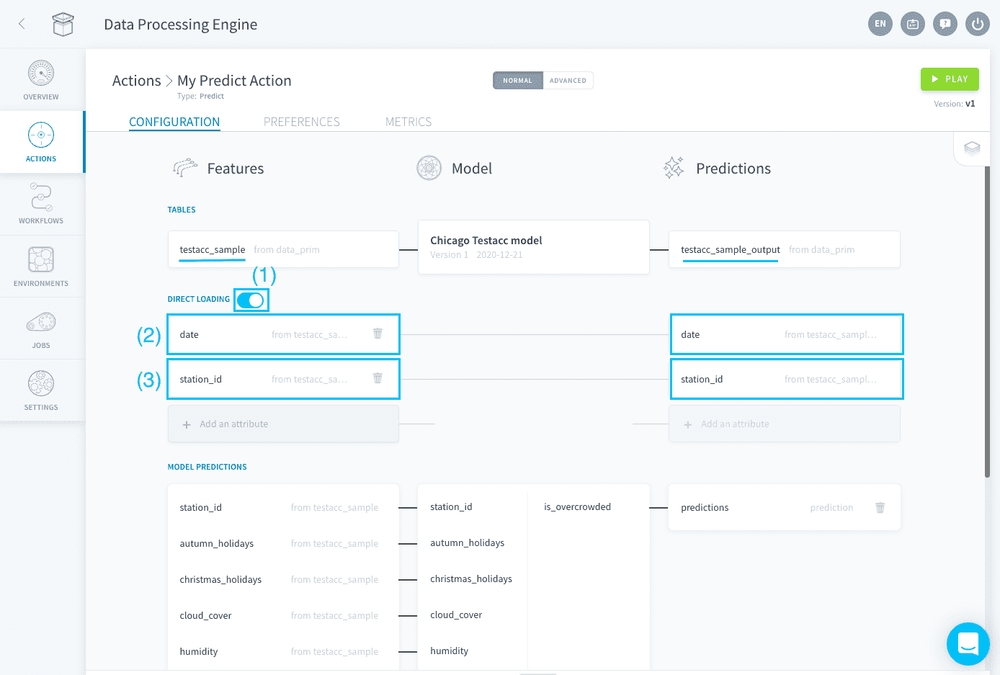

# 予測アクション

予測アクションでは、[機械学習モデル](jp/product/ml/index)を使用して入力データから**AI予測を生成**できます。入力データはData Managerのテーブルから取得する必要があります。出力の予測は、Data Managerの同じテーブルまたは別のテーブルに書き込むことができます。

予測アクションは、*テーブル*を入力または出力として使用するコンシューマーが[パイプライン](jp/product/ml/pipelines/configure/deployment/index?id=create-a-consumer)または[スタンドアローンモデル](jp/product/ml/models/import/index?id=deployment-settings)に追加されたときに、自動的に作成されます。

> 現在、DPEで予測アクションを直接作成することはできません。 

予測アクションは次の3つのゾーンで構成されます。
* [入力](/jp/product/dpe/actions/predict/index.md?id=configure-the-input)：特徴量
* 機械学習モデル
* [出力](/jp/product/dpe/actions/predict/index.md?id=configure-the-output)：予測

---
## 入力の設定

基礎となる機械学習モデルの**すべての特徴量**が入力テーブルの属性にマッピングされている場合、入力は正しく設定されています。マッピングされていないモデルの特徴量は、オレンジ色で表示されます。特徴量にマッピングされた属性を変更するには、対応する属性をクリックしてリストから属性を選択します。

---
## 出力の設定

予測アクションの出力は、基礎となる機械学習モデルから生成される変量です。予測は[同じテーブル](/jp/product/dpe/actions/predict/index.md?id=write-predictions-in-the-same-table)に入力として書き込むか、または[別のテーブル](/jp/product/dpe/actions/predict/index.md?id=write-predictions-in-a-different-table)に書き込むことができます。

### 同じテーブルへの予測の書き込み
予測を同じテーブルに書き込む場合は、「**Predictions（予測）**」のテーブルが「**Features（特徴量）**」のテーブルと同じになるようにします。

DPEで予測を正しい行に書き込むことができるように、「Direct Loading（直接ロード）」セクションでテーブルの主キーを指定する必要があります。

### 別のテーブルへの予測の書き込み

予測を入力とは別のテーブルに書き込む場合は、主キーで識別された行に予測を追加するか、または専用に作成されたテーブルに予測を追加することができます。

主キーで識別された行に予測を書き込む場合は、「Direct Loading（直接ロード）」セクションを使用して入力テーブルと出力テーブルの間で主キーをマッピングする必要があります。

専用に作成されたテーブルに予測を追加する場合は、予測アクションを使用してこのテーブルのすべての属性を物理的に追加する必要があります。
* 出力テーブルに属性が1つしかない場合：予測はこの列の末尾に逐次追加されます。
* 出力テーブルに複数の属性がある場合：予測アクションの「**Direct Loading（直接ロード）**」セクションを使用して入力テーブルからすべてをロードする必要があります。出力テーブルにすでに存在する行が再度追加されることはありません。

!> 「Direct Loading（直接ロード）」セクションで主キーまたは出力テーブルのすべての属性の指定を行わないと、Data Processing Engineで予測を正しく書き込むことができなくなります。

---
##  サポートが必要な場合🆘

> お探しの情報は見つかりましたか。サポートが必要な場合は、プラットフォームの「*Support（サポート）*」ページから直接依頼を送信することができます。また、support@forepaas.com宛にメールを送付することもできます。

{サポートに質問を送付する🤔}(https://support.forepaas.com/hc/en-us/requests)