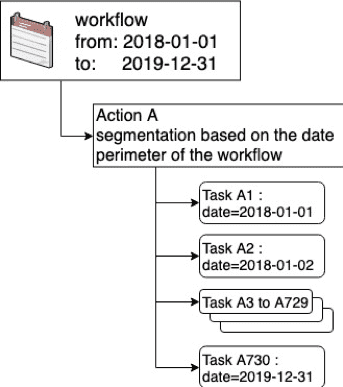
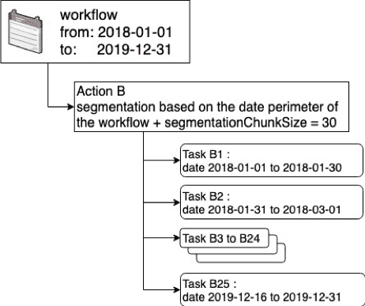

# 関連説明

ここでは、ForePaaSシステム内でのDPEアクションの設計方法について、関連するヒントを示します。疑問点や提案がある場合は、弊社の[製品ポータル](https://portal.productboard.com/ag7nnwdkssrkoqbtjmhdtkfl)にご意見をお寄せいただくか、[サポートチーム](https://support.forepaas.com/)までご連絡ください。

---

## 用語

**セグメント**：
データソースのサブセット。行／列のソースのセグメントは、固定された行数、ソースの属性（日付や値）、またはユーザーアカウント（アカウントベースのソースの場合）に基づいて定義可能
 
**セグメント化**：
DPEのアクションを1つ以上のセグメントを処理する複数のタスクに分割するアクション
 
**セグメント化の値**：
アクションを小規模な複数のタスクに分割するのに使用する参照値

**セグメント化のタイプ**：
詳細モードでのテクニカル名：*segmentationValues*。セグメント化の値のリストを取得するためのプロセスを指定
 
**ソース属性／（セグメント化変数）**：
詳細モードでのテクニカル名：*segmentationVarName*。セグメント化の値に対してフィルターを適用するのに使用するソース内の列を指定

**境界**：DPEにおけるアクションのソースへのフィルタリング

**境界のタイプ**：詳細モードでのテクニカル名：*perimeterValues*。境界の値のリストを取得する方法を指定

**境界の値**：スコープを適用する値のリスト

**ソース属性／（境界変数）**：詳細モードでのテクニカル名：*perimeterVarName*。境界の値に対してフィルターを適用するのに使用するソース内の列を指定

**バケットサイズ**：
詳細モードでのテクニカル名：*segmentationChunkSize*。個々のタスクで処理するセグメント化の値の数

---

## 「バケットサイズ」について

これまでの記事を読んだ方は、いつでも**タスクをバケット（チャンク）にグループ化してデータソースの複数のセグメントを管理できます**。セグメント（値、日付、ソーシャルネットワークのアカウント）のリストに整合性がある場合、タスク数が大きくなりすぎないようにすることができます。

バケットサイズを指定しない場合、デフォルトの「バケットサイズ」の値は1になります（つまり、1つのタスク = 1つのセグメント）。
* バケットサイズを設定しない場合、個々のタスクで1つのセグメントを処理
* バケットサイズを2に設定した場合、個々のタスクで2つのセグメントを処理
* バケットサイズを10に設定した場合、個々のタスクで10のセグメントを処理
* 以下同様

以下は、デフォルト値の1を使用した場合とバケットサイズを30に設定した場合の効果を比較したものです。2018年1月1日から2019年12月31日までの期間で、ワークフローの日付に基づいたセグメント化を行うと仮定します。 

| セグメント化のチャンクサイズなし | セグメント化のチャンクサイズあり |
|             :------------------:          |          :-----------------:           |
|             チャンクサイズ = 1          |          チャンクサイズ = 30           |
|  |  |

最初のケースでは、DPEアクションは730個（365 x 2）のタスクに分割され、1つのタスクが2年間の各日に対応しています。2つ目のケースは、バケットサイズが30に設定されています。このケースでは、個々のタスクで30日分を処理するため、DPEアクションは25個（365 x 2 / 30）のタスクに分割されます。

---

## 例外

### セグメント化のタイプが行数に基づく場合
指定しない場合、バケットサイズと同じセグメント化の行数のデフォルト値は10 000です。 