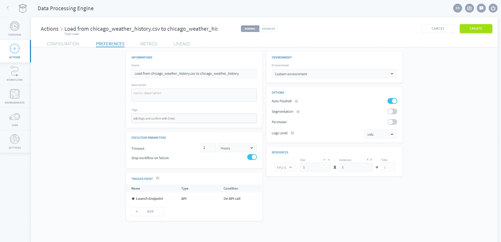

# DPEの基本設定

DPEの各アクションには複数の設定が存在し、これらの設定はアクション画面の「Preferences（基本設定）」タブで管理できます。インターフェースを介して次の3つの主要な設定にアクセスできます。
* **Stops Workflow on Failure（エラー発生時にワークフローを停止）**：アクションで不具合が発生し、*CRITICAL*エラーが生成（ログに表示）された場合、実行中のワークフローを停止し、次のステージまたはアクションを中止
* **Segmentation（セグメント化）**：大きなワークロードをサポートするため、特定の条件に基づいてアクションをサブアクションに分割
* **Perimeter（境界）**：アクションで処理する受け取りデータに対して境界を定義

> **注**：この設定に関するドキュメントは、ForePaaSのDPE環境とデータ管理の一般的な概念を十分に理解しているユーザー様向けです。アクションのパフォーマンスに問題があり、以下の説明で問題が解消されない場合は、遠慮なくお問い合わせください。

---

## セグメント化の設定

DPEのアクションを実行する際には、処理されるデータ量を考慮することが重要です。データ量が多く、ワーカーのリソースが限られている場合、処理能力の上限に達するリスクがあります。これらのアクションを処理するには、アクションの実行を一連のタスクに、インテリジェントに分割する必要があります。
 
セグメント化のオプションを利用すると、処理されるデータ量や特定の属性値に基づいて、**DPEでアクションを分割する方法を定義**できます。分割が行われると、DPEアクションのワークロードは複数のワーカーで並行して分散処理（並列処理）されます。

 

最も一般的な使用方法として、セグメント化では次のことを行うことができます。
* 列に対して**特定の処理フィルターを適用**
* **アクションの実行時間を短縮**するため、処理を複数のワーカーで並列処理し、データソースコネクターへの負荷を軽減
* 毎日実行されるワークフローなどで、ロードアクションを実行するたびに**すべての履歴データを取り込まずに**、直前の数日のみのフィルター処理を実行

{利用可能なセグメント化のオプションについて確認する}(#/jp/product/dpe/actions/settings/segmentation.md)

---

## 境界の設定

DPEアクションの実行中に、処理対象のデータ量が大きくなった場合、必要に応じて、アクションの実行をフィルター処理することができます。**境界のオプションを使用すると、フィルター処理するフィールドとフィルター処理する値のリストの取得方法を定義できます**。

データソースおよび実行するアクションのタイプに応じて複数の境界モードが利用できます。

スコープは具体的に以下を行うのに役立ちます。
* 列に対して処理フィルターを適用
* アクションの実行を高速化
* 特定のデータソースの要求されたワークロードを解放
* 毎日スケジュールされているワークフローで、過去のすべてのデータを処理せずに、直前のX日のデータのみを処理

{利用可能な境界のオプションについて確認する}(#/jp/product/dpe/actions/settings/perimeter.md)

---

このセクションはお役に立ちましたか。疑問点や提案がある場合は、弊社の[製品ポータル](https://portal.productboard.com/ag7nnwdkssrkoqbtjmhdtkfl)にご意見をお寄せいただくか、[サポートチーム](https://support.forepaas.com/)までご連絡ください。