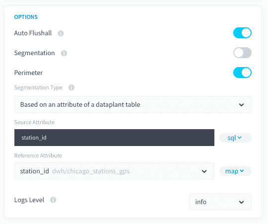
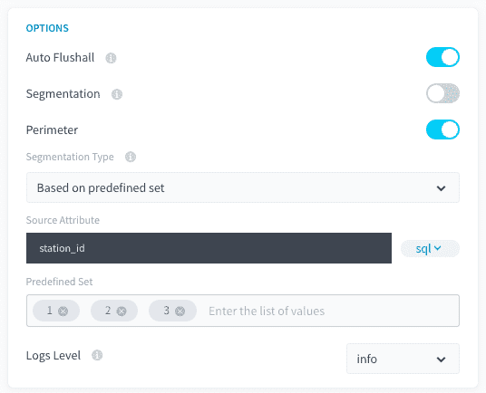
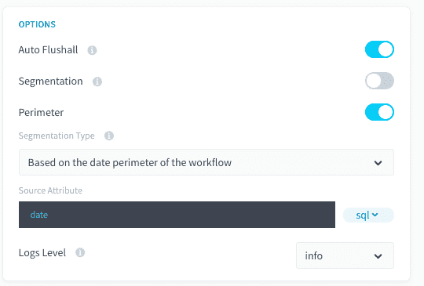

# 境界のオプション

ForePaaSプラットフォーム内では、データソースやセグメント化を行うアクションのタイプに応じて、次のような複数の境界モードが利用できます。
1. Data Managerのテーブル属性の値に基づく境界
2. 事前定義された値のセットに基づく境界
3. ワークフローの日付に基づく境界

---

## 1. Data Managerのテーブル属性の値セットに基づく境界

テーブルの列内に存在するデータリストに対してアクションのフィルタリングを行う場合の例を、次に示します。

| 参照テーブル | ソーステーブル | 宛先テーブル |
|             ---          |          ---          |             ---            |
|  |  |   |

ソーステーブル「orders」に含まれる「income」属性のデータを、「date_order」でグループ化された宛先テーブル「aggr_date」に集計します。tmp_dateテーブルには、2019-01-01から2019-01-03までを集計する日付のリストが含まれています。

この境界モードを有効にすると、テーブルtmp_dateの属性dateに含まれる境界値のリストを構成するための事前ステージが自動的に作成され、検出されたすべての値でアクションのフィルタリングが行われます。

### 互換性
この境界オプションは、以下のアクションとソースにのみ対応しています。

| アクションタイプ | ソースタイプ |
|          ---        |          ---          |
| <ul><li>Load</li><li>Aggregate</li><li>Diff</li><li>Delete_Diff</li><li>Delete</li><li>Custom</li></ul> | <div><ul><li>**データベース**：MySQL、PostgreSQL、SQLServer、Impala、Hive、BiqQuery、ElasticSearch、Cassandra、Redshift、Oracle</li></ul> |

### 構成

この境界オプションを設定するには、「Perimeter Type（境界のタイプ）」ドロップダウンで「*Based on an attribute of a dataplant table（データプラントのテーブルの属性に基づく）*」を選択します。



詳細モードのインターフェースを使用している場合は、JSON形式のアクション設定ファイルに次のフィールドを追加する必要があります。

```json
"perimeter": {
  "active": true,
  "type": "dwh_attributes",
  "values": "dwh/data_prim/tmp_dates/date",
  "var_name": "date_order",
  "attribute": "date",
  "attribute_type": "map"
}
``` 

---

## 2. 事前定義セットに基づくセグメント化

テーブル／ソースの属性に基づいて値のリストを選択する必要がある場合は、この境界モードを選択できます。

### 互換性
この境界オプションは、以下のアクションとソースにのみ対応しています。

| アクションタイプ | ソースタイプ |
|          ---        |          ---          |
| <ul><li>Load</li><li>Aggregate</li><li>Diff</li><li>Delete_Diff</li><li>Delete</li><li>Custom</li></ul> | <div><ul><li>**データベース**：MySQL、PostgreSQL、SQLServer、Impala、Hive、BiqQuery、ElasticSearch、Cassandra、Redshift、Oracle</li></ul> |

### 構成
この境界オプションを設定するには、「Perimeter Type（境界のタイプ）」ドロップダウンで「*Based on predefined set（事前定義セットに基づく）*」を選択します。



詳細モードのインターフェースを使用している場合は、JSON形式のアクション設定ファイルに次のフィールドを追加する必要があります。

```json
"perimeter": {
        "active": true,
        "type": "predefined_set",
        "var_name": "value_2",
        "values": [
          "10",
          "15"
        ]
      }
```
---

## 3. ワークフローの日付の境界に基づくセグメント化

ソースデータに日付の属性が存在する場合は、ワークフロー内で設定された日付に対してアクションの処理をフィルタリングできます。

### 互換性
この境界オプションは、以下のアクションとソースにのみ対応しています。

| アクションタイプ | ソースタイプ |
|          ---        |          ---          |
| <ul><li>Load</li><li>Aggregate</li><li>Diff</li><li>Delete_Diff</li><li>Delete</li><li>Custom</li></ul> | <div><ul><li>**データベース**：MySQL、PostgreSQL、SQLServer、Impala、Hive、BiqQuery、ElasticSearch、Cassandra、Redshift、Oracle</li><li>**API**：Facebook、Twitter、Google Analytics、YouTube Private、YouTube Public、LinkedIn</li></ul> |

### 構成
この境界オプションを設定するには、「Perimeter Type（境界のタイプ）」ドロップダウンで「*Based on the date perimeter of the workflow（ワークフローの日付の境界に基づく）*」を選択します。



このオプションを設定するには、詳細モードに切り替える必要があります。以下のフィールドをJSON形式の設定ファイルに追加する必要があります。

```json
"perimeter":{
	"active":true,
	"type":"workflow/dates",
	"var_name":"date"
}
```
---
DPEアクションに対する*セグメント化*および*境界*オプションの詳細については、DPEアクションの設定の**関連説明**の記事を参照してください。
{DPEアクションの設定の詳細を確認する}(#/jp/product/dpe/actions/settings/advanced.md)