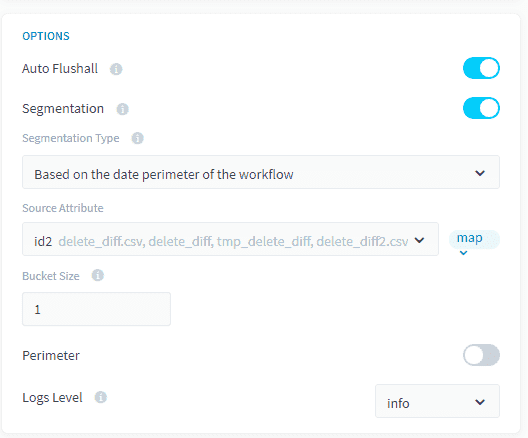
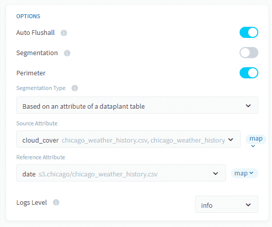
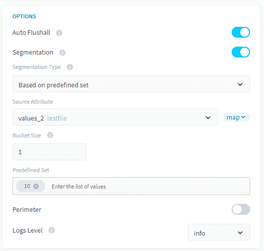
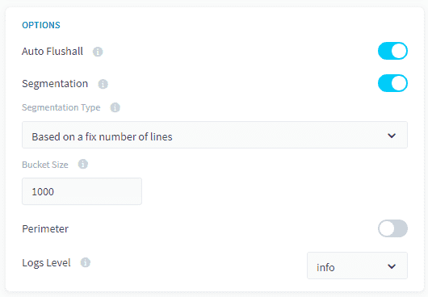
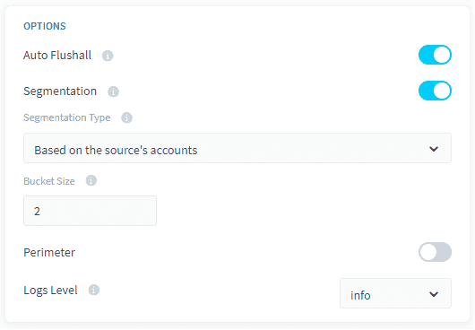
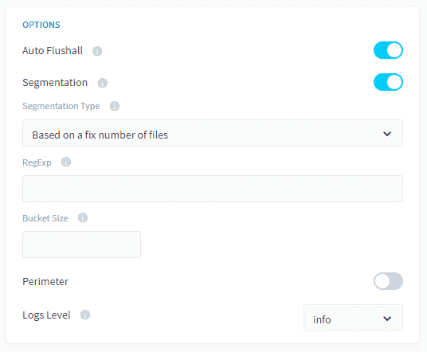

# セグメント化のオプション

ForePaaSプラットフォーム内では、データソースやセグメント化を行うアクションのタイプに応じて、次のような複数のセグメント化モードが利用できます。
1. [ワークフローの日付の境界に基づくセグメント化](#/jp/product/dpe/actions/settings/segmentation?id=_1-based-on-the-date-perimeter-of-the-workflow)
2. [データプラントのテーブルの属性に基づくセグメント化](#/jp/product/dpe/actions/settings/segmentation?id=_2-based-on-an-attribute-of-a-dataplant-table)
3. [事前定義セットに基づくセグメント化](#/jp/product/dpe/actions/settings/segmentation?id=_3-based-on-a-predefined-set)
4. [固定された行数に基づくセグメント化](#/jp/product/dpe/actions/settings/segmentation?id=_4-based-on-a-fixed-number-of-lines)
5. [ソースのアカウントに基づくセグメント化](#/jp/product/dpe/actions/settings/segmentation?id=_5-based-on-the-source39s-accounts)
6. [ファイルに基づくセグメント化](#/jp/product/dpe/actions/settings/segmentation?id=_6-based-on-files)

---

## 1. ワークフローの日付の境界に基づくセグメント化

ソースデータに日付の属性が含まれている場合、アクションを複数のプロセスに分割し、各プロセスで特定の日付や日付のグループ（バケット）を処理できます。この場合、各タスクは抽出する必要のある日付に対してフィルターを適用します。


### 互換性
このセグメント化オプションは、以下のアクションとソースにのみ対応しています。

| アクションタイプ | ソースタイプ |
|          ---        |          ---          |
| <ul><li>Load</li><li>Aggregate</li><li>Diff</li><li>Delete_Diff</li><li>Delete</li><li>Custom</li></ul> | <div><ul><li>**データベース**：MySQL、PostgreSQL、SQLServer、Impala、Hive、BiqQuery、ElasticSearch、Cassandra、Redshift、Oracle</li><li>**API**：Facebook、Twitter、Google Analytics、YouTube Private、YouTube Public</li></ul> |

### バケットサイズ
ソースに数多くの日付が含まれている場合、多数の小さなタスクが生成されて、アクションの実行時間が改善されない可能性があります。これは、ミリ秒単位までの時刻情報を記録できる日付と時刻のタイプの属性を使用する場合に、よくあることです。

生成されるタスクの数が多くなりすぎないようにするには、「バケットサイズ」オプションを使用して、それぞれのタスクで複数の日付をまとめて扱えるようにします。バケットサイズを設定して、タスクでまとめて扱う日付の数を決めます。デフォルトの「バケットサイズ」の値は1です。つまり、以下のようになります。
* バケットサイズを設定しない場合、個々のタスクで1つの日付を処理
* バケットサイズを2に設定した場合、個々のタスクで2つの日付を処理
* バケットサイズを10に設定した場合、個々のタスクで10の日付を処理
* 以下同様

「バケットサイズ」の働きがよく分からない方は、「関連説明」の記事を参照してください。

{「バケットサイズ」オプションの仕組みについて確認する}(#/jp/product/dpe/actions/settings/advanced.md)

### 構成

このセグメント化オプションを設定するには、「Segmentation Type（セグメント化のタイプ）」ドロップダウンで「*Based on the date perimeter of the workflow（ワークフローの日付の境界に基づく）*」を選択し、属性を選択します。



エキスパートモードのインターフェースを使用している場合は、JSON形式のアクション設定ファイルに次のフィールドを追加する必要があります。

```json
      "segmentation": {
        "active": true,
        "type": "workflow_dates",
        "var_name": "id2",
        "chunksize": 1
      }
``` 

---

## 2. データプラントのテーブルの属性に基づくセグメント化

このオプションを使用すると、データモデルの特定のテーブル（通常は参照テーブル）の列に含まれる値のリストを使用して、アクションをセグメント化できます。例として、ソーステーブル「orders」から宛先テーブル「aggr_date」へデータをロードするアクションに対するセグメント化オプションを設定する以下のケースについて考えます。

| 参照テーブル | ソーステーブル | 宛先テーブル |
|             ---          |          ---          |             ---            |
|  |  |   |

オーダー日付「date_order」ごとに「income」データを集計すると想定します。「tmp_date」テーブルをオーダーが行われた期間中のすべての日付の参照テーブルとして使用するとします。例えば、このテーブルには、2019-01-01から2019-01-03までの日付のリストが含まれています。
 
このセグメント化モードを有効にすると、アクションを含むメインステージに対する事前ステージが自動的に生成され、アクションを複数のタスクに分割するのに利用できる固有の日付のリストが作成されます（下の図を参照）。

 

こうすることで、ソーステーブル「orders」のデータが宛先テーブル「aggr_date」に一日ずつロードされます。

### 互換性
このセグメント化オプションは、以下のアクションとソースにのみ対応しています。

| アクションタイプ | ソースタイプ |
|          ---        |          ---          |
| <ul><li>Load</li><li>Aggregate</li><li>Diff</li><li>Delete_Diff</li><li>Delete</li><li>Custom</li></ul> | <ul>**データベース**：MySQL、PostgreSQL、SQLServer、Impala、Hive、BiqQuery、ElasticSearch、Cassandra、Redshift、Oracle</ul> |

### バケットサイズ
セグメント化に使用される属性に数多くの固有の値が含まれているソースの場合、多数の小さなタスクが生成されて、アクションの実行時間が改善されない可能性があります。

生成されるタスクの数が多くなりすぎないようにするには、「バケットサイズ」オプションを使用して、それぞれのタスクでセグメント化属性の複数の値をまとめて扱えるようにします。バケットサイズを設定して、タスクでまとめて扱う値の数を決めます。デフォルトの「バケットサイズ」の値は1であることに注意してください。つまり、以下のようになります。
* バケットサイズを設定しない場合、個々のタスクで1つの値を処理
* バケットサイズを2に設定した場合、個々のタスクで2つの値を処理
* バケットサイズを10に設定した場合、個々のタスクで10の値を処理
* 以下同様

「バケットサイズ」の働きがよく分からない方は、「関連説明」の記事を参照してください。
{「バケットサイズ」オプションの仕組みについて確認する}(#/jp/product/dpe/actions/settings/advanced.md)

### 構成

このセグメント化オプションを設定するには、「Segmentation Type（セグメント化のタイプ）」ドロップダウンで「*Based on an attribute of a DataPlant table（データプラントのテーブルの属性に基づく）*」を選択します。



エキスパートモードのインターフェースを使用している場合は、JSON形式のアクション設定ファイルに次のフィールドを追加する必要があります。

```json
      "segmentation": {
        "active": true,
        "type": "dwh_attributes",
        "var_name": "id",
        "attribute": "name",
        "object": "s3.deldiff/delete_diff.csv",
        "attribute_type": "map",
        "chuncksize": 2
      }
```

---

## 3. 事前定義セットに基づくセグメント化

ハードコードした値のセットをセグメント化の基準として使用する場合は、このモードを使用します。この場合は、セグメント化を適用するソーステーブルの列を選択し、値のセットを手動で入力する必要があります。入力した値ごとに1つのタスクが生成されます（バケットサイズを1に設定した場合）。

### 互換性
このセグメント化オプションは、以下のアクションとソースにのみ対応しています。

| アクションタイプ | ソースタイプ |
|          ---        |          ---          |
| <ul><li>Load</li><li>Aggregate</li><li>Diff</li><li>Delete_Diff</li><li>Delete</li><li>Custom</li></ul> | <ul>**データベース**：MySQL、PostgreSQL、SQLServer、Impala、Hive、BiqQuery、ElasticSearch、Cassandra、Redshift、Oracle</ul> |

### バケットサイズ
セグメント化に使用される属性に数多くの固有の値が含まれているソースの場合、多数の小さなタスクが生成されて、アクションの実行時間が改善されない可能性があります。

生成されるタスクの数が多くなりすぎないようにするには、「バケットサイズ」オプションを使用して、それぞれのタスクでセグメント化属性の複数の値をまとめて扱えるようにします。バケットサイズを設定して、タスクでまとめて扱う値の数を決めます。デフォルトの「バケットサイズ」の値は1であることに注意してください。つまり、以下のようになります。
* バケットサイズを設定しない場合、個々のタスクで1つの値を処理
* バケットサイズを2に設定した場合、個々のタスクで2つの値を処理
* バケットサイズを10に設定した場合、個々のタスクで10の値を処理
* 以下同様

「バケットサイズ」の働きがよく分からない方は、「関連説明」の記事を参照してください。
{「バケットサイズ」オプションの仕組みについて確認する}(#/jp/product/dpe/actions/settings/advanced.md)

### 構成

このセグメント化オプションを設定するには、「Segmentation Type（セグメント化のタイプ）」ドロップダウンで「*Based on predefined set（事前定義セットに基づく）*」を選択します。



エキスパートモードのインターフェースを使用している場合は、JSON形式のアクション設定ファイルに次のフィールドを追加する必要があります。

```json
      "segmentation": {
        "active": true,
        "type": "predefined_set",
        "var_name": "id",
        "chunksize": 1,
        "values": [
          "1"
        ]
      }
```
---

## 4. 固定された行数に基づくセグメント化

このセグメント化モードを利用すると、バケットサイズ変数で定義された固定された行数を使用して、ソースからのデータのロードをシンプルに分割できます。

個々のタスクは「バケットサイズ」と同じ数の行を処理します。
* バケットサイズが1000に設定されている場合、個々のタスクで1000行を抽出
* バケットサイズが50000に設定されている場合、個々のタスクで50000行を抽出
* 以下同様

### 互換性
このセグメント化オプションは、以下のアクションとソースにのみ対応しています。

| アクションタイプ | ソースタイプ |
|          ---        |          ---          |
| <ul><li>Load</li></ul> | <ul><li>**ファイル**：CSVファイル、Excelファイル</li><li>**データストア**：Big Query、AWS S3</li><li>**データベース**：MySQL、PostgreSQL、SQLServer、Impala、Hive、BiqQuery、ElasticSearch、Cassandra、Redshift、Oracle、SQLServer</li></ul> |

### 構成

このセグメント化オプションを設定するには、「Segmentation Type（セグメント化のタイプ）」ドロップダウンで「*Based on a fix number of lines（固定された行数に基づく）*」を選択します。



エキスパートモードのインターフェースを使用している場合は、JSON形式のアクション設定ファイルに次のフィールドを追加する必要があります。

```json
      "segmentation": {
        "active": true,
        "type": "lines",
        "chunksize": 1000
      }
```

!> このセグメント化のタイプは、SQLServerやPostgreSQLなどのデータベースソースで使用できます。ただし、このような場合には、**データプラントにテーブルのすべての属性に対するアクセス権を付与する必要**があります。そうでない場合、アクションのセグメント化を行う際に、アクセス権限不足でSELECTクエリが拒否される可能性があります。

---

## 5. ソースのアカウントに基づくセグメント化

ユーザーアカウント固有のソーシャルネットワークなどのソースの場合、Data Managerコンポーネント内で同じソースに対して複数のアカウントを設定できます。この場合、これらのアカウントを利用して、このソースを利用するDPEアクションを複数のタスクに分割し、各タスクで1つ以上のアカウントのデータを取得できます。

### 互換性
このセグメント化オプションは、以下のアクションとソースにのみ対応しています。

| アクションタイプ | ソースタイプ |
|          ---        |          ---          |
| <ul><li>Load</li></ul> | <ul><li>**API**：Facebook、Twitter、Google Analytics、YouTube Private、YouTube Public、LinkedIn</li></ul> |

### バケットサイズ
ソースに数多くのアカウントが含まれている場合、多数の小さなタスクが生成されて、アクションの実行時間が改善されない可能性があります。

生成されるタスクの数が多くなりすぎないようにするには、「バケットサイズ」オプションを使用して、それぞれのタスクで複数のアカウントをまとめて扱えるようにします。バケットサイズを設定して、タスクでまとめて扱うアカウントの数を決めます。デフォルトの「バケットサイズ」の値は1であることに注意してください。つまり、以下のようになります。
* バケットサイズを設定しない場合、個々のタスクで1つのアカウントを処理
* バケットサイズを2に設定した場合、個々のタスクで2つのアカウントを処理
* バケットサイズを10に設定した場合、個々のタスクで10のアカウントを処理
* 以下同様

「バケットサイズ」の働きがよく分からない方は、「関連説明」の記事を参照してください。

{「バケットサイズ」オプションの仕組みについて確認する}(#/jp/product/dpe/actions/settings/advanced.md)

### 構成

このセグメント化オプションを設定するには、「Segmentation Type（セグメント化のタイプ）」ドロップダウンで「*Based on the source's accounts（ソースのアカウントに基づく）*」を選択します。



エキスパートモードのインターフェースを使用している場合は、JSON形式のアクション設定ファイルに次のフィールドを追加する必要があります。

```json
      "segmentation": {
        "active": true,
        "type": "accounts",
        "chunksize": 1000
      }
```

---

## 6. ファイルに基づくセグメント化

離れた場所にあるソースフォルダー内の同じ構造を持つソースの場合、このセグメント化モードを使用して、DPEでフォルダー内のすべてのファイルを自動的に見つけて、特定のファイル数に対応したタスクを作成できます。これらのファイルごとに、「load_from.source」のアクションのソースファイルが置き換えられます。 

### 互換性
このセグメント化オプションは、以下のアクションとソースにのみ対応しています。

| アクションタイプ | ソースタイプ |
|          ---        |          ---          |
| <ul><li>Load</li></ul> | <ul><li>S3（ファイルアップロード、データストア、AWSなど）</li><li>FTP</li><li>SFTP</li></ul> |

### バケットサイズ
ソースに数多くのファイルが含まれている場合、多数の小さなタスクが生成されて、アクションの実行時間が改善されない可能性があります。

生成されるタスクの数が多くなりすぎないようにするには、「バケットサイズ」オプションを使用して、それぞれのタスクで複数のファイルをまとめて扱えるようにします。バケットサイズを設定して、タスクでまとめて扱うファイルの数を決めます。デフォルトの「バケットサイズ」の値は1であることに注意してください。つまり、以下のようになります。
* バケットサイズを設定しない場合、個々のタスクで1つのファイルを処理
* バケットサイズを2に設定した場合、個々のタスクで2つのファイルを処理
* バケットサイズを10に設定した場合、個々のタスクで10のファイルを処理
* 以下同様

「バケットサイズ」の働きがよく分からない方は、「関連説明」の記事を参照してください。

{「バケットサイズ」オプションの仕組みについて確認する}(#/jp/product/dpe/actions/settings/advanced.md)

### 構成

このセグメント化オプションを設定するには、「Segmentation Type（セグメント化のタイプ）」ドロップダウンで「*Based on files（ファイルに基づく）*」を選択します。



エキスパートモードのインターフェースを使用している場合は、JSON形式のアクション設定ファイルに次のフィールドを追加する必要があります。

```json
      "segmentation": {
        "active": true,
        "type": "files",
        "values": ["a.*"],
        "chunksize": 10
      }
```
---
DPEアクションに対する*セグメント化*および*境界*オプションの詳細については、DPEアクションの設定の**関連説明**の記事を参照してください。
{DPEアクションの設定の詳細を確認する}(#/jp/product/dpe/actions/settings/advanced.md)