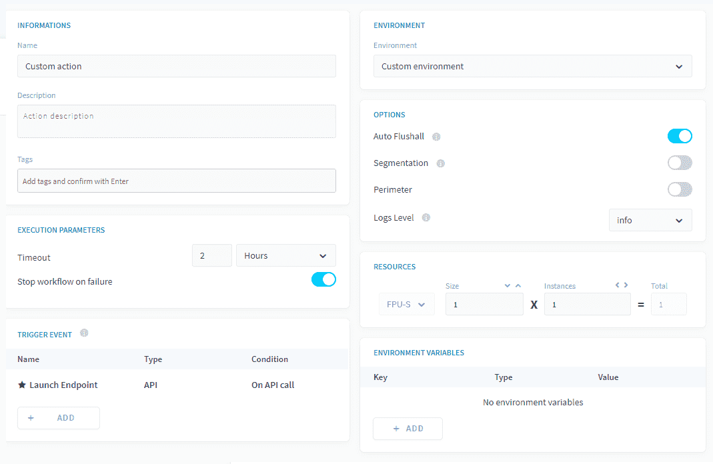
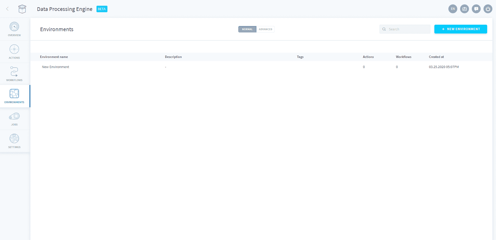
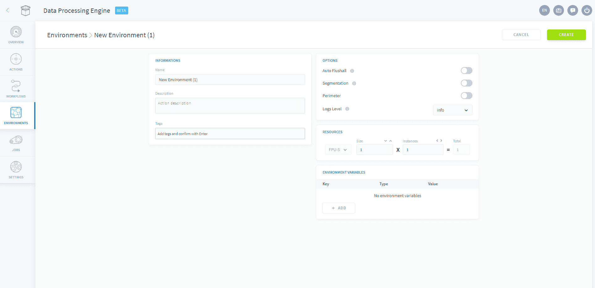
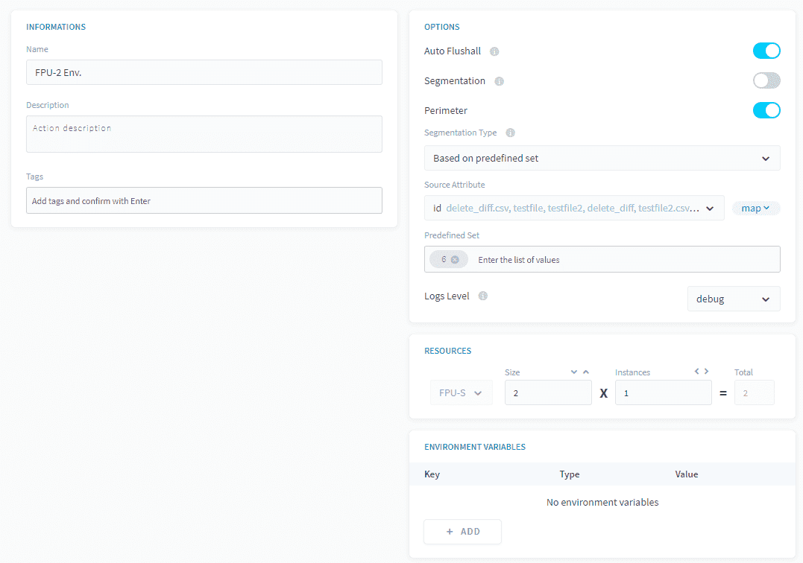

# 環境

## カスタムジョブの基本設定

アクションおよびワークフローに関する記事を参照された方（またはDPEを探索してみた方）は、「Preferences（基本設定）」サブセクションにお気付きだと思います。このサブセクションでは、アクション／ワークフローのパラメータの詳細な制御を行うことができます。

*図1：「Preferences（基本設定）」パネル*

「Environments（環境）」タブは、「Preferences（基本設定）」サブセクションを補完するものです。いくつかのオプションを*環境*として事前に選択しておき、ドロップダウンメニューで環境名を選択すれば、それらの環境パラメータをアクション／ワークフローに適用することができます。 

## 環境の作成

「Environments（環境）」タブに初めてアクセスすると、カスタム環境を作成するための空白のキャンバスが表示されます。

「*New Environment（環境の新規作成）*」をクリックすると、「Preferences（基本設定）」パネルの内容の一部が表示されます。 

ここで、「*Options（オプション）*」、「*Resources（リソース）*」、「*Environment variables（環境変数）*」の内容を選択します。環境には必ず名前と説明を入力してください。

以上で完了です。上の例で、ワークフローやアクションに移動して「*FPU-2 Env.*」を選択すると、リソースのサイズが2に設定され、「Auto Flushall（自動ですべてをフラッシュ）」が有効化され、ログレベルが*debug*に変更され、「6」の値に設定された属性「id」に基づいて「*Perimeter（境界）*」がすべてのアクションに適用されます。  

> 注：環境は恒久的ではありません。すでに適用済みの場合も含めて、**ジョブの環境はいつでも変更できます**。環境は柔軟で、環境のパラメータを変更すると、その環境に割り当てられているすべてのアクションとワークフローに変更内容が反映されます。 

