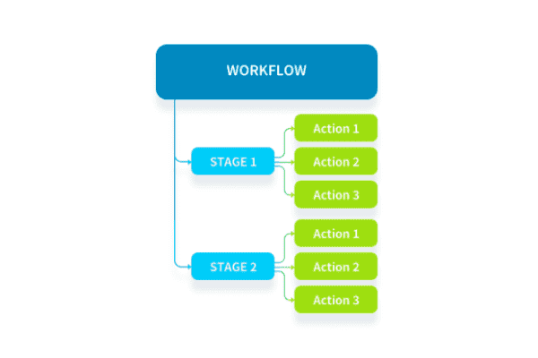

# Data Processing Engine

ここでは、データプロジェクトにおけるデータ処理の基本的な仕組み🔩について説明します。Data Processing Engine（DPE）は、**未処理（生）のソースからForePaaS内のストレージシステムへのデータパイプラインを作成**するためのコンポーネントです。管理、デプロイ、拡張などのすべての機能が自動化されているため、ユーザーは周辺環境の運用に時間を取られることなく、データプロジェクトのビジネスロジックに専念できます。

---

## DPEの仕組み
DPEでは、ソースからForePaaSへのデータの抽出とロードや、データプラント内に保存されたデータの変換といった、データに対するシンプルな操作であるアクションを作成できます。

* **アクション**：アクションは、データに対する1つのまとまった操作です。ステージやワークフローにアクションをまとめると、より複雑なデータ操作を定義できます。ワークフローと同様に、アクションは手動で実行することも、スケジュールに沿って実行するように設定することも、API呼び出しを通じてトリガーすることもできます。 
* **ワークフロー**：ワークフローは、所定の順序で実行される1つまたは複数のアクションです。各ワークフローでは、複数のステージにアクションがまとめられます。ワークフローは、手動で実行することも、スケジュールに沿って実行するように設定することも、API呼び出しを通じてトリガーすることもできます。
* **環境**：環境は、アクションやワークフローの実行に適用される共通の設定です。環境は、リソース割り当て、境界、セグメント化のオプションといったテンプレートジョブ設定を保存するのに使用します。

ForePaaSのDPEは、データ管理やデータ処理を素早く簡単に行えるようにするためのものですが、必要に応じて独自のコードを追加するためのGUIも用意されています。 


*図1：ワークフローの概念図*

{DPEのインターフェースの詳細を確認する}(#/jp/product/dpe/gui)

---

## ジョブベースのオーケストレーション

**DPEはすべてジョブベース**です。ジョブというのは、DPEでワークフローやアクションを1つのまとまりとして実行するものです。ジョブには専用のリソースのセットが個別に割り当てられます。並行して実行できるジョブの数には制限があります。クオータ制限については、コンポーネントの設定を確認してください。

バックグラウンドでアクションやワークフローがトリガーされると、**ForePaaSにより、指定されたリソースを使用してコンテナが自動的に起動**されます。ジョブが終了すると、コンテナは自動的にシャットダウンされます。このため、ForePaaSでは、ジョブが実行されている間しかリソースを使用しません。リソースを常時使用する*長時間実行されるオーケストレーション*と異なり、*ジョブベースのオーケストレーション*では、リソースが使用されるのはジョブの実行中だけです。このため、文字どおりの意味で使用量に応じた従量課金制が可能になり、ジョブの実行ごとのスケーラビリティが向上し、大規模なデータプロジェクトの費用を抑えることができます。

{関連記事でジョブについてさらに確認する}(#/jp/product/dpe/jobs/index.md)

---

## リソース消費

ForePaaSは、データプロジェクトの要件に応じてスケーリングできるようになっています。個別のジョブを実行する場合、ジョブの実行時間に対して任意の数のFPUを割り当てることができ、これに基づいて組織への請求が行われます。

次の2つのジョブを含むDPE設定の例を用いて具体的に説明しましょう。一方のジョブは1週間に2回実行されるようにスケジュールされ、もう一方のジョブは毎日実行されるようにスケジュールされています。それぞれのジョブが次のように設定されているとします。

| ジョブ名 | ジョブのリソース | ジョブの実行時間 | ジョブの回数／週 | ジョブの回数／月 | 
| :---: | :------------: | :---: | :---: | :---: | 
| Job_1 | 1 x 4 = 4 FPU | 10分 | 2 | 約8.7 | 
| Job_2 | 3 x 4 = 12 FPU | 15分 | 7 | 約30.5 | 

1か月に消費する総FPU分（FPU.min）は、次のようになります。
```
4 FPUs x 10 min x 8.7 + 12 FPUs x 15 min x 30.5 = 5,838 FPU.min
```
1か月に消費する総平均FPU月（FPU.month）は、次のようになります。
```
5,838 FPUs.min / (30.5 days x 24 hours x 60 min) = 0.13 FPU.month
```

そのため、月末のDPEのワークフローのリソース使用量は*0.13 FPU.month*になります。

{リソース消費の詳細を確認する}(#/jp/product/billing/resources/index.md)

---

##  サポートが必要な場合🆘

> サポートの依頼が必要な場合は、いつでもプラットフォームの「*Support（サポート）*」タブから直接依頼を送信することができます。また、support@forepaas.com宛にメールを送付することもできます。

{サポートに質問を送付する🤔}(https://support.forepaas.com/hc/en-us/requests)