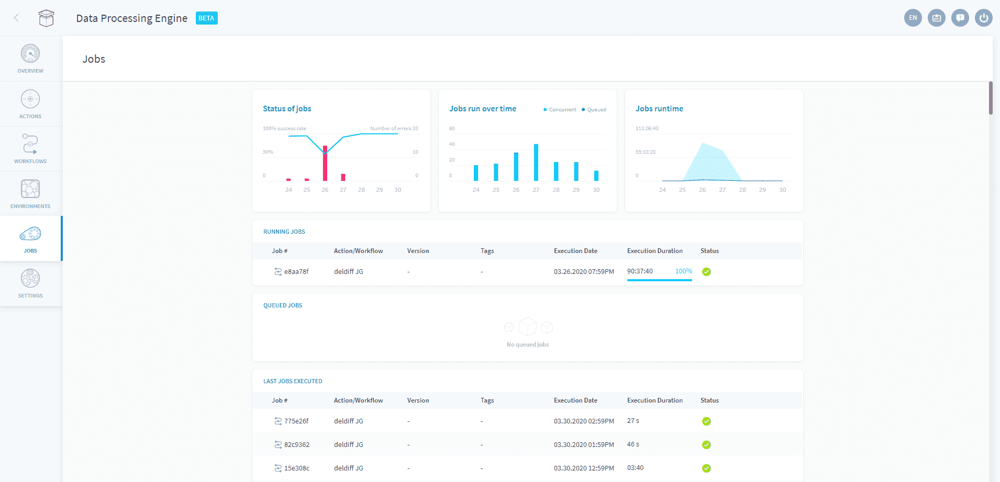

## ジョブ

現在および過去のジョブの実行状況を詳細に示すため、「Jobs（ジョブ）」タブにはユーザーに必要な情報が表示されます。ジョブの情報は、次の3つのセクションに分かれています。

* 進行中のジョブ
  * **実行中のジョブ**
  * **処理待ちのジョブ**
* **過去のジョブのステータス**

このインターフェースは、アクションやワークフローの実行状況を示すためのものです。このパネルは、ワークフローやアクションが安定していて（構築や変更が行われておらず）、優れた診断データが利用できる場合に使用するのに適しています。

---

## 進行中のジョブ

起動された進行中のジョブは、次のいずれかのステータスになります。
* Running（実行中）
* Queued（処理待ち）

### 実行中のジョブ
このウィジェットには、現在実行中のすべてのジョブが表示されます。ジョブの上にマウスカーソルを合わせて*ログ*アイコンをクリックすると、ジョブのログがライブで表示されます。

すでにお気付きかもしれませんが、DPEのリソースは「必要に応じて」割り当てられるため、実際には実行に必要なタイミングで1つのアクションに1つのFPUが割り当てられます（FPUの数は「Preferences（基本設定）」セクションで変更できます）。一度に大量のFPUが割り当てられないようにするため、**デフォルトでDPEに割り当てられる同時実行ジョブの数は、2つまでに制限されます**。 

### 処理待ちのジョブ
同時実行ジョブの上限数である2つよりも多くのジョブの実行が指示された場合、「オーバーフロー」したジョブは処理待ちになります。これらのジョブは、ウィジェット「Queued Jobs（処理待ちのジョブ）」に表示されます。処理待ちのジョブは、実行中のジョブが終了するとすぐに、画面に表示された順序で実行されます。

> DPEコンポーネントに対して設定された制限のリストは、**「Settings（設定）」タブ**の「Quotas（クオータ）」ウィジェット内で参照できます。これらの制限がデータ処理手続きを実行する妨げになる場合は、弊社のサポートチームまでご連絡ください。

---

## 実行された最後のジョブ

過去7日間に実行されたすべてのジョブのリストが表示され、ジョブの成否、実行時間、実行日時が示されます。 