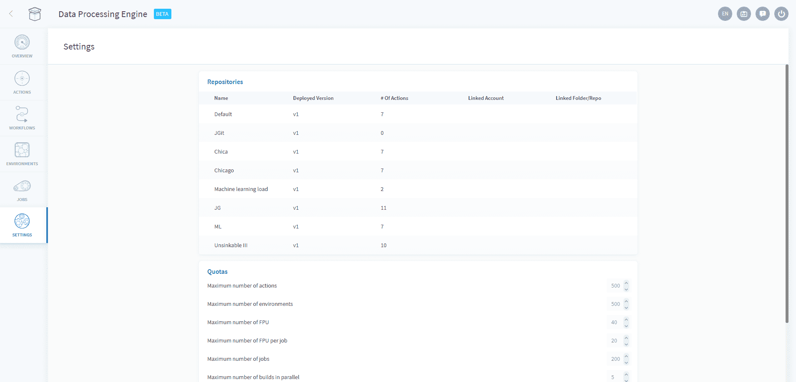

## 設定

「Settings（設定）」タブは、次の2つの用途で使用されます。

* **リポジトリ**

リポジトリパネルには、アクションのリポジトリに関する概要が表示され、各リポジトリの概要を素早く確認できるだけでなく、各リポジトリの編集（リンクされたGitアカウントの変更など）を行うこともできます。

* **クオータ**

 クオータのセクションでは、必要に応じて、DPEのリソースの追加を要求できます。 

