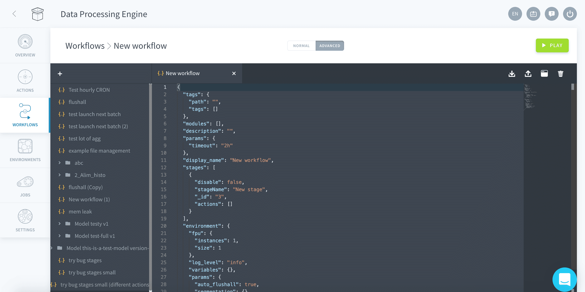

# 詳細モードでのワークフローの作成

ワークフローは、JSON形式の設定ファイルを使用して直接設定することもできます。JSON形式の新しいワークフロー設定ファイルにアクセスするには、「New Workflow（新規ワークフロー）」ウィンドウまたは「Edit Workflow（ワークフローの編集）」ウィンドウの「*Advanced（詳細）*」タブをクリックします。



---

## 構成の概要

ユーザーはJSONエディターに直接入力してワークフローを設定することができます。JSON形式の設定ファイルでは、GUIを使用する場合よりも多くのオプションを利用できます。 

### ワークフローのパラメータ

ワークフローのパラメータは、次の通りです（アルファベット順）。

| パラメータ  | タイプ    | 説明 |
| :--- | :--- | :--- | 
| display_name | 文字列 | ワークフローの名前を設定 |
| description | 文字列 | ワークフローの説明を設定 |
| workflow | テーブル | 関連するアクションを含むステージのリスト |
| logLevel | 文字列 | このワークフローの最小のログレベルを定義する値で、*debug*、*info*、*notice*、*warning*、*error*、または*critical*のいずれかを指定 |
| auto_flushall | ブール型 | ワークフローの最後に「Flush All（すべてをフラッシュ）」ルーチンを追加する／しないの条件。データフローのすべてのキャッシュをリフレッシュするメンテナンスルーチン（QB、API、APP） |
| dateMin | 文字列 | 日付の境界の絶対値下限 |
| dateMax | 文字列 | 日付の境界の絶対値上限 |
| days | JSONオブジェクト | 境界値の相対日付の最小値と最大値 |

### JSON形式の設定の例

以下は、JSON形式の一般的なワークフロー設定ファイルです。このワークフローには2つのステージがあり、「Stage 1」に2つのアクション、「Stage 2」に1つのアクションが存在します。

```json
{
  "params": {
     "log_level": "info"
  },
  "auto_flushall": true,
  "display_name": "flushall",
  "description": "routine maintenance workflow",
  "stages": [
    {
      "stageName": "Stage 1",
      "actions": [
        {"action_conf": "5c9bba68555fb219eb000020"},
        {"action_conf": "5c9bba68555fb2190000ll99"}

      ]
    },
    {
      "stageName": "Stage 2",
      "actions": [
        {"action_conf": "5c9bba68555hghjgjhgjhgjh"}
      ]
    }
  ]
}
```

### 日付の境界のパラメータ

日付の境界は、**絶対的**な日付の上下限（日時を設定）または**相対的**な日付の上下限（現在の日付を元に計算）を使用して定義します。 

**絶対的**な日付の境界を定義するには、*dateMin*および*dateMax*パラメータを使用し、日付をYYYY-MM-DDの書式で文字列として指定します。例えば、次の例では、過去の特定の2つの日付の間でワークフローを再計算できます。

```json
{
  ...
  "dateMin": "2019-04-25",
  "dateMax": "2019-04-25"
}
```

**相対的**な日付の境界を定義するには、*days*パラメータを使用し、現在の日付から下限および上限の日数を指定します。例えば、次の例は、日ごとのワークフローで「一昨日」と「今日」の間のデータのみを扱う必要がある場合に使用します。数字は今日の日付から差し引く日数を表しています。

```json
{
  ...
  "days": {
    "min": "2",
    "max": "0"
  }
}
```

###  ステージのパラメータ

ステージのパラメータは、ユーザーインターフェースから直接変更することもできます。

| パラメータ  | タイプ    | 説明 |
| :--- | :--- | :--- | 
| stageName | 文字列 | 各ステージの名前を指定 |
| disable（ステージ） | ブール型 | ワークフロー内の特定のステージを有効化／無効化 |
| action_conf | 文字列 | 個々のアクションの情報にアクセスする際に見つけられるアクション固有のIDに対応 |
| disable（アクション） | ブール型 | ステージ内の特定のアクションを有効化／無効化 |

```json
{
  "display_name": "flushall",
  …
  "workflow": [
    {
      "disable": false,
      "stageName": "update_metas_lite",
      "actions": [
        {
          "action_conf": "update_metas_lite",
          "disable": false
        }
      ]
    …
  ]
}
```

---

## 構成のオーバーライド

### アクションの設定

アクションの設定のオーバーライドを使用すると、アクションの設定そのものを変更することなく、異なる実行パラメータを使用して、複数のワークフローで同じアクションを再利用できます。例えば、`"perimeterValues":["1","2"]`という値のセットを使用して、アクションの境界を設定しているとします。

次のように、同じワークフロー内で異なる複数のパラメータ値を利用して同じアクションを再利用できます。
```json
{
  "logLevel": "info",
  "auto_flushall": true,
  "display_name": "flushall",
  "workflow": [
    {
      "stageName": "Stage 1",
      "actions": [
        {"action_conf": "5c9bba68555fb219eb000020", "perimeterValues": ["1","2"]},
        {"action_conf": "5c9bba68555fb219eb000020", "perimeterValues": ["8"]}
      ]
    }
  ]
}
```
> この例には特に意味はなく、1つのワークフロー内で同じアクションに対して異なる複数の設定を簡単に定義できることを説明するために示したものです。

### 設定の優先順位

設定は、ワークフロー、ステージ、アクションという3つの異なるレベルでオーバーライドできます。最も細かなレベルの設定は、すべてのサブオブジェクトに対して適用されます。例えば、ステージレベルでの設定は、アクションレベルでの設定によってオーバーライドされます。以下の例を使って、設定の優先順位について説明しましょう。

```json
{
  "logLevel": "info",
  "perimeterValues": ["0"],
  "auto_flushall": true,
  "display_name": "flushall",
  "workflow": [
    {
      "stageName": "Stage 1",
      "perimeterValues": ["1"],
      "actions": [
        {"action_conf": "abc", "perimeterValues": ["2"]},
        {"action_conf": "efg"}

      ]
    },
    {
      "stageName": "Stage 2",
      "actions": [
        {"action_conf": "hij"}
      ]
    }
  ]
}
```

上記のJSON形式の設定ファイルでは、ワークフロー内で実行される各種アクションの境界の値は、次のようになります。

| アクションID  | perimeterValue | 説明 |
| :--- | :--- | :--- | 
| abc | 2 | アクション*abc*には、他のすべてをオーバーライドするperimeterValuesをアクションレベルで設定 |
| efg | 1 | アクション*efg*には、アクションレベルでperimeterValuesは設定されておらず、このアクションが含まれるステージ（この場合は*Stage 1*）に対して設定されたperimeterValuesを使用 |
| hij | 0 | アクション*hij*および*Stage 2*には、どちらにもperimeterValuesが設定されておらず、いずれかのワークフローのperimeterValuesを適用 |

---

## ワークフローのタイムアウト

ワークフロー内のアクションの所要時間が想定よりも大きくなる場合は、タイムアウトオプションを設定してワークフローを中断することができます。タイムアウトの時間は、`"worfklow_timeout":"1h 10m"`のように人が判読できる形式で*workflow_timeout*パラメータの値として設定します。

値はそれぞれの時間単位をすべて足し合わせたものになります。サポートされる時間単位は、次の通りです。

| 時間単位 | 説明 |
| :--- | :--- | 
| w | 週 |
| d | 日 |
| h | 時間 |
| m | 分 |
| s | 秒 |

以下は、ワークフローのタイムアウトオプションを使用したJSON形式の設定ファイルの例です。
```json
{
  "logLevel": "info",
  "auto_flushall": true,
  "worfklow_timeout":"59m 50s",
  "display_name": "flushall",
  "workflow": [
    {
      "stageName": "Stage 1",
      "actions": [
        {"action_conf": "5c9bba68555fb219eb000020"},
        {"action_conf": "5c9bba68555fb2190000ll99"}

      ]
    }
  ]
}
```

