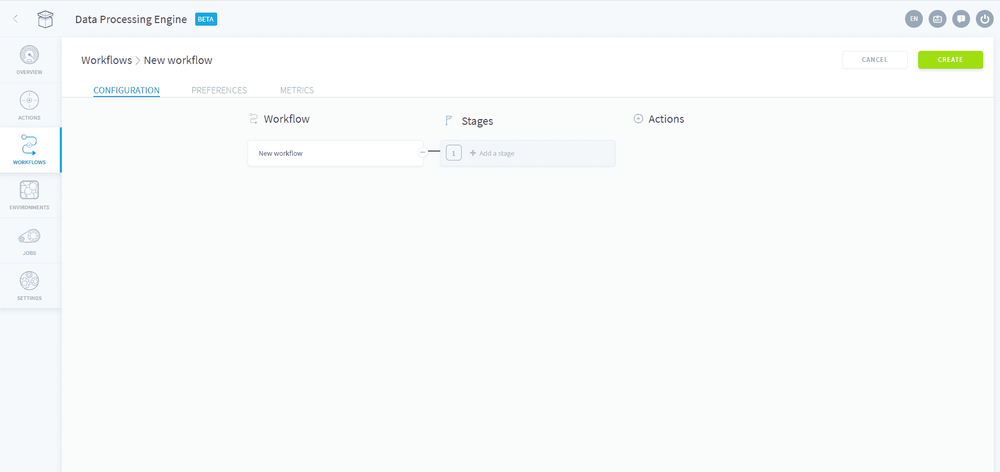
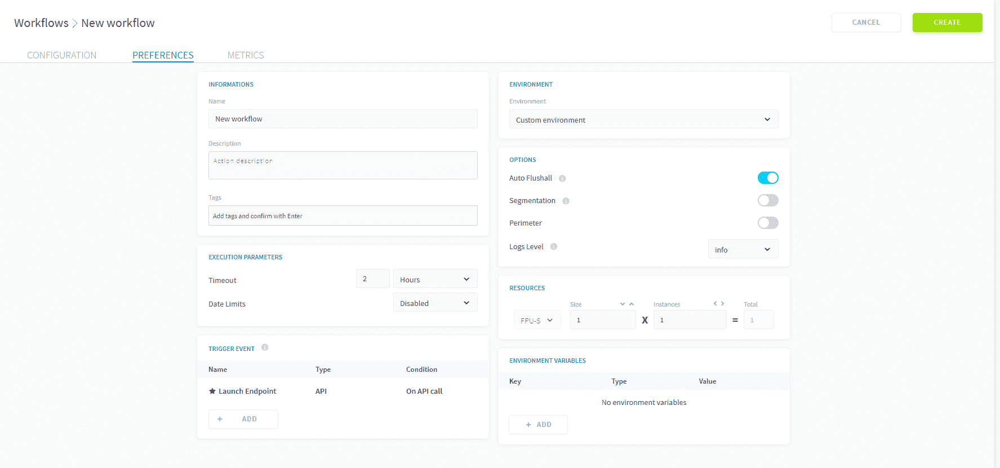
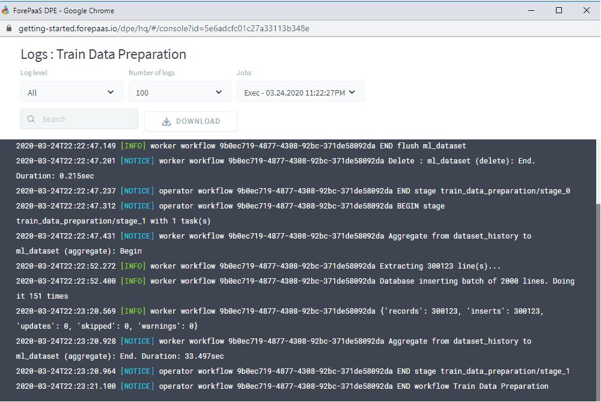

# ワークフローのセットアップ

**ワークフローを作成**する際に、アクションを複数のステージにまとめることでデータの処理をカスタマイズできます。この際、ステージは順番に実行され、アクションは並行して実行されます。ワークフローを実行したときには、ログを確認して**ワークフローの実行をモニタリング**できます。

---

## ワークフローの作成 

ワークフローは主に次の2つのステップで作成します。

- **ステージ**：ワークフローの連続するステージを設定します。各ステージに含まれるアクションは、ワークフローの作成時に追加することも、後から追加することもできます。
- **基本設定**：ワークフローに関する各種パラメータや情報を定義できます。

### 基本設定

「Preferences（基本設定）」タブでは、各種パラメータを定義し、ワークフローの名前と説明を指定することができます。

> **「Auto Flushall（自動ですべてをフラッシュ）」はどのような機能なのでしょうか。**ForePaaSプラットフォームでは、アプリケーションの使用時にパフォーマンスを向上させるため、クエリの出力をキャッシュに保管します（つまり、クエリを「事前に処理」します）。「Flush all（すべてをフラッシュ）」を実行すると、クエリが再度実行され、アプリケーション内のデータがリフレッシュされます。そのため、この機能はデフォルトで有効化されています。この機能を使用すると、一般にワークフローの処理時間が5～10秒程度増えます。連続する複雑なデータ処理ワークフローの場合は、この機能を無効にし、別のワークフローとして最後に1回だけ実行することが望ましいかもしれません。

最後に、「**Advanced（詳細）**」タブを利用すると、JSON形式の設定ファイルを用いてワークフローを詳細にカスタマイズすることができます。 

{詳細モードでワークフローを作成する方法を確認する}(#/jp/product/etl/workflows/advanced-mode)

---

## ワークフローのモニタリング

ワークフローの進行状況をモニタリングする場合は、コンソールアイコンをクリックして「DPEログ」を開きます。
ワークフローを作成する際には、ログで利用可能な情報のレベル（Debug、Info、Notice、Warning、Error、Critical）を定義することができます。

このコンソールには、次のような処理が行われた行数も表示されます。

-	**挿入**：挿入された行数（警告が存在しない場合）
-	**更新**：データベース内に既存の行で更新された行数（警告が存在しない場合）
-	**影響**：警告が存在する場合に影響を受ける行数（これらは更新または挿入に相当） 
-	**スキップ**：処理されなかった行数
-	**警告**：警告が発生した行数で、ブループリントでの指定（処理すべきことをシステムに示す新しいルールの追加）の必要性が見込まれる場合

---

{ワークフローの詳細な設定を確認する}(#/jp/product/etl/workflows/advanced-mode.md)
