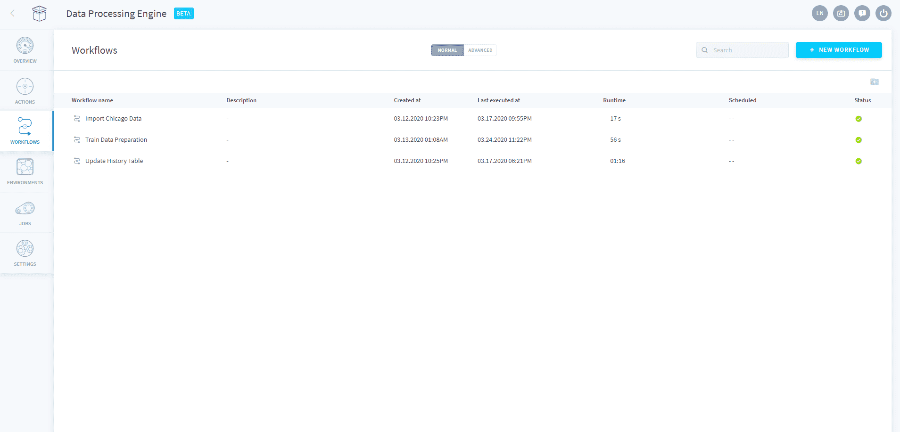
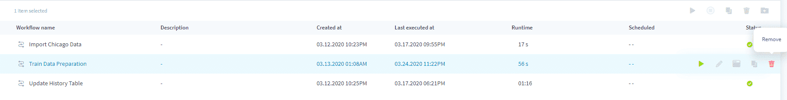

# ワークフロー

ワークフローは**アクションのシーケンスを表すDPEの体系的な構造**であり、次のいずれかの方法で使用できます。
* 手動で実行
* プランの一部として指定の時間に実行するようにスケジュールを設定（CRON）

各ワークフローでは、**連続する**複数のステージにアクションがまとめられます。ステージ内では、複数のアクションが**並行して**実行されます。

---

## 概要

DPE内で作成されたワークフローは、DPEコンポーネントの「*Workflows（ワークフロー）*」タブからアクセスできます。この画面では、実行中のワークフロー、正常に実行が完了したワークフロー、実行中にエラーが発生したワークフローを素早く確認できます。 

ワークフローの数が増えたときには、*フォルダー*を使用して表示内容をまとめるか、画面の右上にある検索バーを使用してワークフローを検索することができます。フォルダーにワークフローを追加する場合は、対象のフォルダー内にワークフローをドラッグアンドドロップします。

ワークフローの各行にある*詳細*アイコン（...）の上にマウスカーソルを合わせると、次の操作を容易に行うことができます。
* ワークフローの**削除**
* 既存のワークフローの**編集**
* ワークフローの**実行**
* ワークフローの**ログの確認**

{ワークフローの設定方法を確認する}(#/jp/product/dpe/workflows/configuration)
