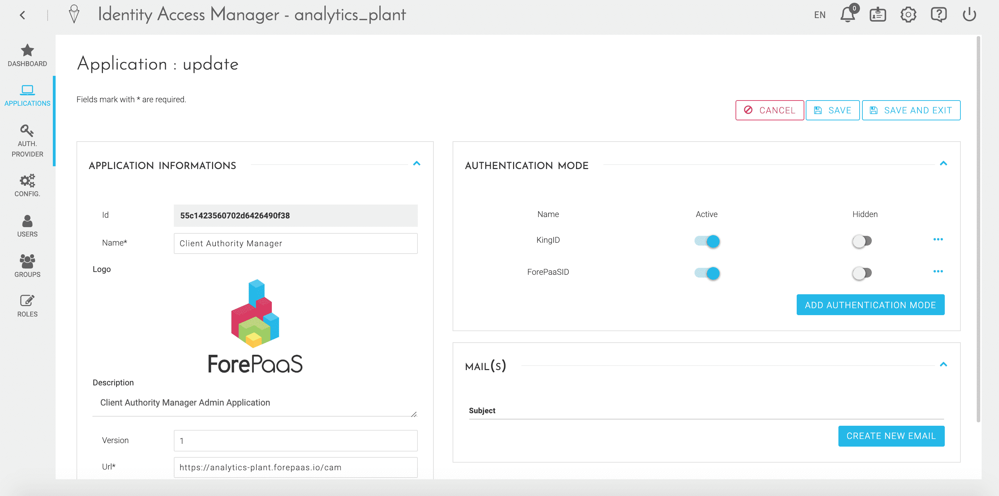

# アプリケーションの認証プロトコルの管理

!> このページには古い情報が含まれています。サポートが必要な場合は、弊社のサポートチームまでご連絡ください。 

ForePaaSでアプリケーションをデプロイすると、アプリケーションは特定のアクセス権限を設定できる独立したエンティティとしてIAM内に自動的に作成されます。アプリケーションには以下が含まれます。
- **Identity Access Manager**：独立したURL（`https://dataplant-name.forepaas.io/cam`）としてアクセスできます。ForePaaSプラットフォームにアクセスすることなくユーザー（特定のアプリケーションの管理者など）にユーザーベースを管理させる場合、このIAM外部アプリケーションを使用します。
- **Dropzone**：データプラントの追加のデータソースとしてData Managerコンポーネントからデプロイできる外部のファイルアップロードポータルです。Dropzoneは管理者以外のユーザーが新しいデータをプラットフォームに手動で入力する必要がある場合に特に便利です。
- **分析アプリケーション**：App Managerコンポーネントからデプロイできる個別の分析アプリケーション。これには、通常、ダッシュボード、レポート、またはアラートツールなどのデータを公開するためのユーザーフレンドリーなインターフェースが含まれます。

プラットフォームでは、デプロイされたアプリケーションごとに以下を設定できます。
- 有効な認証モード
- カスタマイズ要素：アプリケーション名、ロゴ、URL
- カスタマイズされた電子メールテンプレート

