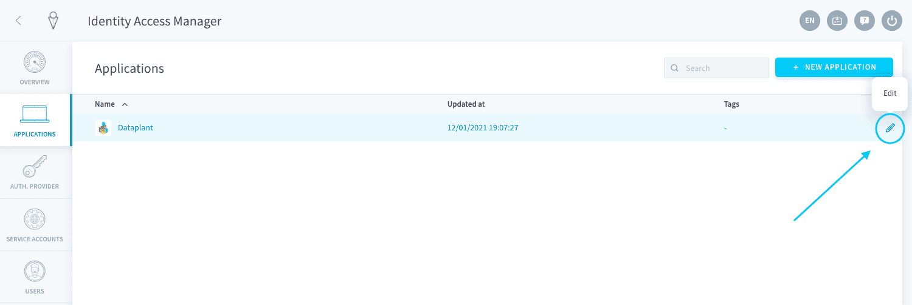
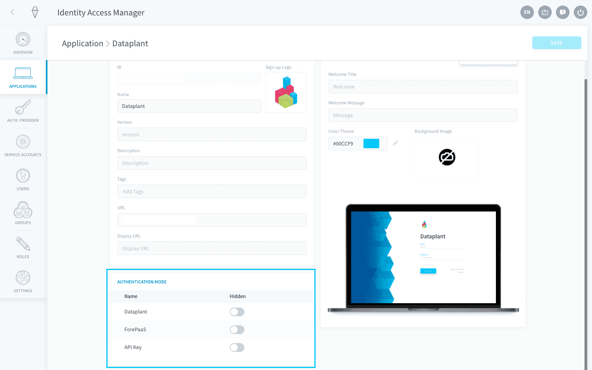
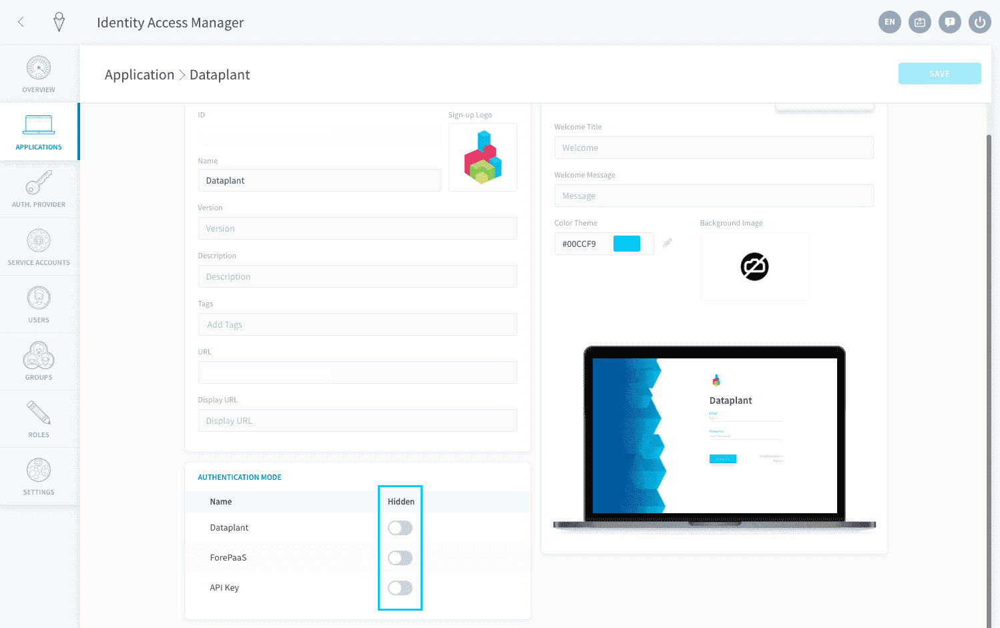
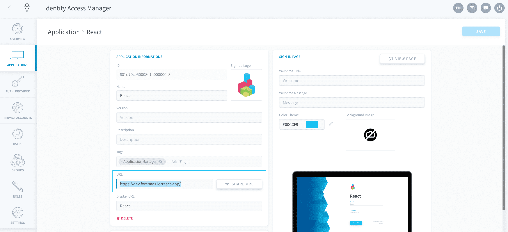
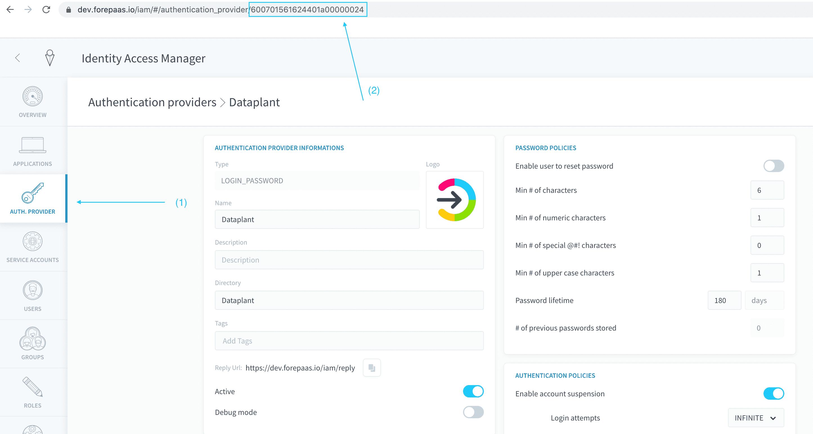

# アプリケーションの認証ページ

認証ページは、ForePaaSアプリケーションの重要な要素であり、アプリケーションの内容にアクセスするためにユーザーがログインを行うページです。 

IAMの「[Auth.Provider（認証プロバイダー）](/jp/product/iam/auth-provider/index)」タブでは、データプラントで使用できる認証方法を設定できます。ログインページの表示をカスタマイズするため、認証方法の[表示／非表示](/jp/product/iam/application/login.md?id=display-an-authentication-provider-on-an-application-login-page)を切り替えることができます。

* [アプリケーションのログインページで認証プロバイダーを表示](/jp/product/iam/application/login.md?id=display-an-authentication-provider-on-an-application-login-page)
* [特定の認証方法へのリンク](/jp/product/iam/application/login.md?id=link-to-a-specific-authentication-provider)

--- 
## アプリケーションのログインページで認証プロバイダーを表示

「**Applications（アプリケーション）**」をクリックして目的のアプリケーションを編集します。

「**Authentication Mode（認証モード）**」パネルを見つけます。

プロバイダーが自動的に表示されていない場合は、新しいプロバイダーを追加します。使用する認証プロバイダーが「*Hidden（非表示）*」に設定されていないことを確認します。非表示に設定された認証プロバイダーは、アプリケーションのログインページに表示されなくなります。

!> 特定のアプリケーションに対して認証プロバイダーを**無効化**することはできません。例えば、アプリケーションのログインページでAzure ADが非表示に設定されている場合でも、Azure ADを介してログインしているユーザーはアプリケーションにアクセスできます。

---
## 特定の認証プロバイダーへのリンク

データプラントで複数の認証プロバイダーが有効になっている場合でも、アプリケーション用の特定の認証ページにアクセスするURLリンクを生成できます。次のものが必要になります。
- アプリケーションのURL
- 認証方法のID 

アプリケーションのURLはアプリケーションのIAM設定で取得できます。

認証プロバイダーのIDを取得するには、IAMの認証プロバイダー設定ページに移動してURLを確認します。

アプリケーション用の認証ページにアクセスするには、次のURLリンクを使用します。  

?> **アプリケーションのURL**#/?auth_mode_id=**認証方法のID**

> 💡ヒント：
- [*ForePaaSアカウント*](/jp/product/iam/auth-provider/index.md?id=forepaas)認証方法のもう1つのIDは`king`です。
- [*Dataplant*](/jp/product/iam/auth-provider/index.md?id=dataplant)認証方法のもう1つのIDは`password`です。