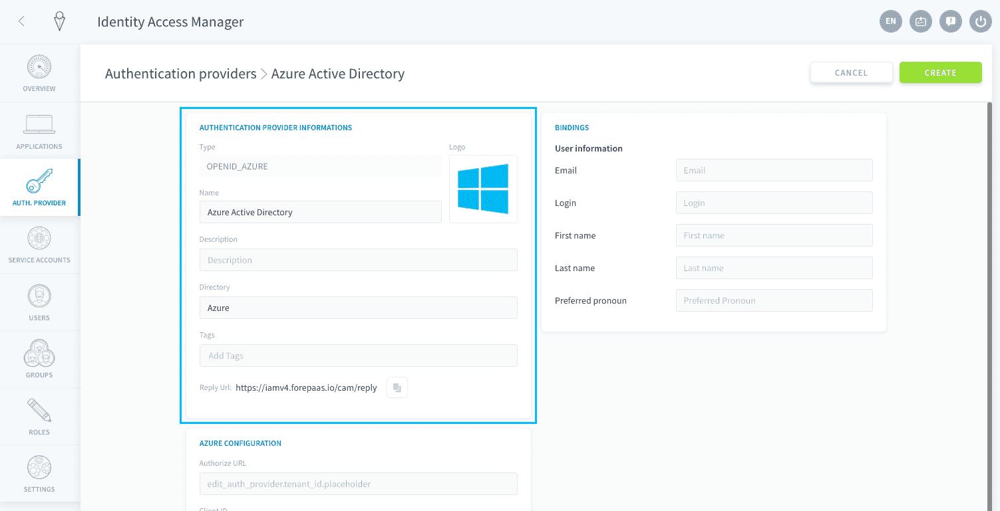

# Azure ADによるSSO認証のセットアップ

Azure Active Directory（AD）をお使いの企業がAzure ADを利用してForePaaSアプリケーションにログインする場合は、このガイドが役立ちます。

IAMを開いて、「**Auth.Provider（認証プロバイダー）**」をクリックします。


認証プロバイダーの追加が済んでいない場合は、*Azure ID*認証プロバイダーの[新規追加](/jp/product/iam/auth-provider/index.md?id=add-an-authentication-provider)を行います。すでに認証プロバイダーを追加済みの場合は、認証プロバイダーの編集を行います。

設定は2つの部分に分けて行います。まず[Microsoft Azureで権限を設定](/jp/product/iam/auth-provider/azure_ad.md?id=configuration-on-azure)した後に、[IAMで認証プロバイダーを設定](/jp/product/iam/auth-provider/azure_ad.md?id=configuration-on-the-forepaas-iam)する必要があります。

---
## Azureの設定

AzureのコンソールでForePaaSを登録する必要があります。次のURLにアクセスします：https://portal.azure.com

Azureでの設定は、次の4つのステップで行います。
* [テナントIDの取得](/jp/product/iam/auth-provider/azure_ad.md?id=step-1-retrieve-the-tenant-id)
* [Identity Access Managerの登録](/jp/product/iam/auth-provider/azure_ad.md?id=step-2-register-the-identity-access-manager)
* [クライアントIDの取得](/jp/product/iam/auth-provider/azure_ad.md?id=step-3-retrieve-the-client-id)
* [クライアントシークレットの取得](/jp/product/iam/auth-provider/azure_ad.md?id=step-4-retrieve-the-client-secret)

### ステップ1：Tenant ID（テナントID）の取得

*テナントID*は、お使いのAzureの企業環境におけるIDです。テナントIDを見つけるには、Azureサービスの一覧で「**Azure Active Directory**」を選択します。次に、サイドバーの「Properties（プロパティ）」をクリックします。


?> このIDは、このあとで行うIAMの設定の際に必要になります。 

### ステップ2：Identity Access Managerの登録
続いて、Microsoft Azure AD内でアプリケーションの登録を行う必要があります。これはAzureに接続するすべてのアプリケーションで機能しますが、このケースでは、ForePaaS IAMを直接登録します。

サイドバーで「**App Registrations（アプリの登録）**」を選択してから、「*New registration（新規登録）*」をクリックします。
  

#### *Name（名前）*
この名前はアプリケーションの内容を説明するためのものです。Azure AD内で設定を見つけるのに役立ちます。 


#### *Supported account types（サポートされるアカウントの種類）*
このパラメータでは、ForePaaS IAMで認証を行うのに使用するAzure ADディレクトリを指定します。お使いのADのみがForePaaS IAMにログインできるようにするため、「*Accounts in this organizational directory only（この組織のディレクトリ内のアカウントのみ）*」を選択することをお勧めします。

  

#### *Redirect URL（リダイレクトURL）*
「*Web*」を選択します。 


URLフィールドに、ForePaaSに追加した新しい認証プロバイダーの「**Reply URL（応答URL）**」フィールドをコピーして貼り付けます（これは、ForePaaS IAM全体で同じです）。

  

完了したら、「**Register（登録）**」をクリックします。

  

### ステップ3：クライアントIDの取得
*クライアントID*は、新しく追加したアプリケーション（ForePaaS IAM）のユーザーIDです。クライアントIDは、「Overview（概要）」ページの*アプリケーション（クライアント）ID*で確認できます。

  

?> クライアントIDは、このあとで行うIAMの設定の際に必要になります。 

### ステップ4：クライアントシークレットの取得
IAMアプリケーションのページで、サイドバーの「**Certificates & secrets（証明書とシークレット）**」をクリックします。「*New client secret（新しいクライアントシークレット）*」をクリックします。

  

説明を記入し、有効期日を選択して、「**Add（追加）**」をクリックします。

  

クライアントシークレットが作成されたら、クライアントシークレットの値（**Value**）をコピーして保存します。

 

?> クライアントシークレットは、このあとで行うIAMの設定の際に必要になります。

### まとめ
上記のすべてのステップが完了すると、次の情報が得られます。

```
Tenant ID (Step 1): XXXXXXXX-XXXX-XXXX-XXXX-XXXXXXXXXXXX
Client ID (Step 3): XXXXXXXX-XXXX-XXXX-XXXX-XXXXXXXXXXXX
Client Secret (Step 4): XXXXXXXXXXXXXXXXXXXXXXXXXXXXXXXX
```
> Azureポータルで新しいアプリケーションの設定を詳細にカスタマイズする必要がある場合は、[Azure ADのドキュメント](https://docs.microsoft.com/en-us/azure/active-directory/manage-apps/what-is-application-management)を参照することをお勧めします。

---
## ForePaaS IAMでの設定
次に、ForePaaSのIdentity Access Managerで新しい認証プロバイダーを設定する必要があります。


### 基本情報の入力

- Name（名前）／Description（説明）：新しい認証方法のIAM内での名前と説明
- Directory（ディレクトリ）：このディレクトリを元に作成されるすべてのアカウントに対する統一されたタグで、例えば、*Azure*と入力
- Tags（タグ）：追加のタグ付けオプションで、完全に任意で使用
- Reply URL（応答URL）：認証プロバイダーがリダイレクトするForePaaSのURL
- Active（アクティブ）：この認証プロバイダーをログインするのに使用できるかどうかを指定
- Debug Mode（デバッグモード）：これをオンにすると、[インフラモニタリング](/jp/product/infra-monitoring/index)で認証ログを参照可能



### Azure設定の入力

続いて、「**Azure Configuration（Azure設定）**」パネルに移動します。


ここでは、前のセクションでAzure上で収集した情報を入力します。次のように設定します。
- Tenant ID（テナントID）：*テナントID*（Azure上の設定の[ステップ1](/jp/product/iam/auth-provider/azure_ad.md?id=step-1-retrieve-the-tenant-id)で取得）
- Client ID（クライアントID）：*クライアントID*（Azure上の設定の[ステップ3](/jp/product/iam/auth-provider/azure_ad.md?id=step-3-retrieve-the-client-id)で取得）
- Client Secret（クライアントシークレット）：*クライアントシークレット値*（Azure上の設定の[ステップ4](/jp/product/iam/auth-provider/azure_ad.md?id=step-4-retrieve-the-client-secret)で取得）
- Scope（スコープ）：ForePaaSがAzure ADからアクセスできる情報の範囲であり、省略可能。空欄のままにした場合は、`openid email profile`の値を使用


### 結合とカスタムマッピング

「**Bindings（結合）**」パネルでは、AzureとForePaaSとの間のフィールドのマッピングをカスタマイズできます。ここでは、プラットフォームによって自動的にフィールドのマッピングが行われるため、設定を行わないことをお勧めします。


「**Custom mappings（カスタムマッピング）**」パネルでは、この認証プロバイダーを介してログインしたすべてのユーザーを特定のロールやグループに自動的に割り当てることができます。


### アクティブ化
Azure ADの設定は以上です。設定が完了していない場合は、「**Create（作成）**」をクリックします。それ以外の場合は、**保存**します。

認証プロバイダーの一覧に、新しく作成した認証方法が表示されます。この認証プロバイダーを*アクティブ*に設定します。


選択したアプリケーションで、新しい認証方法が[表示される](/jp/product/iam/application/login.md?id=display-an-authentication-provider-on-an-application-login-page)ことを確認します。アプリケーションのログインページに、Azure ADのオプションが表示されているはずです。Azure ADのオプションをクリックすると、Azureのログイン画面にリダイレクトされるか、すでにAzureのアカウントにログインしている場合は、そのままアプリケーションに移動します。


{アプリケーションのログインページにAzure ADを表示する}(#/jp/product/iam/application/login.md?id=display-an-authentication-provider-on-an-application-login-page)
