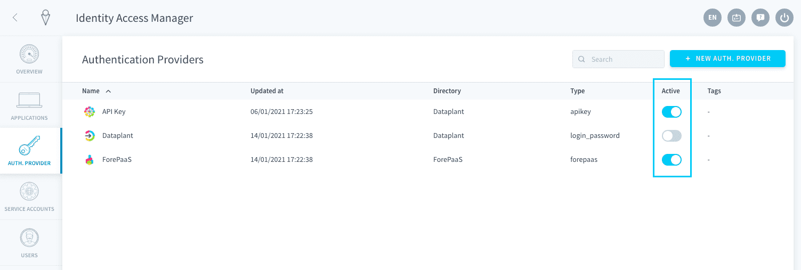
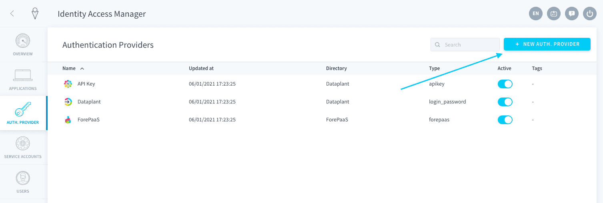
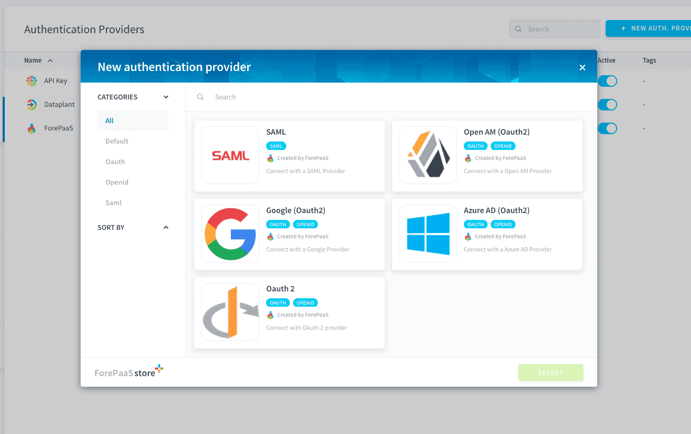

# 認証プロバイダー

Identity Access Managerでは、**データプラントおよびアプリケーション**にログインするのに使用する認証方法を設定できます。

認証プロバイダーはそれぞれアクティブまたは非アクティブに設定できます。非アクティブに設定した認証プロバイダーは、データプラントやアプリケーションへの認証に使用できなくなります。

* [デフォルトの内部認証プロバイダー](/jp/product/iam/auth-provider/index.md?id=default-forepaas-authentication-providers)
* [認証プロバイダーの追加](/jp/product/iam/auth-provider/index.md?id=add-an-authentication-provider)
  * [利用可能な外部認証プロバイダーのリスト](/jp/product/iam/auth-provider/index.md?id=list-of-authentication-providers)

---
## ForePaaSのデフォルトの認証プロバイダー

ForePaaSではすべてのデータプラントで、デフォルトの認証プロバイダーとして[**ForePaaS**](/jp/product/iam/auth-provider/index.md?id=forepaas)、[**データプラント**](/jp/product/iam/auth-provider/index.md?id=dataplant)、[**APIキー**](/jp/product/iam/auth-provider/index.md?id=api-key)が利用できます。

### ForePaaS

これは、ForePaaSプラットフォーム用のメインの認証プロバイダーです。この認証プロバイダーでは、最初にプラットフォームに参加したときに作成した[ForePaaSアカウント](/jp/product/account-setup/create-account)を使用できます。 

> この認証プロバイダーはクラウド管理プラットフォーム内にあり、参加しているすべての組織とデータプラントにサービスを提供します。

### データプラント

これは、電子メールでサインインするシンプルな方法であり、特定のデータプラントのIAMによって提供されます。データプラント上でデプロイ済みのすべてのアプリケーションで使用できます。エンドユーザーにForePaaS上でのアカウント作成を求めることなく、アプリケーションに招待する簡易な方法です。 

> この認証プロバイダーはデータプラント内にあるため、ユーザー情報はすべてデータプラント内に保管され、ForePaaSチームと共有されることはありません。

### APIキー

APIキーは、一般にユーザーが[APIキーとシークレットキー](/jp/product/iam/users/api-secret-key)を使用して接続するために使用します。これらは主に、[データプラントのAPI](/jp/technical/api-reference/index)を使用した高度な設定やカスタム設定に使用されます。 

!> 外部ユーザーやアプリケーションがAPIを介してデータプラントに接続するには、この認証方法がアクティブになっている必要があります。

---
## 認証プロバイダーの追加

「*+New auth. provider（認証プロバイダーを追加）*」ボタンをクリックします。 

### 認証プロバイダーのリスト

ForePaaSでは、次の5つの外部[シングルサインオン](https://en.wikipedia.org/wiki/Single_sign-on)（SSO）プロバイダーをサポートしています。

| プロバイダー | タイプ | 説明 |
| :---- | :---- | :---- |
| **Azure AD** | SSO | Active Directory（AD）は、MicrosoftがWindowsドメインネットワーク用に開発したディレクトリサービス |
| **Open AM** | SSO | OpenAMは、Open Identity Platform Communityがサポートしているオープンソースのアクセス管理、エンタイトルメント、およびフェデレーションサーバーのプラットフォーム |
| **Open ID** | SSO | OpenIDは、非営利団体であるOpenID Foundationが普及を進めているオープンスタンダードの分散型の認証プロトコル |
| **Google** | SSO | Google SSOは、Googleの認証プロトコル |
| **SAML 2.0** | SSO | SAML 2.0（Security Assertion Markup Language 2.0）は、セキュリティドメイン間で認証および許可データをやり取りするためのSAML標準のバージョン  |

続いて、新しい認証プロバイダーの設定を行うことができます。設定は認証プロバイダーによって異なります。

{Azure ADの設定方法を確認する}(#/jp/product/iam/auth-provider/azure_ad.md)

