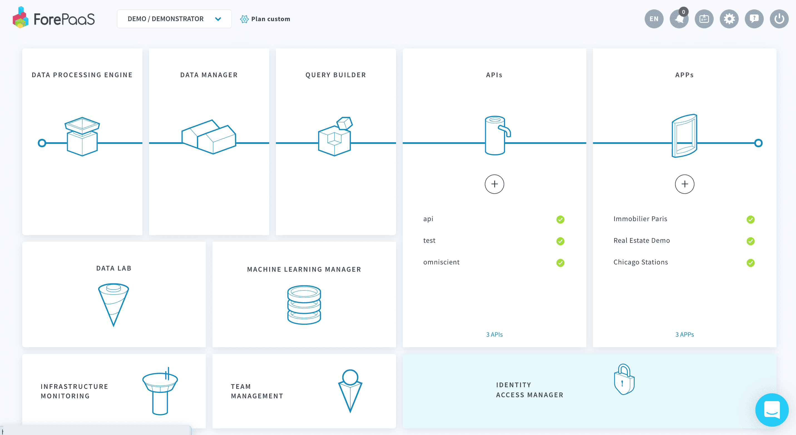

# Identity Access Manager

Identity Access Manager（IAM）では、データプラント内での**チームメンバーのアクセス**の管理に加えて、データプラントのアプリケーションに対する**エンドユーザーとその認証**の管理を一元的に行います。

IAMでは、次のことを行うことができます。
* デプロイ済みの**アプリケーション**のログインページの定義
* 外部ソリューションによるSSOを可能にするための新しい**認証プロバイダー**のセットアップ
* 特定の**ロール**が割り当てられた**グループ**に対する**チームメンバー**の管理

---
## アプリケーション

ForePaaSでデプロイしたアプリケーションは、「**Applications（アプリケーション）**」タブに表示されます。このタブでは、アプリケーション用に特定のログインページを定義することができます。具体的には、次のことを行うことができます。
* ページデザインやアクセス用URLなどのアプリケーションのログイン情報を変更
* 認証プロバイダーリストから選択することで認証モードを指定

{アプリケーションのログインページを管理する}(#/jp/product/iam/application/index.md)

---
## 認証プロバイダー

「**Auth.Provider（認証プロバイダー）**」タブでは、デフォルトで利用可能な認証プロバイダーの他に、追加のプロバイダーをセットアップできます。こうすることで、会社のActive Directoryなどの外部のユーザーディレクトリに接続できるようになります。

認証プロバイダーでは、SSOプロバイダー（*SAML*、*JWT*、または*OpenID*など）や、多要素認証（MFA）プロバイダー（*Google Authenticator*または*SMS*など）など、選択したプロバイダーの種類に応じた設定が必要になります。

> ForePaaSでは、*ForePaaSプラットフォームID*、*データプラントID*、*API／シークレットキー*という**3つのプロバイダーがデフォルトで提供**されています。これらのプロバイダーはすべて新しいアプリケーションに追加されます。新しいプロバイダーを追加する際には、アプリケーションの認証設定を編集し、アプリケーションのログインメニューでユーザーがそのプロバイダーを利用できるようにする必要があります。

{認証プロバイダーをセットアップする}(#/jp/product/iam/auth-provider/index.md)

---
## ユーザーとロール

Identity Access Managerでは、次の3つのレベルを使用してアクセス権限を管理できます。
* **ユーザー／サービスアカウント**：データプラントで作業を行うチームメンバーまたはアプリケーションのエンドユーザー
* **グループ**：固有のメンバーとロールを持つチーム
* **ロール**：ユーザー／サービスアカウントまたはグループに付与できるアクセス権限

{ユーザーとロールの詳細を確認する}(#/jp/product/iam/users/index.md)

---
##  サポートが必要な場合🆘

サポートの依頼が必要な場合は、いつでもプラットフォームの「*Support（サポート）*」タブから直接依頼を送信することができます。また、support@forepaas.com宛にメールを送付することもできます。