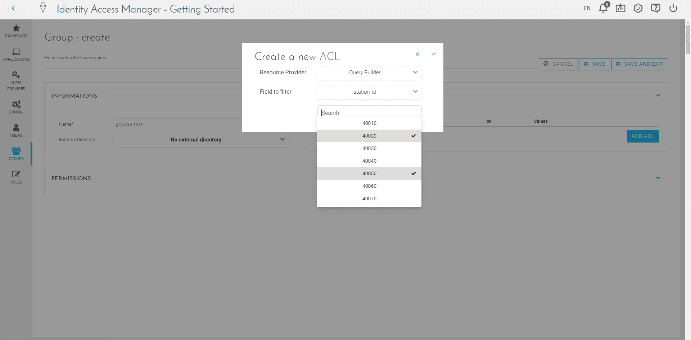

# Configure Access Control List (ACL) for your users with groups

!> Uh-oh! It seems this page contains outdated information. Please reach out to our support team if you need help with anything. 

## Pre-requisites
- You’ve been granted an access to your ForePaaS IAM
- You know the specific field on which your ACL(s) is/are based on

?> This document is for projects that require their users to connect through SSO to get a limited access to a ForePaaS application. Here, we’ll learn how to create a group with ACL(s) and add a user to this group.

## Step by step

### Create a new ACL group 

1. Connect to your Identity Access Manager (IAM) and click on « Groups » on the left bar.    

2. Create a new group by clicking on « NEW » (top-right corner).    

3. Enter a name for your group and then click on "Add ACL".    

4. Select a Resource Provider (here the Query Builder) and then select the field on which you are creating ACL (here « station_id ») .   

5. . A new field appears with the value you requested  
Select the required fields for this ACL for this group.

6. Click on "Save" represented by the "v" at the top-right corner of the pop-in  

7. You can see a sum-up of your new ACL in the group  
Once your ACL(s) are done, click on "Save and exit".  

8. Your new group appears in the groups’ list.  

### Create an email template sent to users

1. Click on « Config. » in the left menu and go on "Emails Templates".  

2. Edit the email « App permission », it will allow you to let your new users know they were added in the group which gives them access to the app content.  

3. Here you can customize the text, subject and sender of the email as you want.  
Keep the <%= appurl %> in the email, it will be replaced by the URL of your app.  

4. Once done, save your email.  

### Add a user in a group

1. Click on "Users" on the left bar menu  

2. To add a user in a group, select the user you want to add to a group and click on "Edit".  

3. Select "Group" in the "Options" box and choose the group in which you want this user to belong to.  

4. Scroll down to "Permissions" and click on "Edit Permissions"  

5. Check the user has access to the app you want to  

6. Click on "Yes" in "Send an email [...] URL(s)?"  
It will send an automatic email to the user letting him know he can connect to the app.  
