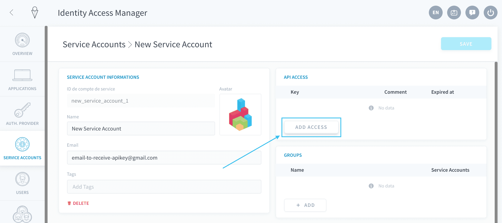

# ユーザー／サービスアカウントのAPIキーおよびシークレットキーの生成

プラットフォームの外部からForePaaSに接続する場合は、認証を行うための**APIキーとシークレットキー**を生成する必要があります。*APIキー*は、APIに接続するユーザーに関連付けられた公開キーです。*シークレットキー*は、そのユーザーのみが知っている秘密キーです。一時的な[認証トークン](/jp/product/iam/users/api-secret-key.md?id=generate-an-authentication-token)を生成することで、APIキーとシークレットキーの2つを組み合わせて認証を行います。

APIキーとシークレットキーは、[ユーザー](/jp/product/iam/users/users)または[サービスアカウント](/jp/product/iam/users/service-accounts)ごとに生成できます。

* [新しいAPI／シークレットキーの生成](/jp/product/iam/users/api-secret-key.md?id=generate-a-new-set-of-api-and-secret-keys)
  * [ユーザーの場合](/jp/product/iam/users/api-secret-key.md?id=for-a-user)
  * [サービスアカウントの場合](/jp/product/iam/users/api-secret-key.md?id=for-a-service-account)
* [認証トークンの生成](/jp/product/iam/users/api-secret-key.md?id=generate-an-authentication-token)

--- 
## 一連の新しいAPIキーとシークレットキーの生成
### ユーザーの場合

Identity Access Managerの「**Users（ユーザー）**」タブに移動します。必要に応じて右上にある検索バーを使用して、APIキーとシークレットキーを生成するユーザーを検索します。ユーザーを編集します。


ユーザーの設定で、「**API Access（APIアクセス）**」パネルまで下にスクロールし、「*Add access（アクセスを追加）*」をクリックします。


キーの「Lifetime（有効期日）」と、ユーザーにAPIキーとシークレットキーの情報を電子メールで送信するかどうかを選択します。その後、「**Create（作成）**」をクリックします。

> 💡 Identity Access Managerの設定の*デフォルト*値は変更できます。


新しいウィンドウが開き、APIキーとシークレットキーの値が表示されます。

!> このウィンドウを閉じると、シークレットキーを再度表示することはできません。ユーザーに電子メールを送信するか、キーをコードに保存して、キーを記録するようにしてください。


キーを削除するには、削除するキーの上にマウスカーソルを合わせて、**ごみ箱**🗑️アイコンをクリックします。キーを削除すると、キーの資格情報は無効になり、認証に使用できなくなります。


### サービスアカウントの場合

Identity Access Managerの「**Service Accounts（サービスアカウント）**」タブに移動します。必要に応じて右上にある検索バーを使用して、APIキーとシークレットキーを生成するサービスアカウントを検索します。


サービスアカウントの設定で、「**API Access（APIアクセス）**」パネルに移動し、「*Add access（アクセスを追加）*」をクリックします。



その後の[手順はユーザーの場合と同じ](/jp/product/iam/users/api-secret-key.md?id=for-a-user)です。APIキーとシークレットキーを電子メールで送信する場合は、サービスアカウント用の電子メールアドレスを指定する必要があります。


---
## 認証トークンの生成

### 生成スクリプト

APIキーとシークレットキーの作成が済んだら、APIエンドポイントを介してForePaaSへの認証を行うため、動的な認証トークンを生成する必要があります。認証トークンが有効なのは短期間のみです。この期間はIAMの設定で指定できます。


トークンを生成するには、以下のコマンド例を実行します。

<!-- tabs:start -->
#### **cURL**
```bash
curl --request POST \
  --url https://{dataplant_subdomain}.forepaas.io/iam/login \
  --data '{
    "auth_mode": "apikey",
    "apikey": "",
    "secretkey": ""
}'
```

#### **Python 3+**
```python
import requests

url = "https://{dataplant_subdomain}.forepaas.io/iam/login"

payload = {
  "auth_mode": "apikey",
  "apikey": "",
  "secretkey": ""
}

response = requests.request("POST", url, data=payload)

print(response.text)
```
<!-- tabs:end -->

!> **{dataplant_subdomain}**は必ず更新してください。更新しない場合、コマンドは実行されません。  
[データプラントのサブドメインを取得する方法](/jp/product/dataplant/config-ids?id=dataplant-subdomain)


---
##  サポートが必要な場合🆘

サポートの依頼が必要な場合は、いつでもプラットフォームの「*Support（サポート）*」タブから直接依頼を送信することができます。また、support@forepaas.com宛にメールを送付することもできます。