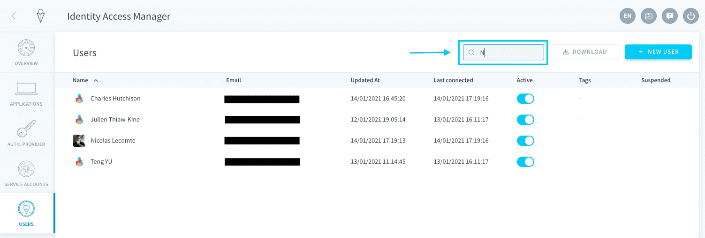

# Managing DataPlant Users

!> Uh-oh! It seems this page contains outdated information. Please reach out to our support team if you need help with anything. 

When a user is registered to a DataPlant either as an administrator (i.e. connected via the authentication of the ForePaaS platform) or as an Dataplant application user (i.e. connected via the embedded authentication service of the DataPlant), he can be found in the **User** tab of the Identity Access Manager.

This page is still a work in progress! 🚧 Get in touch for more questions.

{Send your questions to support 🤔}(https://support.forepaas.com/hc/en-us/requests)

---

## Editing user information

To edit user information, simply hover over the user that you would like to edit and click on the edit button on the far right.

---

Continue to read the following articles to learn more about advanced usage of the IAM component such as create API / Secret keys to authenticate via API.

{Generate a User API & Secret Key}(#/jp/product/iam/api-secret-key.md)