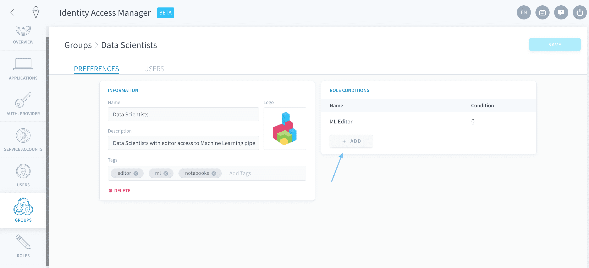

# ロールと条件

ロールは、ユーザー、サービスアカウント、またはグループに割り当てることができる一連の権限です。

エンドユーザーまたはサービスアカウントは、以下にアクセスできます。
- 個別に付与されたすべての権限
- 所属しているグループに付与されたすべての権限

---
## ロールの作成
### Identity Access Managerでの作成
Identity Access Managerで、「**Roles（ロール）**」タブを開きます。画面の右上の「**New Role（新規ロール）**」をクリックします。


ロールの画像、名前、説明、タグを入力し、「**Add Permission（権限を追加）**」をクリックしてこのロールに関連するアクセスレベルを定義します。


権限を定義するには、以下を指定します。
- **サービス**：権限の影響を受けるコンポーネント（Data Processing Engine、機械学習など）
- **リソース**：権限の影響を受けるサブコンポーネント（DPEのアクション、ワークフローなど）
- **アクション**：このサービスとリソースに付与されるアクセス権（作成、読み取りなど）

> アスタリスク（*****）を指定すると、すべてのサービス／リソース／アクションが選択されます。


ロールには権限を必要なだけ追加できます。例えば、以下のロールには、DPEのワークフローへのフルアクセスと、機械学習のすべてのコンポーネントへの読み取り専用アクセスの権限が付与されます。


最後に、「**Create（作成）**」をクリックしてロールを保存します。


### APIでの作成
```sh
# {permission} should be replaced by one or multiple permissions
# A permission will always have that kind of format: "service.resource.action"
# for example:
# "iam.user.read": will give read-only access to the users list of a dataplant

curl --request POST \
  --url '/roles' \
  --header 'content-type: application/json' \
  --data '{
	"display_name": "My role",
	"permissions":[{permission}]
}'
```

---
## ユーザー、サービスアカウント、またはグループにロールをバインドする方法

### Identity Access Managerでの作成
作業手順は、ユーザー、サービスアカウント、グループですべて同じです。ユーザー、サービスアカウント、またはグループにロールをバインドするには、Identity Access Managerの該当するタブに移動します。

編集するユーザー／サービスアカウント／グループを選択し、その行の末尾にある**編集**✏️ボタンをクリックします。


「Role Conditions（ロール条件）」ボックスで「**Add（追加）**」をクリックします。



ドロップダウンメニューでバインドするロールを選択します。また、ロールバインドに対する条件を設定することもできます（[下記を参照](/jp/product/iam/users/roles?id=How-to-set-up-a-condition-on-a-role-binding)）。


「**Create（作成）**」をクリックしてから「**Save（保存）**」をクリックします。

### APIでの作成


```sh
# {type} should be replaced by "users,service_accounts or groups"
# {id} should be replaced by the id of the user, service account or group you want to edit
# {roleId and anotherRoleId} should be the id of the roles to add

## REMEMBER that it will replace all the roles of the edited object. It won't keep other roles already there, so be careful not to remove existing roles.

curl --request PUT \
  --url '/{type}/{id}' \
  --header 'content-type: application/json' \
  --data '{
    "roles": [{
      "role":"{roleId}"
    },{
      "role":"{anotherRoleId}"
    }]
}'
```


---
## ロールバインドに対する条件を設定する方法
条件は、ユーザー／サービスアカウント／グループにロールをバインドする際に、**ロールの権限に対して設定できるフィルター**です。
  
デフォルトの条件なしのロールバインドでは、このロールの権限が制約なしに付与されます。権限に関連するオブジェクトに対して条件を追加すると、権限が付与される対象が目的のオブジェクトのみになります。 

> 例えば、権限`iam.user.read`を含むロールを条件なしにユーザーにバインドすると、ユーザーはすべてのユーザーリストにアクセスできるようになります。  
ただし、`tag:"my-tag"`などの条件を追加した場合、このユーザーには_"my-tag"_というタグを持つユーザーリストの読み取りアクセスのみが付与されます。

{ロールの条件を設定する方法を確認する}(#/jp/product/iam/v4-changes.md?id=_3-acl-management)

?> 🚧 このセクションは準備中です。