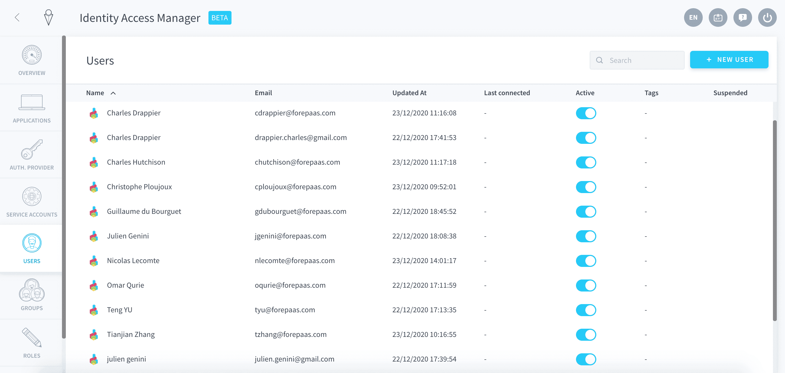

# ユーザー

?> 🚧 このセクションは準備中です。

ユーザーがデータプラントにチームメンバーとして登録されている場合（つまり、ForePaaSプラットフォームの認証を介して接続されている場合）、またはアプリケーションのエンドユーザーとして登録されている場合（データプラントの内蔵認証サービスを介して接続されている場合）、ユーザーはIdentity Access Managerの「**Users（ユーザー）**」タブで確認できます。

---
## 認証ディレクトリ

ユーザーは、さまざまな認証方法（ディレクトリ）を使用してデータプラントに接続できます。デフォルトで、次の2つのディレクトリが存在します。
- **ForePaaS**：ForePaaSプラットフォーム用の認証プロトコルで、データプラントへの管理者アクセス権を持つユーザーのデフォルトのサインイン方法です。アプリケーションの対象となる他のすべてのユーザー（通常、アプリケーションのエンドユーザーと呼ばれる）には、接続するためのForePaaSアカウントは必要なく、ForePaaS IDというデータプラントのログイン／パスワード情報が使用されます。
- **Dataplant**：データプラントの内部認証サービスです。これを使用すると、データプラント内にデプロイされたデータセットやアプリケーションへのアクセス権限を割り当てることができます。

---
## APIキーとシークレットキー

ワークフローや機械学習パイプラインの起動などのジョブをForePaaSの外部からトリガーすることが必要になる場合があります。外部コードの認証を行えるようにするには、APIキーとシークレットキーを生成する必要があります。

{ユーザーのAPIキーおよびシークレットキーの生成}(#/jp/product/iam/users/api-secret-key.md)
