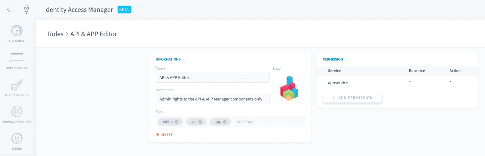
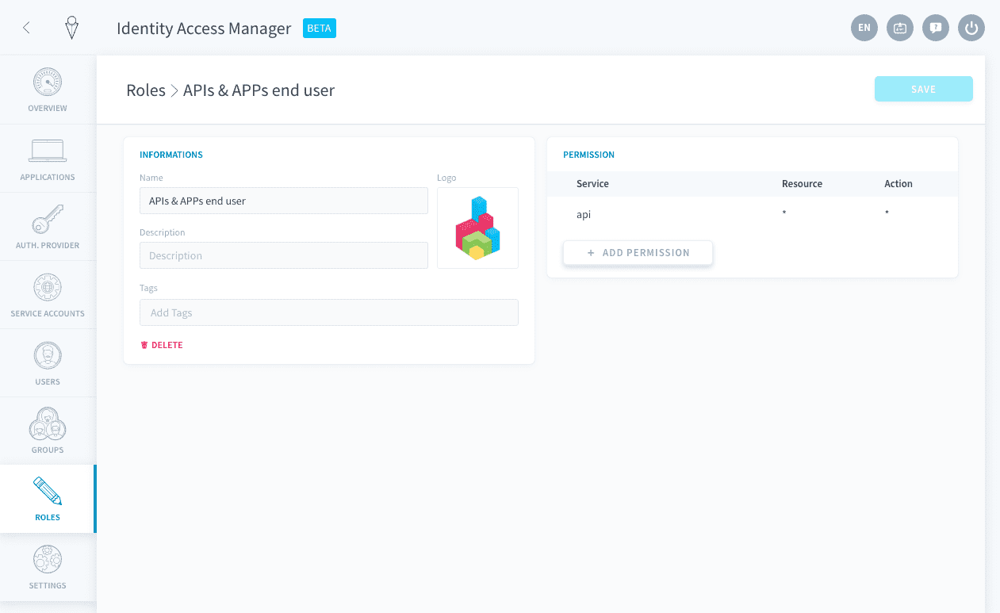
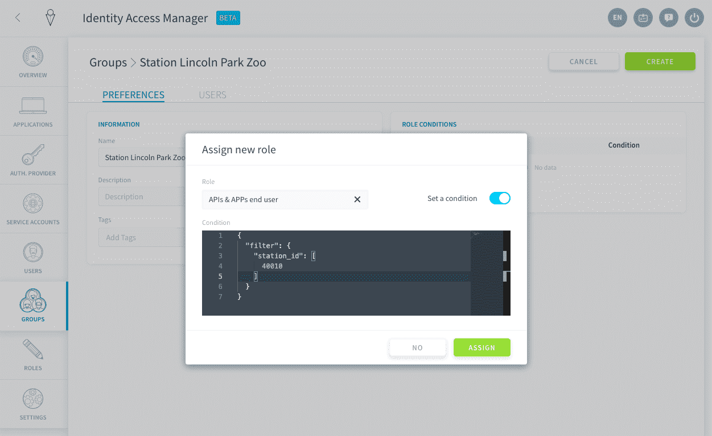
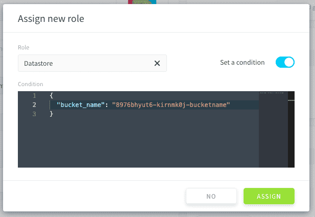

# バージョン4.0の変更点（2020年12月23日）

IAMのバージョン4.0は、前のバージョンとほとんど同じです。このページでは、主な変更点を列挙します。

---
## 1. 設定の移行

前のバージョンのIAMを使用していた場合、設定（ユーザー、グループ、ACL、設定、電子メールテンプレートなど）はすべて自動的に移行されますので、設定の移行について気にする必要はありません。

---
## 2. 「ロール」の導入


「チーム管理」コンポーネントの見直しが行われ「ロール」が導入されました。これは、バージョン4.0へのアップグレードを行う一番の理由になっています。バージョン4.0では、機能と権限のコントロールの強化が図られています。

データプラントのコンポーネントへのアクセスは、（カスタムACLに対応した）チーム管理とIAM v3.0ではなく、IAMを使ってすべて管理されます。デフォルトで複数のロールが作成されます。これらのロールには、ロールの内容に応じてデータプラントのコンポーネントへのアクセス権限があらかじめ設定されています。例えば、API & APP Managerロールには、appserviceのすべてのリソースとすべてのアクションへのフルアクセスが割り当てられています（`appservice * * `）。




---
## 3. 「サービスアカウント」の導入


 
v4.0で新たに導入されたサービスアカウントは、APIコンシューマー、リモート・サーバー・アクセス、スクリプト、およびその他の自動化されたエンティティなどの人間以外のユーザーを除き、「ユーザーアカウント」と同じように機能します。

「アカウント」であるため、次のような機能が追加で利用できます。
- API-key認証タイプによるデータプラントアクセス
- どのディレクトリにも属さない 


---
## 4. ACL管理

ACL管理は効果的にカスタマイズできるように変更されました。現在、ACLは**ロール条件**と呼ばれています。

### 4A. 特定のデータ値に関するロール条件

はじめに、次のように、`API * * `へのアクセスが可能なロールを作成する必要があります。



続いて、このロールを選択したグループやユーザーに関連付け、このロールの***ロール条件***を有効にします。




次のように、JSONを入力します。

```json
{
  "filter": {
    "station_id": [
      40010
    ]
  }
}
```
> 💡このフィルターには複数の値を入力できます。


### 4B. 特定のデータストアバケットに関するロール条件

（`datastore * * `の許可を持つ）ロール*datastore*をグループやユーザーに割り当てる必要があります。

続いて、**ロール条件**を追加してアクセスを制限するバケットを指定します。 

```json
{
  "bucket_name": "name-of-the-bucket" 
}
```
これは最終的に次のようになります。



---
## 5. アプリケーションに関する権限

この機能は誤って使用される可能性があるため、コンポーネントの再構成に伴い、**各アプリケーションの「権限」**の管理は利用できなくなりました。

> 一部のユーザーに対して一部のAPIやAPPへのアクセスをブロックするセキュアな手段が必要な場合は、弊社の[ロードマップページ](https://hq.forepaas.io/#/features)からご意見をお寄せください。

---
## 6. ユーザー管理

### 6A. 電子メールアドレスはユーザーごとに一意

異なる複数のユーザーで同じ電子メールアドレスを使用できなくなりました。
ログインは以前から一意になっていました。

### 6B. ユーザーの移行とマージに関する注意 

移行時に、複数のユーザーの電子メールアドレスが同じである場合、以下の要素が1つのユーザーにマージされます。
- APIキー
- グループ 
- ACL 
- その他

ファーストネームやラストネームなどの属性は、最後に作成されたユーザーのものが使用されます。


### 6C. 複数のリポジトリ

1人のユーザーを複数のリポジトリにリンクできるため、リポジトリごとにユーザーを作成する必要はなくなりました。このため、各ユーザーのアクセス権限をこれまでよりも効率的に管理できます。

---
## 7. 新しいデータプラントでのデフォルトディレクトリの名称変更

デフォルトディレクトリに関する2つの名称の変更が行われています。

| IAM v3の古い名称 | IAM 4.0の新しい名称 |
|          ---        |          ---          |
| King | ForePaaS |
| ForePaaS | データプラント |


---
##  サポートが必要な場合🆘

サポートの依頼が必要な場合は、いつでもプラットフォームの「*Support（サポート）*」タブから直接依頼を送信することができます。また、support@forepaas.com宛にメールを送付することもできます。