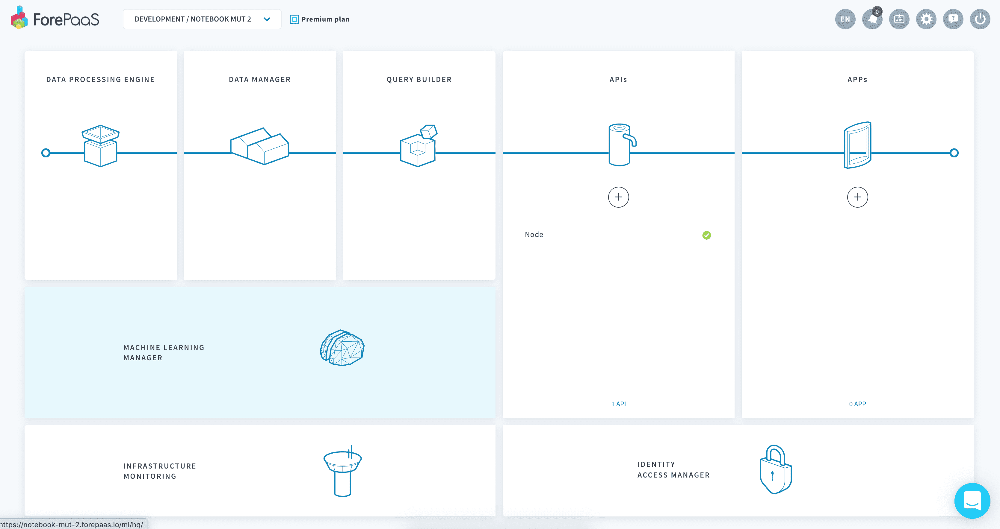
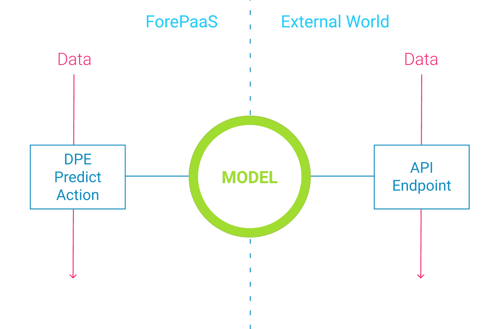

# Machine Learning Manager

Machine Learning Managerでは、**AIモデルの学習と運用環境へのデプロイ**を行うことができます。さまざまな方法を利用して、機械学習に着手できます。[Notebooks](jp/product/ml/notebooks/index)で試験を行う、[パイプライン](jp/product/ml/pipelines/index)で予測モデルの学習を新規に行う、または外部で学習済みの[モデル](/jp/product/ml/models/index)ファイルをデプロイする、といった方法を用いることができます。

---
## コンポーネントの概要

Machine Learning Managerでは、**AIを利用したアプリケーションでモデルを運用環境に展開**することができます。ForePaaSの他のコンポーネントと同様に、Machine Learning Managerはコンテナとマイクロサービステクノロジーをベースとしています。このため、学習、スコア評価、予測などの個別の機械学習ジョブをスケーリングして、膨大な処理データ量や高頻度なデータ処理に適合させることができます。 

作成したモデルは、次のいずれかで使用できます。
* **Data Processing Engine（DPE）**：ForePaaSデータモデルに予測を書き込み
* **外部API**

Machine Learning Managerでは、次のアクションを実行できます。
* [Notebooksの作成](jp/product/ml/notebooks/index)とNotebooksを使用したデータの探索
* [新しいMLモデルの学習を行うためのパイプラインの新規セットアップ](jp/product/ml/pipelines/index)
* [モデルの比較とデプロイ](/jp/product/ml/models/index)およびパブリック／プライベートマーケットプレイスを活用した既存モデルのアップロードや共有

---
## 入門編チュートリアル

初めて機械学習を利用する人にとって、機械学習の使い方の習得は手間のかかる作業です。弊社では、Machine Learning Managerの使い方を学ぶためのサンプルデータを使用した簡単なステップ・バイ・ステップのチュートリアルを用意しています。

{機械学習🤖のチュートリアルを確認する}(#/jp/getting-started/ml/index)

---
## Machine Learning Managerで機械学習に着手する3つの方法

### Notebooks

Jupyter Notebooksとの連携を利用すると、コンピューティングパフォーマンスを気にすることなく、データの詳細な調査を行うことができます。

{ForePaaSでJupyter Notebooksを作成する}(#/jp/product/ml/pipelines/index.md)

### パイプライン

パイプラインを使用して、機械学習モデルを新規に設計してデプロイすることができます。データの準備や検証などのすべての作業が簡略化されているため、ユーザーはビジネス上の成果に注力することができます。

{パイプラインでモデルの学習を行う}(#/jp/product/ml/pipelines/index.md)

### モデル

学習済みモデルをすでにお持ちで🦾、ForePaaSのテクノロジーを利用してバージョン管理された運用環境でモデルを維持管理する場合は、以下のリンクを参照してください。

{ForePaaSで学習済みモデルをデプロイする🚀}(#/jp/product/ml/models/index.md)

---
##  サポートが必要な場合🆘

> お探しの情報は見つかりましたか。サポートが必要な場合は、プラットフォームの「*Support（サポート）*」ページから直接依頼を送信することができます。また、support@forepaas.com宛にメールを送付することもできます。

{サポートに質問を送付する🤔}(https://support.forepaas.com/hc/en-us/requests)