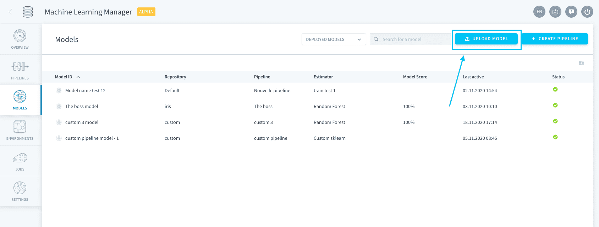
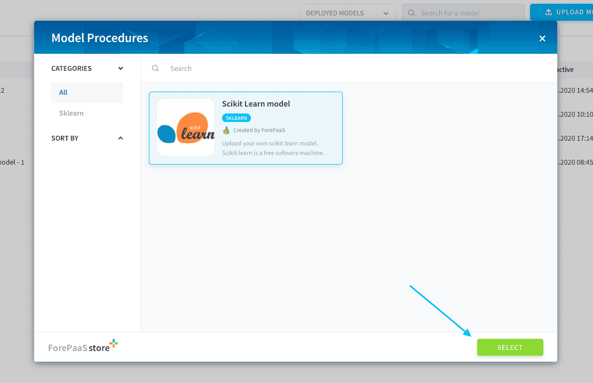
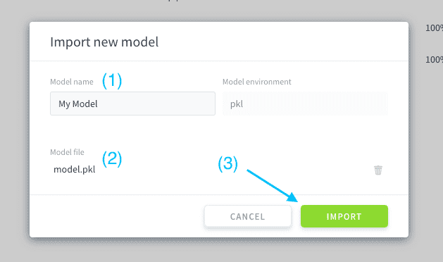
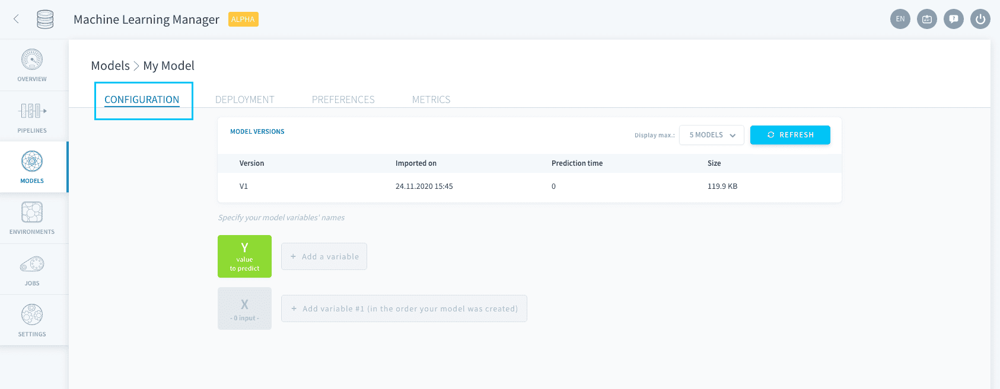
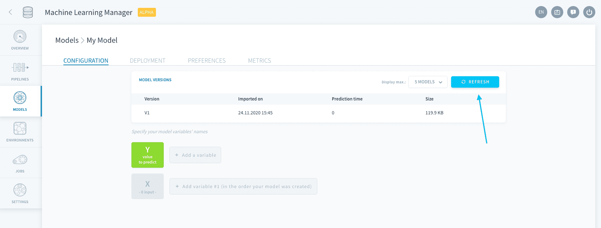
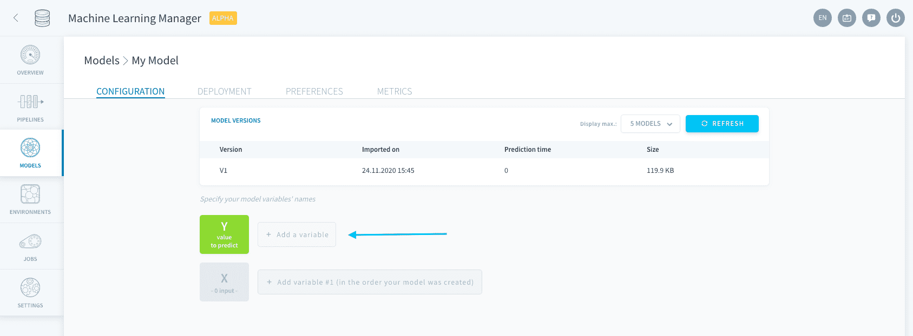
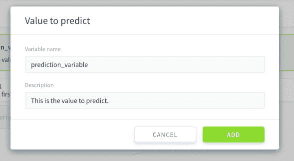
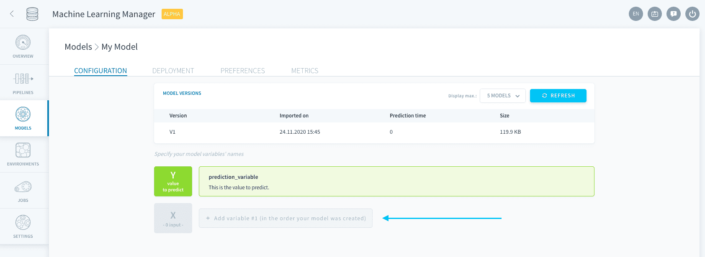
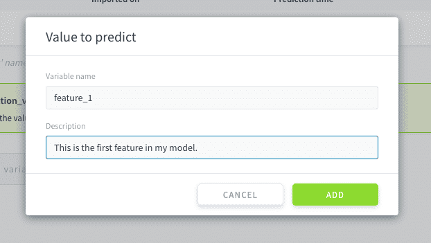
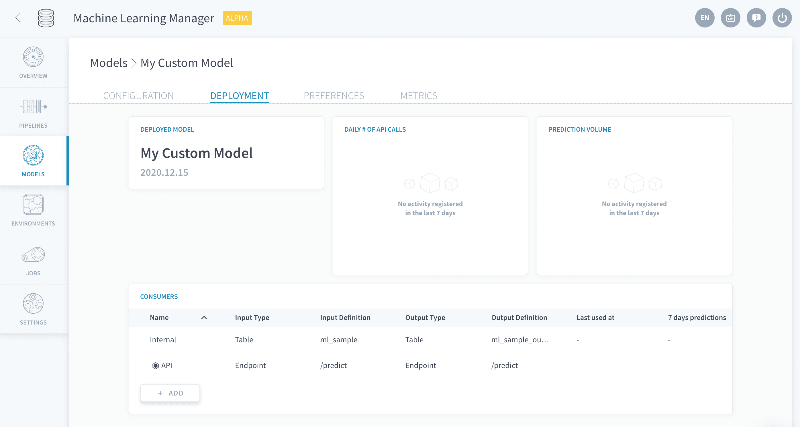

# モデルのインポート

「Models（モデル）」ページの「**Upload Model（モデルのアップロード）**」をクリックすると、学習済みモデルをForePaaSに容易にインポートできます。

お使いのコンピューターやGitリポジトリから**プライベートモデルをアップロード**するか、別のユーザーがストアに登録した**コミュニティの共有モデルをインポート**することができます。

コミュニティの共有モデルを使用するには、ストア内で目的のモデルを検索してインポートします。

プライベートモデルを使用する場合は、ストア内でいずれかの「*Custom（カスタム）*」オプションを選択します。

> ストアの「Custom（カスタム）」オプションにお使いのモデル言語が見つからない場合、そのモデル言語はForePaaSでまだサポートされていません。  
弊社では、ForePaaSプラットフォームでの連携の強化に継続的に取り組んでいます。弊社の[ロードマップページ](https://hq.forepaas.io/#/features)からご意見をお寄せください。今後のリリースで機能強化を行う際の参考にさせていただきます😀。

モデルの名前とファイルを指定し、「**Import（インポート）**」をクリックします。

続いて、モデルのデプロイを構成する必要があります。これは次の複数のステップで行います。

* [構成](jp/product/ml/models/import/index.md?id=configuration)
  * [バージョンの管理](jp/product/ml/models/import/index.md?id=manage-versions)
  * [変数の指定](jp/product/ml/models/import/index.md?id=specify-variables)
* [デプロイの設定](jp/product/ml/models/import/index.md?id=deployment-settings)

> 共有モデルは作成者がすでに設定済みですので、ボタンを1回クリックするだけでデプロイできます。

---
## 構成

モデルのセットアップは、「**Configuration（構成）**」タブで行います。

### バージョンの管理

モデルのすべてのバージョンが表に記載されるため、変更の追跡や比較を簡単に行うことができます。 

> 今のところ、インポートしたモデルでスコア評価を行うことはできません。今後この機能の追加を希望される方は、弊社の[ロードマップポータルからご意見をお寄せください](https://hq.forepaas.io/#/features)。

モデルのバージョンを更新するには、表の上部にある「**Refresh（リフレッシュ）**」ボタンをクリックします。

お持ちのファイルから最新バージョンのモデルを選択するように求められます。

### 変数の指定

モデルを作成するのに使用した言語／ソフトウェアによっては、モデルの特徴量の指定が必要になります。このステップは、予測を行う際に**推論APIが入力データを正しくマッピングする**のに必要です。

最初に、Yの横にある「**Add a variable（変数の追加）**」をクリックして、予測対象の値の名前を指定します。

次に、Xの横にある同じボタンをクリックして、Xデータセットで変数を指定します。 

Xの変数の指定は、次のいずれかの方法で行うことができます。
* 1つずつ手動で入力。
* 🚧 *準備中！* テキストファイルをアップロードしてまとめて追加。コードのボイラープレートを確認する場合は、[こちら](jp/product/ml/models/import/bulk-add-x)をクリックしてください。

!> 変数の名前は、予測を要求する際に使用する名前と同じである必要があります。

---
## デプロイの設定

ここでは、デプロイ済みモデルを使用して予測を行う方法を決めます。すべての設定は、**コンシューマー**と呼ばれるものを介して行われます。コンシューマーは、予測を行うためにデータを供給するデプロイ済みモデルに接続されたエンティティです。 

デプロイの設定は、スタンドアローンモデルの場合とパイプラインの場合で同じです。詳細については、以下の記事を参照してください。

{デプロイの設定の管理}(#/jp/product/ml/pipelines/configure/deployment/index.md)

---
##  サポートが必要な場合🆘

> お探しの情報は見つかりましたか。サポートが必要な場合は、プラットフォームの「*Support（サポート）*」ページから直接依頼を送信することができます。また、support@forepaas.com宛にメールを送付することもできます。

{サポートに質問を送付する🤔}(https://support.forepaas.com/hc/en-us/requests)