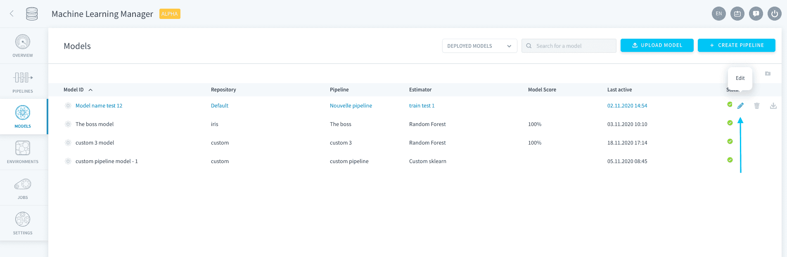
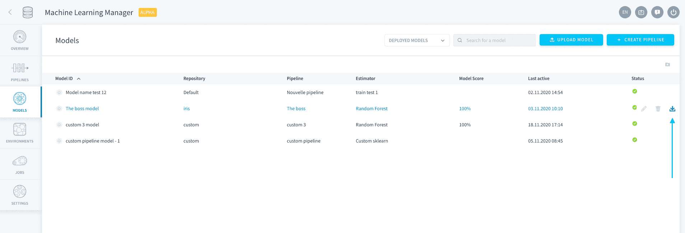
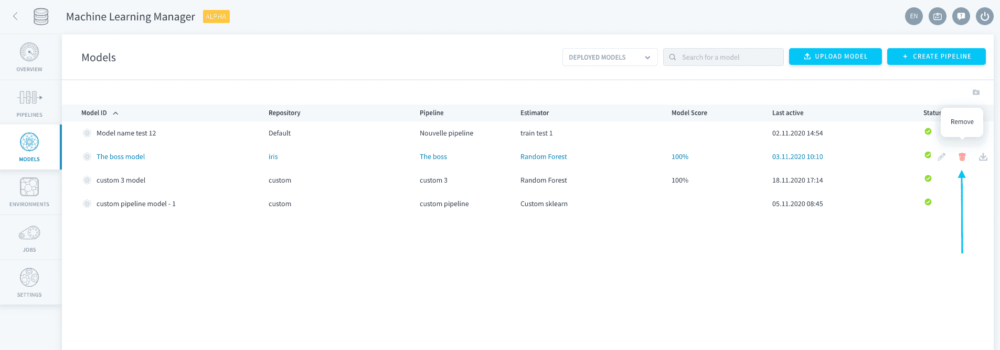

# モデル

「**Models（モデル）**」ページでは、データプラントのすべての機械学習プロジェクト（リポジトリ）内に存在するすべてのモデルを参照できます。デフォルトでは、「*Deployed Models（デプロイ済みモデル）*」のみが表示されるようにフィルタリングされていますが、「*All Models（すべてのモデル）*」を表示することもできます。

ForePaaSプラットフォームでは、*学習用データ*でフィッティングされた*推定器とパラメータ*の2つの要素の組み合わせを**_モデル_**と呼んでいます。ForePaaSには、次の2つのタイプのモデルがあります。
- ForePaaSのパイプラインを通じて作成されたモデル：**ForePaaSモデル**
- 外部からインポートされたモデルまたは消去されたパイプラインに属していたモデル：**スタンドアローンモデル**

---
## 外部モデルのインポート

ForePaaSの外部ですでに学習を済ませたモデルがある場合は、ForePaaSを使ってこのモデルを運用環境で稼働させることができます。これを行う方法については、以下のリンクを参照してください。

{学習済みモデルのインポート📥}(#/jp/product/ml/models/import/index.md)

> ForePaaSで独自のモデルの設計と学習を行うには、[パイプラインを実行](jp/product/ml/pipelines/index)する必要があります。サイドバーの「**Pipelines（パイプライン）**」タブに移動するか、「Models（モデル）」ページの右上にある「**Create Pipeline（パイプラインの作成）**」のショートカットを使用します。

---
## モデルの管理

「Models（モデル）」ページは、すべてのモデルを管理できるコントロールセンターです。

モデルを変更する必要がある場合は、**編集🖋アイコン**をクリックします。モデルがForePaaSのパイプラインを通じて作成されている場合は、ここでパイプラインを編集できます。モデルがスタンドアローンモデルの場合は、モデルの設定ページが開きます。

また、**ダウンロード📥アイコン**をクリックして、モデルファイルをお使いのコンピューターにダウンロードすることもできます。

最後に、**ごみ箱🗑アイコン**をクリックすると、モデルを消去できます。 

!> **ForePaaSのモデル**を消去しても、元になるパイプラインは消去されません。このため、パイプラインを実行して新しいバージョンのモデルを生成することができます。  
消去した**スタンドアローンモデル**は、改めてインポートしない限り、元に戻すことはできません。

---
##  サポートが必要な場合🆘

> お探しの情報は見つかりましたか。サポートが必要な場合は、プラットフォームの「*Support（サポート）*」ページから直接依頼を送信することができます。また、support@forepaas.com宛にメールを送付することもできます。

{サポートに質問を送付する🤔}(https://support.forepaas.com/hc/en-us/requests)