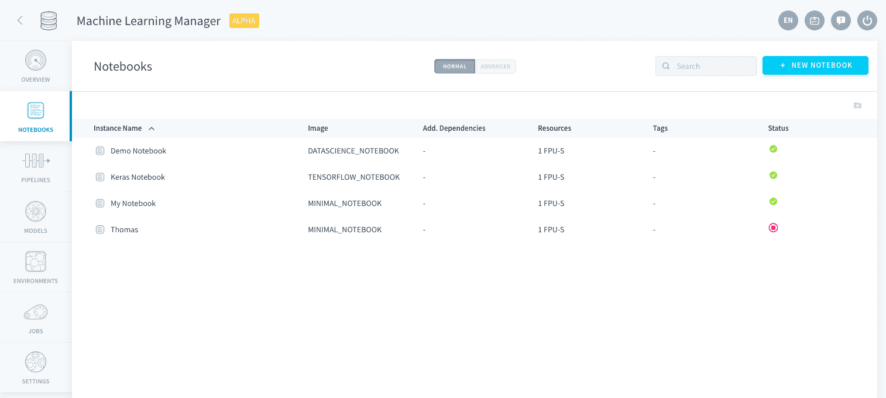
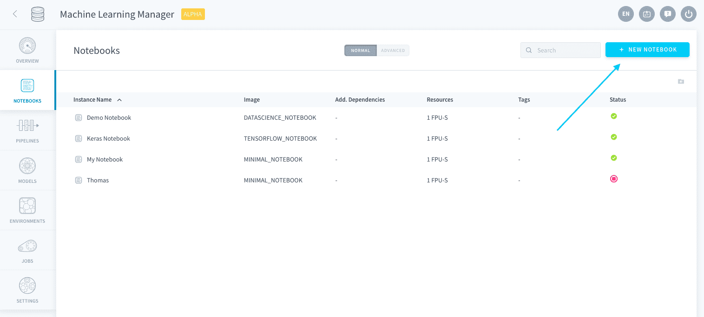
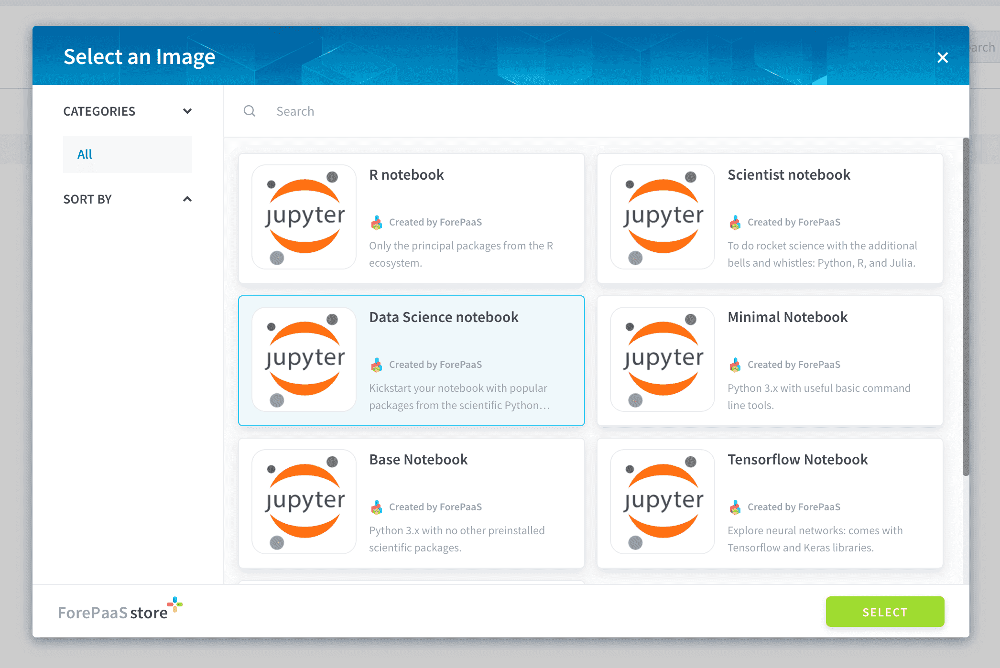
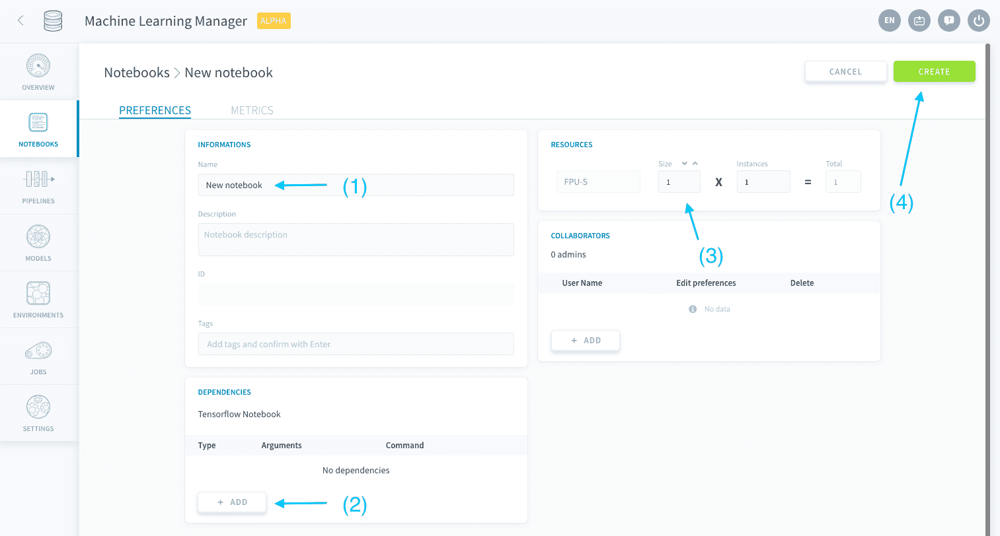
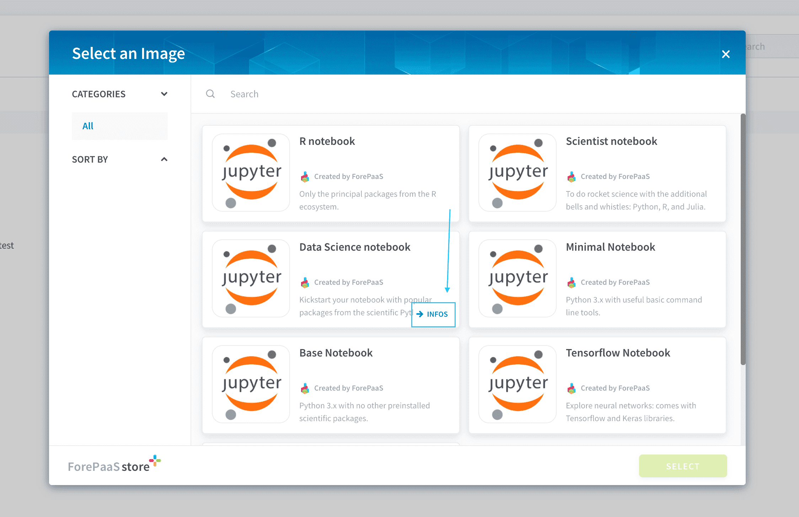
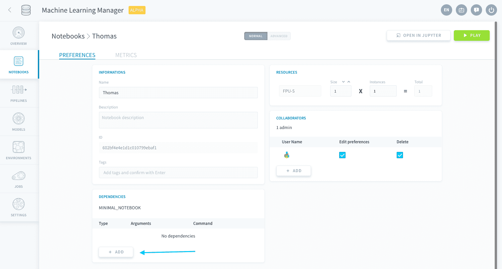
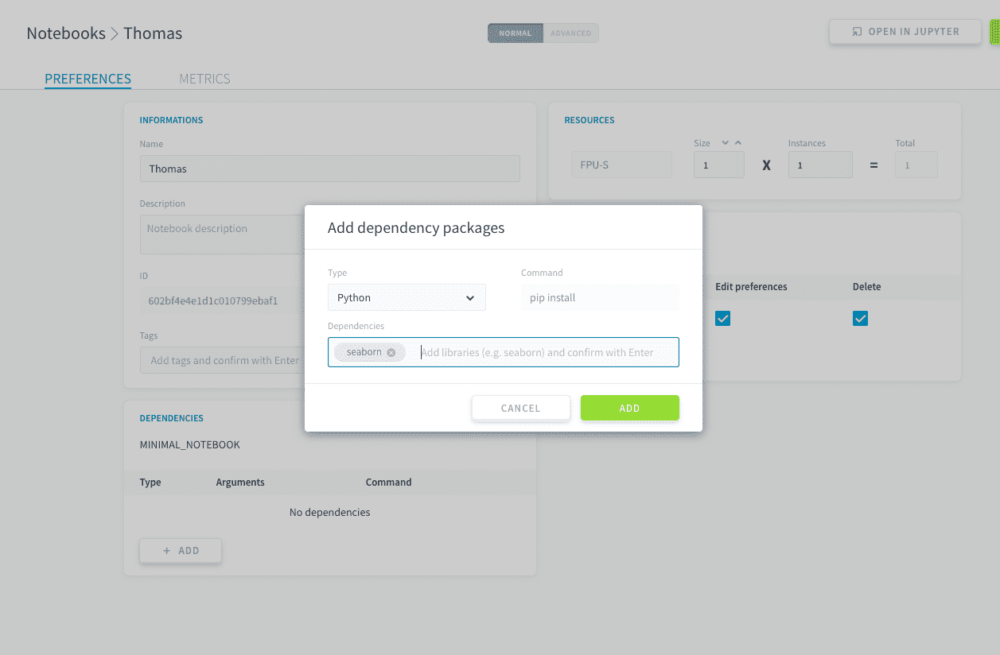
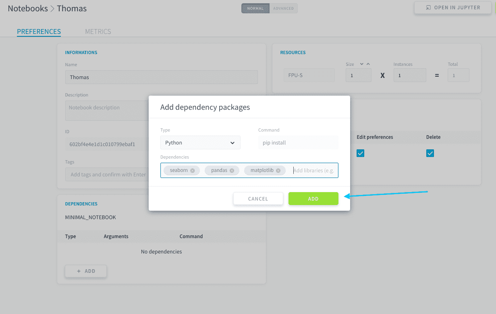

# Notebooksの作成

Notebooksインスタンスを作成するには、Machine Learning Managerの「**Notebooks（ノートブック）**」セクションに移動します。

右上にある「**New notebook（新規ノートブック）**」をクリックします。

Jupyter環境の[コンテナイメージ](https://jupyter-docker-stacks.readthedocs.io/en/latest/using/selecting.html)（新しいノートブックで使用するパッケージと依存関係）を選択する必要があります。ForePaaSには、データ分析およびデータサイエンスで最もよく使用されるライブラリを含むすぐに実行可能なイメージが用意されています。 

> 初めてNotebooksを作成する場合は、*Data Science notebook*を使用することをお勧めします。これには、pandas、scipy、scikit-learn、matplotlibなどのデータ探索用の基本的なすべてのPythonライブラリが含まれています。

Notebooksを作成する前にNotebooksの設定を行うことができます（これらの設定は後から変更することもできます）。「**Create（作成）**」をクリックすると、個別の環境と専用のコンピューティングリソースを使用して、Notebooksのサーバーが起動されます。

Notebooksの設定では、主に次の2点について設定します。
* [追加の依存関係](/jp/product/ml/notebooks/create.md?id=notebook-dependencies)
* [リソース](/jp/product/ml/notebooks/create.md?id=notebook-resources)

---
## Notebooksの依存関係

Notebooksのイメージには、すでにデフォルトパッケージが含まれています。マーケットプレイスではイメージの説明を個別に確認することができます。 

依存関係を追加で指定するには、「*Dependencies（依存関係）*」パネルの「**Add（追加）**」ボタンをクリックします。

依存関係のタイプを選択し、サーバーにインストールするパッケージの名前を入力します。

タグのように複数のパッケージをまとめて追加するには、その都度*Enter*キーを押します。

---
## Notebooksのリソース

新しいNotebooksのリソースを設定する方法については、該当するセクションを参照してください。Notebooksのリソースを設定してから、Notebooksの作成を確認するようにしてください。

{Notebooksのリソースの設定}(#/jp/product/ml/notebooks/index.md?id=edit-resources)